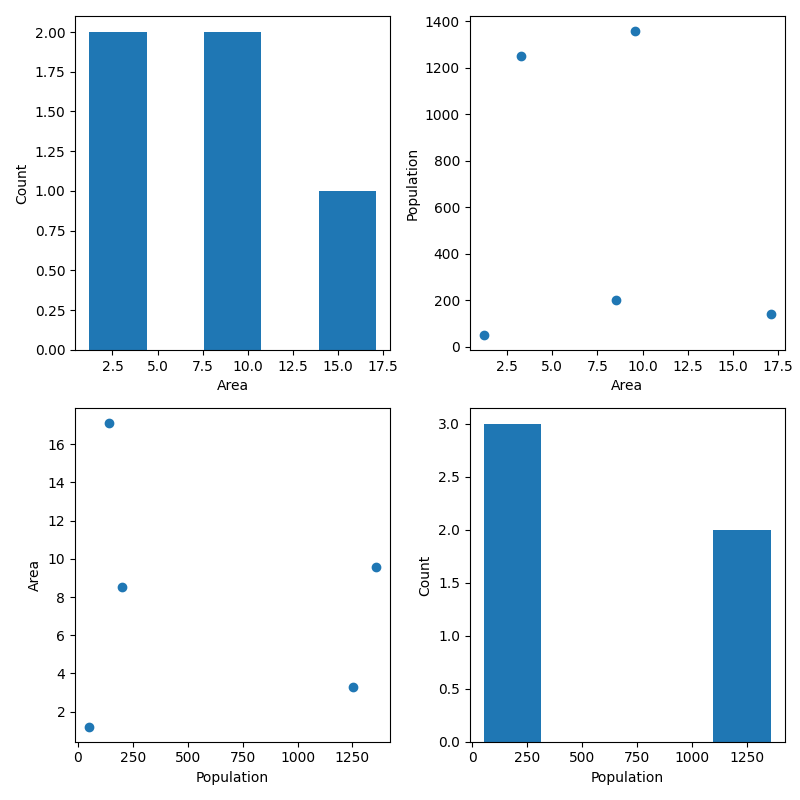
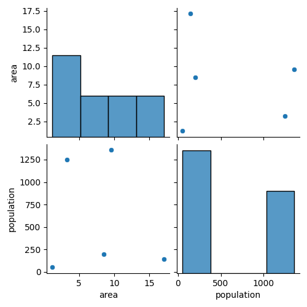
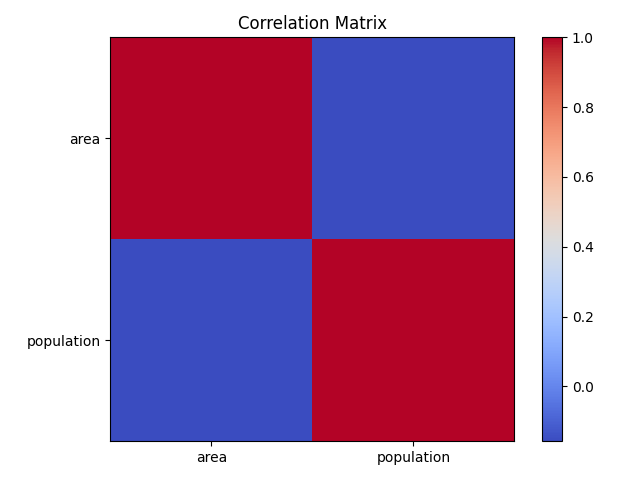
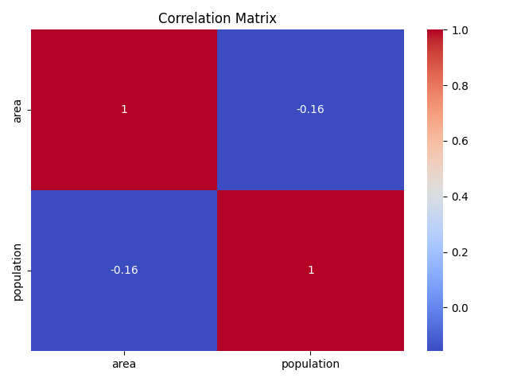
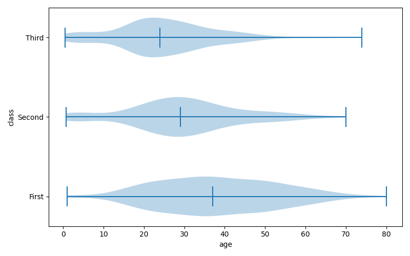
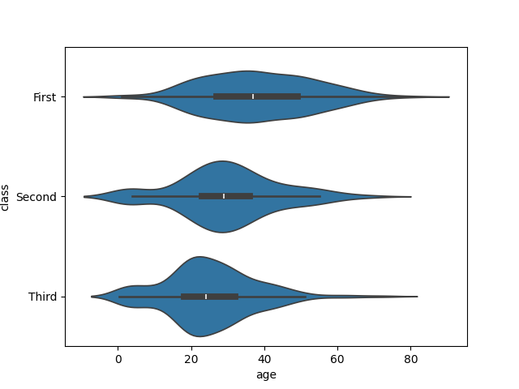

# Table of Contents

- [Table of Contents](#table-of-contents)
- [Week 01 - Numpy, Pandas, Matplotlib \& Seaborn](#week-01---numpy-pandas-matplotlib--seaborn)
  - [Administrative](#administrative)
  - [Python Packages](#python-packages)
    - [Introduction](#introduction)
    - [Importing means executing the script](#importing-means-executing-the-script)
  - [Code formatting](#code-formatting)
  - [NumPy](#numpy)
    - [0. Importing](#0-importing)
    - [1. Array Creation](#1-array-creation)
    - [2. Array Attributes and Inspection](#2-array-attributes-and-inspection)
    - [3. Array Manipulation](#3-array-manipulation)
    - [4. Indexing, Slicing, and Iteration](#4-indexing-slicing-and-iteration)
    - [5. Mathematical and Universal Functions (`ufuncs`)](#5-mathematical-and-universal-functions-ufuncs)
    - [6. Linear Algebra](#6-linear-algebra)
    - [7. Statistical Functions](#7-statistical-functions)
    - [8. Broadcasting](#8-broadcasting)
    - [9. Random Number Generation](#9-random-number-generation)
    - [10. File I/O and Miscellaneous](#10-file-io-and-miscellaneous)
  - [Pandas](#pandas)
    - [0. Importing](#0-importing-1)
    - [1. Introduction to DataFrames](#1-introduction-to-dataframes)
    - [2. Data Structures and Creation](#2-data-structures-and-creation)
    - [3. Data Inspection](#3-data-inspection)
    - [4. Data Selection and Indexing](#4-data-selection-and-indexing)
    - [5. Filtering Data](#5-filtering-data)
    - [6. Data Manipulation](#6-data-manipulation)
    - [7. Statistical and Mathematical Operations](#7-statistical-and-mathematical-operations)
    - [8. Handling Missing Data](#8-handling-missing-data)
    - [9. Grouping and Aggregation](#9-grouping-and-aggregation)
    - [10. File I/O and Miscellaneous](#10-file-io-and-miscellaneous-1)
  - [Matplotlib](#matplotlib)
    - [Line plot](#line-plot)
    - [Scatter plot](#scatter-plot)
    - [Drawing multiple plots on one figure](#drawing-multiple-plots-on-one-figure)
    - [The logarithmic scale](#the-logarithmic-scale)
    - [Histogram](#histogram)
      - [Introduction](#introduction-1)
      - [In `matplotlib`](#in-matplotlib)
      - [Use cases](#use-cases)
    - [Checkpoint](#checkpoint)
    - [Customization](#customization)
      - [Axis labels](#axis-labels)
      - [Title](#title)
      - [Ticks](#ticks)
      - [Adding more data](#adding-more-data)
      - [`plt.tight_layout()`](#plttight_layout)
        - [Problem](#problem)
        - [Solution](#solution)
  - [Seaborn](#seaborn)
    - [0. Importing](#0-importing-2)
    - [1. Figure, Axes, and Styling](#1-figure-axes-and-styling)
    - [2. Basic Plots: Line and Scatter](#2-basic-plots-line-and-scatter)
    - [3. Categorical Plots: Bar and Box](#3-categorical-plots-bar-and-box)
    - [4. Distribution Plots: Histogram and KDE](#4-distribution-plots-histogram-and-kde)
    - [5. Advanced Statistical Plots](#5-advanced-statistical-plots)
      - [Pair Plot](#pair-plot)
      - [Heatmap](#heatmap)
      - [Violin Plot](#violin-plot)
    - [6. Customization and Subplots](#6-customization-and-subplots)
    - [7. Saving and Displaying Plots](#7-saving-and-displaying-plots)
- [Week 02 - Machine learning with scikit-learn](#week-02---machine-learning-with-scikit-learn)
  - [What is machine learning?](#what-is-machine-learning)
  - [The `scikit-learn` syntax](#the-scikit-learn-syntax)
  - [The classification challenge](#the-classification-challenge)
  - [Measuring model performance](#measuring-model-performance)
  - [Model complexity (overfitting and underfitting)](#model-complexity-overfitting-and-underfitting)
  - [Hyperparameter optimization (tuning) / Model complexity curve](#hyperparameter-optimization-tuning--model-complexity-curve)
  - [The Model Report](#the-model-report)

# Week 01 - Numpy, Pandas, Matplotlib & Seaborn

## Administrative

- [ ] Create a chat in Messenger.

## Python Packages

### Introduction

You write all of your code to one and the same Python script.

<details>

<summary>What are the problems that arise from that?</summary>

- Huge code base: messy;
- Lots of code you won't use;
- Maintenance problems.

</details>

<details>

<summary>How do we solve this problem?</summary>

We can split our code into libraries (or in the Python world - **packages**).

Packages are a directory of Python scripts.

Each such script is a so-called **module**.

Here's the hierarchy visualized:


These modules specify functions, methods and new Python types aimed at solving particular problems. There are thousands of Python packages available from the Internet. Among them are packages for data science:

- there's **NumPy to efficiently work with arrays**;
- **Matplotlib for data visualization**;
- **scikit-learn for machine learning**.

</details>

Not all of them are available in Python by default, though. To use Python packages, you'll first have to install them on your own system, and then put code in your script to tell Python that you want to use these packages. Advice:

- always install packages in **virtual environments** (abstractions that hold packages for separate projects).
  - You can create a virtual environment by using the following code:

    ```console
    python3 -m venv .venv
    ```

    This will create a hidden folder, called `.venv`, that will store all packages you install for your current project (instead of installing them globally on your system).

  - If there is a `requirements.txt` file, use it to install the needed packages beforehand.
    - In the github repo, there is such a file - you can use it to install all the packages you'll need in the course. This can be done by using this command:

    ```console
    (if on Windows) > .venv\Scripts\activate
    (if on Linux) > source .venv/bin/activate
    (.venv) > pip install -r requirements.txt
    ```

Now that the package is installed, you can actually start using it in one of your Python scripts. To do this you should import the package, or a specific module of the package.

You can do this with the `import` statement. To import the entire `numpy` package, you can do `import numpy`. A commonly used function in NumPy is `array`. It takes a Python list as input and returns a [`NumPy array`](https://numpy.org/doc/stable/reference/generated/numpy.array.html) object as an output. The NumPy array is very useful to do data science, but more on that later. Calling the `array` function like this, though, will generate an error:

```python
import numpy
array([1, 2, 3])
```

```console
NameError: name `array` is not defined
```

To refer to the `array` function from the `numpy` package, you'll need this:

```python
import numpy
numpy.array([1, 2, 3])
```

```console
array([1, 2, 3])
```

This time it works.

Using this `numpy.` prefix all the time can become pretty tiring, so you can also import the package and refer to it with a different name. You can do this by extending your `import` statement with `as`:

```python
import numpy as np
np.array([1, 2, 3])
```

```console
array([1, 2, 3])
```

Now, instead of `numpy.array`, you'll have to use `np.array` to use NumPy's functions.

There are cases in which you only need one specific function of a package. Python allows you to make this explicit in your code.

Suppose that we ***only*** want to use the `array` function from the NumPy package. Instead of doing `import numpy`, you can instead do `from numpy import array`:

```python
from numpy import array
array([1, 2, 3])
```

```console
array([1, 2, 3])
```

This time, you can simply call the `array` function without `numpy.`.

This `from import` version to use specific parts of a package can be useful to limit the amount of coding, but you're also loosing some of the context. Suppose you're working in a long Python script. You import the array function from numpy at the very top, and way later, you actually use this array function. Somebody else who's reading your code might have forgotten that this array function is a specific NumPy function; it's not clear from the function call.


^ using numpy, but not very clear

Thus, the more standard `import numpy as np` call is preferred: In this case, your function call is `np.array`, making it very clear that you're working with NumPy.


- Suppose you want to use the function `inv()`, which is in the `linalg` subpackage of the `scipy` package. You want to be able to use this function as follows:

    ```python
    my_inv([[1,2], [3,4]])
    ```

    Which import statement will you need in order to run the above code without an error?

  - A. `import scipy`
  - B. `import scipy.linalg`
  - C. `from scipy.linalg import my_inv`
  - D. `from scipy.linalg import inv as my_inv`

    <details>

    <summary>Reveal answer:</summary>

    Answer: D

    </details>

### Importing means executing the script

Remember that importing a package is equivalent to executing it. Thus, you should always have `if __name__ == '__main__'` block of code and call your functions from there.

Run the scripts `test_script1.py` and `test_script2.py` that are in the folder `Week_01 - Numpy, Pandas, Matplotlib, Seaborn` to see the differences.

## Code formatting

In this course we'll strive to learn how to develop scripts in Python. In general, good code in software engineering is one that is:

1. Easy to read.
2. Safe from bugs.
3. Ready for change.

This section focuses on the first point - how do we make our code easier to read? Here are some principles:

1. Use a linter/formatter.
2. Simple functions - every function should do one thing. This is the single responsibility principle.
3. Break up complex logic into multiple steps. In other words, prefer shorter lines instead of longer.
4. Do not do extended nesting. Instead of writing nested `if` clauses, prefer [`match`](https://docs.python.org/3/tutorial/controlflow.html#match-statements) or many `if` clauses on a single level.

You can automatically handle the first point - let's see how to install and use the `yapf` formatter extension in VS Code.

1. Open the `Extensions` tab, either by using the UI or by pressing `Ctrl + Shift + x`. You'll see somthing along the lines of:
  


2. Search for `yapf`:


3. Select and install it:


4. After installing, please apply it on every Python file. To do so, press `F1` and type `Format Document`. The script would then be formatted accordingly.


## NumPy

NumPy is a fundamental Python library for numerical computing, providing support for large, multi-dimensional arrays and matrices, along with a collection of mathematical functions to operate on these arrays efficiently.

### 0. Importing

By convention `numpy` is imported with the alias `np`:

```python
import numpy as np
```

### 1. Array Creation

These functions create new arrays from scratch or from existing data.

Use the official documentation of NumPy: <https://numpy.org/doc/stable/reference/arrays.ndarray.html#the-n-dimensional-array-ndarray>, to fill in the missing parts (marked with `???`) below.

| Function | Problem Solved | Example |
|----------|----------------|---------|
| `np.array(object, dtype=None)` | Converts lists, tuples, or other iterables into NumPy arrays. | `np.array([[1, 2], [3, 4]])`  # Creates a 2x2 array |
| `np.zeros(shape, dtype=float)` | Creates arrays filled with zeros. | `???`  # 2x3 array of zeros |
| `np.ones(shape, dtype=None)` | ??? | `???`  # 3x2 array of integer ones |
| `np.full(shape, fill_value, dtype=None)` | ??? | `np.full((2, 2), 5)`  # ??? |
| `np.eye(N, M=None, k=0, dtype=float)` | ??? | `???`  # a matrix with 1 on the upper-right diagonal |
| `np.identity(n, dtype=None)` | ??? | `np.identity(4)`  # ??? |
| `np.arange(start=0, stop, step=1, dtype=None)` | Generates evenly spaced values within a range, like Python's `range`. | `???`  # array([0, 2, 4, 6, 8]) |
| `np.linspace(start, stop, num=50, endpoint=True)` | Creates evenly spaced samples over an interval. | `???`  # array([0., 0.25, 0.5, 0.75, 1.]) |
| `np.logspace(start, stop, num=50, base=10.0)` | Generates logarithmically spaced numbers, for exponential scales. | `np.logspace(0, 2, 3)`  # ??? |

<details>
<summary>Reveal answer</summary>

| Function | Problem Solved | Example |
|----------|----------------|---------|
| `np.array(object, dtype=None)` | Converts lists, tuples, or other iterables into NumPy arrays. | `np.array([[1, 2], [3, 4]])`  # Creates a 2x2 array |
| `np.zeros(shape, dtype=float)` | Creates arrays filled with zeros. | `np.zeros((2, 3))`  # 2x3 array of zeros |
| `np.ones(shape, dtype=None)` | Creates arrays filled with ones. | `np.ones((3, 2), dtype=int)`  # 3x2 array of integer ones |
| `np.full(shape, fill_value, dtype=None)` | Fills arrays with a specified value. | `np.full((2, 2), 5)`  # 2x2 array filled with 5 |
| `np.eye(N, M=None, k=0, dtype=float)` | Return a 2-D array with ones on a diagonal and zeros elsewhere. | `np.eye(3, k=1)`  # a matrix with 1 on the upper-right diagonal |
| `np.identity(n, dtype=None)` | Similar to `eye` but always square with `1` on the main diagonal. | `np.identity(4)`  # 4x4 identity matrix |
| `np.arange(start=0, stop, step=1, dtype=None)` | Generates evenly spaced values within a range, like Python's `range`. | `np.arange(0, 10, 2)`  # array([0, 2, 4, 6, 8]) |
| `np.linspace(start, stop, num=50, endpoint=True)` | Creates evenly spaced samples over an interval. | `np.linspace(0, 1, 5)`  # array([0., 0.25, 0.5, 0.75, 1.]) |
| `np.logspace(start, stop, num=50, base=10.0)` | Generates logarithmically spaced numbers, for exponential scales. | `np.logspace(0, 2, 3)`  # array([1., 10., 100.]) |

</details>

### 2. Array Attributes and Inspection

These attributes provide metadata about arrays.

Use the official documentation of NumPy: <https://numpy.org/doc/stable/reference/arrays.ndarray.html#the-n-dimensional-array-ndarray>, to fill in the missing parts (marked with `???`) below.

```python
arr = np.array([[1, 2, 3]])
```

| Attribute | Problem Solved | Example |
|--------------------|----------------|---------|
| `.shape` | ??? | `arr.shape`  # ??? |
| `.ndim` | ??? | `arr.ndim`  # ??? |
| `.size` | ??? | `arr.size`  # ??? |
| `.dtype` | ??? | `arr.dtype`  # ??? |

<details>
<summary>Reveal answer</summary>

| Attribute | Problem Solved | Example |
|--------------------|----------------|---------|
| `.shape` | Returns the dimensions of the array. | `arr.shape`  # (1, 3) |
| `.ndim` | Gives the number of dimensions. | `arr.ndim`  # 2 (since the array is a matrix: 1 row, 3 columns) |
| `.size` | Total number of elements. | `arr.size`  # 3 |
| `.dtype` | Data type of elements. | `arr.dtype`  # dtype('int64') |

</details>

### 3. Array Manipulation

These functions reshape, combine, or split arrays, addressing data restructuring needs.

Use the official documentation of NumPy: <https://numpy.org/doc/stable/reference/arrays.ndarray.html#the-n-dimensional-array-ndarray>, to fill in the missing parts (marked with `???`) below.

```python
arr = np.arange(6)
```

| Function | Problem Solved | Example |
|----------|----------------|---------|
| `arr.reshape(newshape)` | Changes array shape **without copying** data. | `reshaped = arr.reshape(2, 3); reshaped`  # ??? |
| `arr.ravel(order='C')` | ??? | `reshaped.ravel()`  # ??? |
| `arr.flatten(order='C')` | ??? | `reshaped.flatten()`  # array([0,1,2,3,4,5]) |
| `arr.T` or `arr.transpose(*axes)` | ??? | `reshaped.T`  # ??? |
| `np.concatenate((a1, a2, ...), axis=0)` | ??? | `np.concatenate((np.ones(2), np.zeros(2)))`  # ??? |
| `np.vstack(tup)` | ??? | `???`  # 2x3 array |
| `np.hstack(tup)` | ??? | `???`  # 2x2 array |
| `np.split(ary, indices_or_sections, axis=0)` | ??? | `???`  # [array([0,1]), array([2,3]), array([4,5])] |
| `np.repeat(a, repeats, axis=None)` | ??? | `np.repeat([1,2], 2)`  # array([1,1,2,2]) |
| `np.pad(array, pad_width, mode='constant')` | ??? | `np.pad(np.ones((2,2)), 1)`  # ??? |
| `np.diag(v, k=0)` | ??? | `np.diag(np.array([[1,2],[3,4]]))`  # ??? <br> `np.diag([1,2,3])`  # ??? |

<details>
<summary>Reveal answer</summary>

| Function | Problem Solved | Example |
|----------|----------------|---------|
| `arr.reshape(newshape)` | Changes array shape **without copying** data. | `reshaped = arr.reshape(2, 3); reshaped`  # `[[0,1,2],[3,4,5]]` |
| `arr.ravel(order='C')` | Flattens multi-dimensional array into 1D. A copy is made only if needed. | `reshaped.ravel()`  # array([0,1,2,3,4,5]) |
| `arr.flatten(order='C')` | Similar to `ravel` but always copies. | `reshaped.flatten()`  # array([0,1,2,3,4,5]) |
| `arr.T` or `arr.transpose(*axes)` | Swaps axes, essential for matrix operations like dot products. | `reshaped.T`  # `[[0,3],[1,4],[2,5]]` |
| `np.concatenate((a1, a2, ...), axis=0)` | Joins arrays along an axis, for merging datasets. | `np.concatenate((np.ones(2), np.zeros(2)))`  # array([1.,1.,0.,0.]) |
| `np.vstack(tup)` | Stacks arrays vertically (row-wise), for building matrices from rows. | `np.vstack((np.arange(3), np.arange(3)))`  # 2x3 array |
| `np.hstack(tup)` | Stacks horizontally (column-wise), for adding columns. | `np.hstack((np.ones((2,1)), np.zeros((2,1))))`  # 2x2 array |
| `np.split(ary, indices_or_sections, axis=0)` | Splits array into sub-arrays, for partitioning data. | `np.split(np.arange(6), 3)`  # [array([0,1]), array([2,3]), array([4,5])] |
| `np.repeat(a, repeats, axis=None)` | Repeats elements for upsampling. | `np.repeat([1,2], 2)`  # array([1,1,2,2]) |
| `np.pad(array, pad_width, mode='constant')` | Adds padding to arrays. | `np.pad(np.ones((2,2)), 1)`  # 4x4 with zeros around |
| `np.diag(v, k=0)` | Extracts diagonal or constructs a diagonal matrix. | `np.diag(np.array([[1,2],[3,4]]))`  # array([1,4]) <br> `np.diag([1,2,3])`  # 3x3 matrix with [1,2,3] on the main diagonal |

</details>

### 4. Indexing, Slicing, and Iteration

These allow accessing and modifying subsets, solving efficient data extraction problems.

Use the official documentation of NumPy: <https://numpy.org/doc/stable/reference/arrays.ndarray.html#the-n-dimensional-array-ndarray>, to fill in the missing parts (marked with `???`) below.

```python
arr = np.arange(10)
```

| Function | Problem Solved | Example |
|----------|----------------|---------|
| `arr[start:stop:step]` | Extracts sub-arrays, like list slicing but multi-dimensional. | `arr[2:7:2]`  # ??? |
| `arr[[indices]]` | Selects specific elements by index lists, for non-contiguous access. | `???`  # array([0,3,5]) |
| `arr[condition]` | Filters based on conditions. | `arr[arr > 5]`  # ??? <br> `???` # array([6, 8])|
| `np.where(condition, x, y)` | ??? | `np.where(arr > 5, arr, 0)`  # ??? |
| `np.argwhere(a)` | ??? | `np.argwhere(arr > 5)`  # ??? |

<details>
<summary>Reveal answer</summary>

| Function | Problem Solved | Example |
|----------|----------------|---------|
| `arr[start:stop:step]` | Extracts sub-arrays, like list slicing but multi-dimensional. | `arr[2:7:2]`  # array([2,4,6]) |
| `arr[[indices]]` | Selects specific elements by index lists, for non-contiguous access. | `arr[[0,3,5]]`  # array([0,3,5]) |
| `arr[condition]` | Filters based on conditions. | `arr[arr > 5]`  # array([6,7,8,9]) <br> `arr[(arr > 5) & (arr % 2 == 0)]` # array([6, 8])|
| `np.where(condition, x, y)` | Conditional element-wise selection, like ternary operators for arrays. | `np.where(arr > 5, arr, 0)`  # array([0, 0, 0, 0, 0, 0, 6, 7, 8, 9]) |
| `np.argwhere(a)` | Finds indices of non-zero elements, for locating matches. | `np.argwhere(arr > 5)`  # `array([[6],[7],[8],[9]])` |

</details>

### 5. Mathematical and Universal Functions (`ufuncs`)

Element-wise operations on arrays, solving **vectorized computations** for speed over loops.

Use the official documentation of NumPy: <https://numpy.org/doc/stable/reference/arrays.ndarray.html#the-n-dimensional-array-ndarray>, to fill in the missing parts (marked with `???`) below.

| Function | Problem Solved | Example |
|----------|----------------|---------|
| `x1 + x2` or `np.add(x1, x2)` | ??? | `np.add(np.ones(3), np.arange(3))`  # ??? |
| `-` or `np.subtract(x1, x2)` | ??? | `np.subtract(np.arange(3), 1)`  # ??? |
| `*` or `np.multiply(x1, x2)` | ??? | `np.multiply(2, np.arange(3))`  # ??? |
| `/` or `np.divide(x1, x2)` | ??? | `np.divide(np.arange(1,4), 2)`  # ??? |
| `**` or `np.power(x1, x2)` | ??? | `np.power(2, np.arange(3))`  # ??? |
| `np.sqrt(x)` | ??? | `np.sqrt(np.array([4,9,16]))`  # ??? |
| `np.exp(x)` | ??? | `np.exp(np.array([0,1]))`  # ??? |
| `np.log(x)` | ??? | `np.log(np.exp(144))`  # ??? |
| `np.sin(x)`, `np.cos(x)`, `np.tan(x)` | Trigonometric functions or angles. | `np.sin(np.pi/2)`  # ??? |
| `np.abs(x)` | Absolute value. | `np.abs(np.array([-1,0,1]))`  # ??? |
| `np.round(a, decimals=0)` | Rounding or precision control. | `np.round(3.14159, 2)`  # ??? |
| `np.clip(a, a_min, a_max)` | Limits values to a range. | `np.clip(np.arange(5), 1, 3)`  # ??? |
| `np.cumsum(a, axis=None)` | Cumulative sum totals. | `???`  # array([0,1,3,6]) |
| `np.diff(a, n=1, axis=-1)` | ??? | `???`  # array([3,5]) |

<details>
<summary>Reveal answer</summary>

| Function | Problem Solved | Example |
|----------|----------------|---------|
| `x1 + x2` or `np.add(x1, x2)` | Element-wise addition. | `np.add(np.ones(3), np.arange(3))`  # array([1,2,3]) |
| `-` or `np.subtract(x1, x2)` | Element-wise subtraction. | `np.subtract(np.arange(3), 1)`  # array([-1,0,1]) |
| `*` or `np.multiply(x1, x2)` | Element-wise multiplication. | `np.multiply(2, np.arange(3))`  # array([0,2,4]) |
| `/` or `np.divide(x1, x2)` | Element-wise division. | `np.divide(np.arange(1,4), 2)`  # array([0.5,1.,1.5]) |
| `**` or `np.power(x1, x2)` | Element-wise exponentiation. | `np.power(2, np.arange(3))`  # array([1,2,4]) |
| `np.sqrt(x)` | Square root. | `np.sqrt(np.array([4,9,16]))`  # array([2,3,4]) |
| `np.exp(x)` | Exponential. | `np.exp(np.array([0,1]))`  # array([1., 2.71828183]) |
| `np.log(x)` | Natural log. | `np.log(np.exp(144))`  # 144.0 |
| `np.sin(x)`, `np.cos(x)`, `np.tan(x)` | Trigonometric functions or angles. | `np.sin(np.pi/2)`  # 1.0 |
| `np.abs(x)` | Absolute value. | `np.abs(np.array([-1,0,1]))`  # array([1,0,1]) |
| `np.round(a, decimals=0)` | Rounding or precision control. | `np.round(3.14159, 2)`  # 3.14 |
| `np.clip(a, a_min, a_max)` | Limits values to a range. | `np.clip(np.arange(5), 1, 3)`  # array([1,1,2,3,3]) |
| `np.cumsum(a, axis=None)` | Cumulative sum totals. | `np.cumsum(np.arange(4))`  # array([0,1,3,6]) |
| `np.diff(a, n=1, axis=-1)` | Discrete differences. | `np.diff(np.array([1,4,9]))`  # array([3,5]) |

</details>

### 6. Linear Algebra

Functions for matrix operations, solving systems of equations, decompositions, etc.

Use the official documentation of NumPy: <https://numpy.org/doc/stable/reference/arrays.ndarray.html#the-n-dimensional-array-ndarray>, to fill in the missing parts (marked with `???`) below.

| Function | Problem Solved | Example |
|----------|----------------|---------|
| `np.dot(a, b)` or `a @ b` | ??? | `np.dot(np.eye(2), np.array([1,2]))`  # ??? |
| `np.matmul(a, b)` | ??? | `np.matmul(np.ones((2,2)), np.ones((2,1)))`  # ??? |
| `np.linalg.inv(a)` | ??? | `np.linalg.inv(np.array([[1,2],[3,4]]))`  # `array([[-2. ,  1. ], [ 1.5, -0.5]])` |
| `np.linalg.det(a)` | Determinant, for invertibility checks. | `np.linalg.det(np.eye(3))`  # ??? |
| `???` | Eigenvalues and vectors. | `???` # ??? |
| `np.linalg.solve(a, b)` | ??? | `np.linalg.solve(np.array([[1,1],[1,2]]), np.array([3,5]))`  # ??? |
| `np.linalg.norm(x, ord=None)` | ??? | `np.linalg.norm(np.array([3,4]))`  # ??? |
| `np.cross(a, b)` | ??? | `np.cross([1,0,0], [0,1,0])`  # ??? |
| `np.trace(a)` | ??? | `np.trace(np.eye(3))`  # ??? |

<details>
<summary>Reveal answer</summary>

| Function | Problem Solved | Example |
|----------|----------------|---------|
| `np.dot(a, b)` or `a @ b` | Matrix multiplication. | `np.dot(np.eye(2), np.array([1,2]))`  # array([1,2]) |
| `np.matmul(a, b)` | Similar to dot but for multi-dim, broadcasting-aware. | `np.matmul(np.ones((2,2)), np.ones((2,1)))`  # `[[2],[2]]` |
| `np.linalg.inv(a)` | Matrix inverse, for solving linear systems. | `np.linalg.inv(np.array([[1,2],[3,4]]))`  # `array([[-2. ,  1. ], [ 1.5, -0.5]])` |
| `np.linalg.det(a)` | Determinant, for invertibility checks. | `np.linalg.det(np.eye(3))`  # 1.0 |
| `np.linalg.eig(a)` | Eigenvalues and vectors. | `eigen_values, eigen_vectors = np.linalg.eig(np.array([[1,0],[0,2]]))` # eigen_values=`array([1., 2.])` eigen_vectors=`array([[1., 0.], [0., 1.]])` |
| `np.linalg.solve(a, b)` | Solves Ax = b. | `np.linalg.solve(np.array([[1,1],[1,2]]), np.array([3,5]))`  # array([1,2]) |
| `np.linalg.norm(x, ord=None)` | Vector or matrix norms, for distances. | `np.linalg.norm(np.array([3,4]))`  # 5.0 (Euclidean) |
| `np.cross(a, b)` | Cross product, for vectors in 3D (produces a third vector perpendicular to both original vectors). | `np.cross([1,0,0], [0,1,0])`  # array([0,0,1]) |
| `np.trace(a)` | Return the sum along diagonals of the array. | `np.trace(np.eye(3))`  # 3.0 |

</details>

### 7. Statistical Functions

Aggregate statistics on arrays, for data summarization and analysis.

Use the official documentation of NumPy: <https://numpy.org/doc/stable/reference/arrays.ndarray.html#the-n-dimensional-array-ndarray>, to fill in the missing parts (marked with `???`) below.

| Function | Problem Solved | Example |
|----------|----------------|---------|
| `np.mean(a, axis=None)` | ??? | `np.mean(np.array([1,3,2,2,2,200]))`  # ??? |
| `np.median(a, axis=None)` | ??? | `np.median(np.array([1,3,2,2,2,200]))`  # ??? |
| `np.std(a, axis=None)` | ??? | `np.std(np.array([1,2,3]))`  # ≈0.816 |
| `np.var(a, axis=None)` | ??? | `???`  # 2.0 |
| `np.sum(a, axis=None)` | ??? | `???`  # 5.0 |
| `np.prod(a, axis=None)` | ??? | `???`  # 6 |
| `np.min(a, axis=None)`, `np.max(a, axis=None)` | ??? | `???`  # ??? |
| `np.argmin(a, axis=None)`, `np.argmax(a, axis=None)` | ??? | `???`  # ??? |
| `np.percentile(a, q, axis=None)` | ??? | `???`  # 50.0 |
| `np.corrcoef(x, y=None)` | Correlation coefficients, for relationships. | `np.corrcoef(np.arange(3), np.arange(3)[::-1])`  # Correlation matrix |
| `np.histogram(a, bins=10)` | ??? | `???` |
| `np.bincount(x, weights=None)` | ??? | `np.bincount([0,1,1,2])`  # ??? |

<details>
<summary>Reveal answer</summary>

| Function | Problem Solved | Example |
|----------|----------------|---------|
| `np.mean(a, axis=None)` | Average value. | `np.mean(np.array([1,3,2,2,2,200]))`  # 35.0 |
| `np.median(a, axis=None)` | Median, robust to outliers. | `np.median(np.array([1,3,2,2,2,200]))`  # 2.0 |
| `np.std(a, axis=None)` | Standard deviation, for variability. | `np.std(np.array([1,2,3]))`  # ≈0.816 |
| `np.var(a, axis=None)` | Variance, for spread. | `np.var(np.arange(5))`  # 2.0 |
| `np.sum(a, axis=None)` | Total sum. | `np.sum(np.ones(5))`  # 5.0 |
| `np.prod(a, axis=None)` | Product of elements. | `np.prod(np.arange(1,4))`  # 6 |
| `np.min(a, axis=None)`, `np.max(a, axis=None)` | Min/max values. | `np.min(np.array([-1,0,1]))`  # -1 |
| `np.argmin(a, axis=None)`, `np.argmax(a, axis=None)` | Indices of min/max. | `np.argmax([1,3,2])`  # 1 |
| `np.percentile(a, q, axis=None)` | Percentiles, for quantiles. | `np.percentile(np.arange(101), 50)`  # 50.0 |
| `np.corrcoef(x, y=None)` | Correlation coefficients, for relationships. | `np.corrcoef(np.arange(3), np.arange(3)[::-1])`  # Correlation matrix |
| `np.histogram(a, bins=10)` | Histogram computation, for distributions. | `hist, bins = np.histogram(np.random.randn(100), 5)` |
| `np.bincount(x, weights=None)` | Counts occurrences. | `np.bincount([0,1,1,2])`  # array([1,2,1]) |

</details>

### 8. Broadcasting

Broadcasting allows operations on arrays of different shapes, solving mismatched dimension problems without loops.

- **Problem Solved**: Apply an operation without explicit replication, e.g., adding a scalar to an array or a row to a matrix.
- **Examples**:

```python
arr = np.arange(6).reshape(2,3)
arr
```

```console
array([[0, 1, 2],
       [3, 4, 5]])
```

```python
scalar_add = arr + 5 # <- This is broadcasting: adds 5 to all elements. Under the hood: arr + np.full((2,3), 5)
scalar_add
```

```console
array([[ 5,  6,  7],
       [ 8,  9, 10]])
```

```python
row_add = arr + np.array([10,20,30])  # Broadcasts row to matrix
row_add
```

```console
array([[10, 21, 32],
       [13, 24, 35]])
```

- **Broadcasing semantics**: Broadcasting does not work with all types of arrays.

Two arrays are *broadcastable* if the following two rules hold:

1. Each array has at least one dimension.
2. When iterating over the dimension sizes, starting at the trailing/right-most dimension, the dimension sizes must either be equal, one of them is `1`, or one of them does not exist.

```python
a = np.array([[1,2,3],[4,5,6]]) # dimension/shape: (2, 3)
b = np.array([1,2,3])           # dimension/shape: (1, 3)
a + b                           # Rule 1: ok. Rule 2: ok, since 3 = 3 and b's first dimension is 1.
# [[2,4,6],
#  [5,7,9]]
```

Explain whether x and y broadcastable:

```python
x = np.ones((5, 7, 3))
y = np.ones((5, 7, 3))
```

<details>
<summary>Reveal answer</summary>

same shapes are always broadcastable

```python
x + y
```

```console
array([[[2., 2., 2.],
        [2., 2., 2.],
        ...
        [2., 2., 2.],
        [2., 2., 2.]]])
```

</details>

Explain whether x and y broadcastable:

```python
x=np.ones((0,))
y=np.ones((2,2))
```

<details>
<summary>Reveal answer</summary>

x and y are not broadcastable, because x does not have at least 1 dimension

```python
x + y
```

```console
Traceback (most recent call last):
  File "<stdin>", line 1, in <module>
ValueError: operands could not be broadcast together with shapes (0,) (2,2)
```

</details>

Explain whether x and y broadcastable:

```python
x=np.ones((5,3,4,1))
y=np.ones((3,1,1))
```

<details>
<summary>Reveal answer</summary>

x and y are broadcastable, since the trailing dimensions line up:

- 1st trailing dimension: both have size 1;
- 2nd trailing dimension: y has size 1;
- 3rd trailing dimension: x size == y size;
- 4th trailing dimension: y dimension doesn't exist.

```python
x + y
```

```console
array([[[[2.],
         [2.],
         ...
         [2.],
         [2.]]]])
```

</details>

Explain whether x and y broadcastable:

```python
x=np.ones((5,2,4,1))
y=np.ones((3,1,1))
```

<details>
<summary>Reveal answer</summary>

x and y are not broadcastable, because in the 3rd trailing dimension 2 != 3

```python
x + y
```

```console
Traceback (most recent call last):
  File "<stdin>", line 1, in <module>
ValueError: operands could not be broadcast together with shapes (5,2,4,1) (3,1,1)
```

</details>

### 9. Random Number Generation

Functions for simulations, sampling, or initialization with (pseudo-) random values.

Use the official documentation of NumPy: <https://numpy.org/doc/stable/reference/arrays.ndarray.html#the-n-dimensional-array-ndarray>, to fill in the missing parts (marked with `???`) below.

| Function | Problem Solved | Example |
|----------|----------------|---------|
| `np.random.rand(d0, d1, ...)` | ??? | `???`  # 2x2 random matrix |
| `np.random.randn(d0, d1, ...)` | ??? | `???` |
| `np.random.randint(low, high=None, size=None)` | ??? | `???`  # 5 ints between 0-9 |
| `np.random.choice(a, size=None, replace=True)` | ??? | `???` |
| `np.random.shuffle(x)` | ??? | `arr = np.arange(5); np.random.shuffle(arr); arr` |
| `np.random.uniform(low=0.0, high=1.0, size=None)` | Uniform distribution. | `???` |
| `np.random.normal(loc=0.0, scale=1.0, size=None)` | Normal distribution. | `???` |

<details>
<summary>Reveal answer</summary>

| Function | Problem Solved | Example |
|----------|----------------|---------|
| `np.random.rand(d0, d1, ...)` | Uniform [0,1) random numbers. | `np.random.rand(2,2)`  # 2x2 random matrix |
| `np.random.randn(d0, d1, ...)` | Standard normal distribution. | `np.random.randn(3)` |
| `np.random.randint(low, high=None, size=None)` | Random integers. | `np.random.randint(0, 10, 5)`  # 5 ints between 0-9 |
| `np.random.choice(a, size=None, replace=True)` | Samples from array. | `np.random.choice(['a','b','c'], 2)` |
| `np.random.shuffle(x)` | Shuffles array in-place. | `arr = np.arange(5); np.random.shuffle(arr); arr` |
| `np.random.uniform(low=0.0, high=1.0, size=None)` | Uniform distribution. | `np.random.uniform(-1,1,3)` |
| `np.random.normal(loc=0.0, scale=1.0, size=None)` | Normal distribution. | `np.random.normal(0, 2, 5)` |

</details>

### 10. File I/O and Miscellaneous

Saving/loading arrays, and other utilities.

Use the official documentation of NumPy: <https://numpy.org/doc/stable/reference/arrays.ndarray.html#the-n-dimensional-array-ndarray>, to fill in the missing parts (marked with `???`) below.

| Function | Problem Solved | Example |
|----------|----------------|---------|
| `np.savetxt(fname, X, delimiter=' ')` | Saves to text file, for human-readable output. | `np.savetxt('data.txt', np.arange(5))` |
| `np.loadtxt(fname, delimiter=None)` | Loads from text, for importing CSV-like data. | `txt_data = np.loadtxt('data.txt')` |
| `np.copy(a)` | Deep copy of array. | `np.copy(arr)` |
| `np.sort(a, axis=-1, kind='quicksort')` | Sorts array, for ordering data. | `???`  # array([1,2,3]) |
| `np.argsort(a, axis=-1)` | ??? | `np.argsort([3,1,2])`  # ??? |
| `np.searchsorted(a, v)` | ??? | `???`  # 2 |
| `np.all(a, axis=None)` | ??? | `np.all(np.array([True, True]))`  # ??? |
| `np.any(a, axis=None)` | ??? | `np.any(np.array([False, True]))`  # ??? |
| `np.isnan(a)` | ??? | `???`  # [False, True] |
| `np.isinf(a)` | ??? | `???`  # [False, True] |

<details>
<summary>Reveal answer</summary>

| Function | Problem Solved | Example |
|----------|----------------|---------|
| `np.savetxt(fname, X, delimiter=' ')` | Saves to text file, for human-readable output. | `np.savetxt('data.txt', np.arange(5))` |
| `np.loadtxt(fname, delimiter=None)` | Loads from text, for importing CSV-like data. | `txt_data = np.loadtxt('data.txt')` |
| `np.copy(a)` | Deep copy of array. | `np.copy(arr)` |
| `np.sort(a, axis=-1, kind='quicksort')` | Sorts array, for ordering data. | `np.sort([3,1,2])`  # array([1,2,3]) |
| `np.argsort(a, axis=-1)` | Indices that would sort, for indirect sorting. | `np.argsort([3,1,2])`  # array([1,2,0]) |
| `np.searchsorted(a, v)` | Finds insertion points for sorted arrays. | `np.searchsorted([1,3,5], 4)`  # 2 |
| `np.all(a, axis=None)` | Checks if all elements are true, for conditions. | `np.all(np.array([True, True]))`  # True |
| `np.any(a, axis=None)` | If any true, for existence checks. | `np.any(np.array([False, True]))`  # True |
| `np.isnan(a)` | Detects NaNs, for data cleaning. | `np.isnan(np.array([1, np.nan]))`  # [False, True] |
| `np.isinf(a)` | Detects infinities. | `np.isinf(np.array([1, np.inf]))`  # [False, True] |

</details>

`numpy` is great for doing vector arithmetic operations. If you compare its functionality with regular Python lists, however, some things have changed:

- `numpy` arrays cannot contain elements with different types;
- the typical arithmetic operators, such as `+`, `-`, `*` and `/` have a different meaning for regular Python lists and `numpy` arrays.

Four lines of code have been provided for you:

A. `np.array([True, 1, 2, 3, 4, False])`
B. `np.array([4, 3, 0]) + np.array([0, 2, 2])`
C. `np.array([1, 1, 2]) + np.array([3, 4, -1])`
D. `np.array([0, 1, 2, 3, 4, 5])`

Which one of the above four lines is equivalent to the following expression?

```python
np.array([True, 1, 2]) + np.array([3, 4, False])
```

<details>
<summary>Reveal answer</summary>

$B$.

</details>

## Pandas

Pandas is a high-level Python library for data manipulation and analysis, built on NumPy.

It excels at handling tabular data with mixed data types (e.g., strings, floats) in structures like Series (1D labeled array) and DataFrame (2D table with labeled axes).

### 0. Importing

By convention, `pandas` is imported with the alias `pd`:

```python
import pandas as pd
import numpy as np  # Often used with Pandas
```

### 1. Introduction to DataFrames

Tabular data, like spreadsheets, consists of rows (observations) and columns (variables). For example, in a chemical plant, you might have temperature measurements:

| Observation | Temperature | Date       | Location |
|-------------|-------------|------------|----------|
| 1           | 25.5        | 2025-01-01 | Plant A  |
| 2           | 26.2        | 2025-01-02 | Plant B  |

Pandas stores such data in a **DataFrame**, which supports:

- Labeled rows and columns.
- Mixed data types (e.g., strings, numbers).
- Efficient handling of large datasets.

For example, consider the BRICS dataset:

```python
data = {
    'country': ['Brazil', 'Russia', 'India', 'China', 'South Africa'],
    'capital': ['Brasilia', 'Moscow', 'New Delhi', 'Beijing', 'Pretoria'],
    'area': [8.516, 17.10, 3.286, 9.597, 1.221],
    'population': [200.4, 143.5, 1252, 1357, 52.98]
}
df_brics = pd.DataFrame(data, index=['BR', 'RU', 'IN', 'CH', 'SA'])
```

```console
         country    capital    area  population
BR        Brazil   Brasilia   8.516      200.40
RU        Russia     Moscow  17.100      143.50
IN         India  New Delhi   3.286     1252.00
CH         China    Beijing   9.597     1357.00
SA  South Africa   Pretoria   1.221       52.98
```

### 2. Data Structures and Creation

Create Series (1D) and DataFrames (2D) from various sources.

Use the official Pandas documentation: <https://pandas.pydata.org/docs/reference/index.html>, to fill in the missing parts (marked with `???`) below.

| Function | Problem Solved | Example |
|----------------|----------------|---------|
| `pd.Series(data, index=None)` | Creates a 1D labeled array. | `???`  # Creates a series with values [1, 2, 3] and index ['a', 'b', 'c']  |
| `pd.DataFrame(data, index=None, columns=None)` | Creates a 2D table from dicts/lists. | `???`  # Creates a DataFrame with columns 'A', 'B' and values 1, 2 for A, and 3, 4 for B. |
| `???` | Loads CSV data into a DataFrame. | `???`  # Reads in the data in 'brics.csv' and uses the first column as index. |
| `???` | Creates DataFrame from list of tuples. | `???`  # Creates a DataFrame with columns 'num', 'letter', and values 1, 2 for 'num' and 'x', 'y' for 'letter' |

<details>
<summary>Reveal answer</summary>

| Function | Problem Solved | Example |
|----------------|----------------|---------|
| `pd.Series(data, index=None)` | Creates a 1D labeled array. | `pd.Series([1, 2, 3], index=['a', 'b', 'c'])`  # Creates a series with values [1, 2, 3] and index ['a', 'b', 'c'] |
| `pd.DataFrame(data, index=None, columns=None)` | Creates a 2D table from dicts/lists. | `pd.DataFrame({'A': [1, 2], 'B': [3, 4]})`  # Creates a DataFrame with columns 'A', 'B' and values 1, 2 for A, and 3, 4 for B. |
| `pd.read_csv(file, delimiter=',')` | Loads CSV data into a DataFrame. | `pd.read_csv('brics.csv', index_col=0)`  # Reads in the data in 'brics.csv' and uses the first column as index. |
| `pd.DataFrame.from_records(data)` | Creates DataFrame from list of tuples. | `pd.DataFrame.from_records([(1, 'x'), (2, 'y')], columns=['num', 'letter'])`  # Creates a DataFrame with columns 'num', 'letter', and values 1, 2 for 'num' and 'x', 'y' for 'letter' |

</details>

### 3. Data Inspection

Inspect DataFrame metadata and summaries.

Use the official Pandas documentation: <https://pandas.pydata.org/docs/reference/index.html>, to fill in the missing parts (marked with `???`) below.

```python
df = pd.DataFrame({'A': [1, 2, 3], 'B': ['x', 'y', 'z']})
```

| Property | Problem Solved | Example |
|--------|----------------|---------|
| `.shape` | ??? | `df.shape`  # (3, 2) |
| `.info()` | ??? | `df.info()` |
| `.describe()` | ??? | `df.describe()` |
| `.describe(include='object')` | ??? | `df.describe(include='object')` |
| `.head(n=5)` | ??? | `df.head(2)` # Shows the first ??? rows. |
| `.dtypes` | ??? | `df.dtypes` |
| `.columns` | ??? | `df.columns` |

<details>
<summary>Reveal answer</summary>

| Property | Problem Solved | Example |
|--------|----------------|---------|
| `.shape` | Returns dimensions (rows, columns). | `df.shape`  # (3, 2) |
| `.info()` | Shows DataFrame structure and types. | `df.info()` |
| `.describe()` | Summarizes numeric columns. | `df.describe()` |
| `.describe(include='object')` | Summarizes string columns. | `df.describe(include='object')` |
| `.head(n=5)` | Views first n rows. | `df.head(2)` # Shows the first 2 rows. |
| `.dtypes` | Returns column data types. | `df.dtypes` |
| `.columns` | Returns the names of the columns. | `df.columns` |

</details>

### 4. Data Selection and Indexing

Access data using labels (`loc`), positions (`iloc`), or brackets (`[]`).

Use the official Pandas documentation: <https://pandas.pydata.org/docs/reference/index.html>, to fill in the missing parts (marked with `???`) below.

```python
df_brics = pd.DataFrame({
    'country': ['Brazil', 'Russia', 'India', 'China', 'South Africa'],
    'capital': ['Brasilia', 'Moscow', 'New Delhi', 'Beijing', 'Pretoria'],
    'area': [8.516, 17.10, 3.286, 9.597, 1.221],
    'population': [200.4, 143.5, 1252, 1357, 52.98]
}, index=['BR', 'RU', 'IN', 'CH', 'SA'])
```

| Method | Problem Solved | Example |
|--------|----------------|---------|
| `df['column']` | ??? | `???`  # Series(['Brazil', 'Russia', 'India', 'China', 'South Africa'], index=['BR', 'RU', 'IN', 'CH', 'SA']) |
| `df[['col1', 'col2']]` | ??? | `???`  # DataFrame with 'country', 'capital' columns |
| `df.loc[label]` | ??? | `???`  # Series(country='Russia', capital='Moscow', area=17.1, population=143.5) |
| `df.iloc[integer]` | ??? | `???`  # Series(country='Russia', capital='Moscow', area=17.1, population=143.5) |
| `df.loc[:, cols]` | ??? | `???`  # DataFrame with all rows, 'country' and 'capital' columns |
| `df.at[label, column]` | ??? | `???`  # 'Moscow' |
| `df.iat[integer, integer]` | ??? | `???`  # 'Russia' |

<details>
<summary>Reveal answer</summary>

| Method | Problem Solved | Example |
|--------|----------------|---------|
| `df['column']` | Selects column as Series. | `df_brics['country']`  # Series(['Brazil', 'Russia', 'India', 'China', 'South Africa'], index=['BR', 'RU', 'IN', 'CH', 'SA']) |
| `df[['col1', 'col2']]` | Selects columns as DataFrame. | `df_brics[['country', 'capital']]`  # DataFrame with 'country', 'capital' columns |
| `df.loc[label]` | Label-based row/column access. | `df_brics.loc['RU']`  # Series(country='Russia', capital='Moscow', area=17.1, population=143.5) |
| `df.iloc[integer]` | Position-based row/column access. | `df_brics.iloc[1]`  # Series(country='Russia', capital='Moscow', area=17.1, population=143.5) |
| `df.loc[:, cols]` | Selects all rows, specific columns. | `df_brics.loc[:, ['country', 'capital']]`  # DataFrame with all rows, 'country' and 'capital' columns |
| `df.at[label, column]` | Fast scalar access by label. | `df_brics.at['RU', 'capital']`  # 'Moscow' |
| `df.iat[integer, integer]` | Fast scalar access by position. | `df_brics.iat[1, 0]`  # 'Russia' |

</details>

### 5. Filtering Data

Filter rows based on conditions.

Use the official Pandas documentation: <https://pandas.pydata.org/docs/reference/index.html>, to fill in the missing parts (marked with `???`) below.

```python
df_brics = pd.DataFrame({
    'country': ['Brazil', 'Russia', 'India', 'China', 'South Africa'],
    'capital': ['Brasilia', 'Moscow', 'New Delhi', 'Beijing', 'Pretoria'],
    'area': [8.516, 17.10, 3.286, 9.597, 1.221],
    'population': [200.4, 143.5, 1252, 1357, 52.98]
}, index=['BR', 'RU', 'IN', 'CH', 'SA'])
```

| Method | Problem Solved | Example |
|--------|----------------|---------|
| `df[condition]` | ??? | `df_brics[df_brics['area'] > 8]`  # DataFrame with rows 'BR', 'RU', 'CH' |
| `df[(condition1) & (condition2)]` | ??? | `df_brics[(df_brics['area'] >= 8) & (df_brics['area'] <= 10)]`  # DataFrame with rows 'BR', 'CH' |
| `???` | Filters values in a range. | `???`  # DataFrame with rows 'BR', 'CH' |
| `df.loc[condition, cols]` | ??? | `???`  # Series(['Brazil', 'Russia', 'China']) |

<details>
<summary>Reveal answer</summary>

| Method | Problem Solved | Example |
|--------|----------------|---------|
| `df[condition]` | Filters rows by condition. | `df_brics[df_brics['area'] > 8]`  # DataFrame with rows 'BR', 'RU', 'CH' |
| `df[condition1 & condition2]` | Filters with multiple conditions. | `df_brics[(df_brics['area'] >= 8) & (df_brics['area'] <= 10)]`  # DataFrame with rows 'BR', 'CH' |
| `df['col'].between(left, right)` | Filters values in a range. | `df_brics[df_brics['area'].between(8, 10)]`  # DataFrame with rows 'BR', 'CH' |
| `df.loc[condition, cols]` | Filters rows and selects columns. | `df_brics.loc[df_brics['area'] > 8, 'country']`  # Series(['Brazil', 'Russia', 'China']) |

</details>

### 6. Data Manipulation

Reshape, clean, or transform data.

Use the official Pandas documentation: <https://pandas.pydata.org/docs/reference/index.html>, to fill in the missing parts (marked with `???`) below.

```python
df = pd.DataFrame({'A': [1, 2, np.nan], 'B': [4, 5, 6]})
df_brics = pd.DataFrame({
    'country': ['Brazil', 'Russia', 'India', 'China', 'South Africa'],
    'capital': ['Brasilia', 'Moscow', 'New Delhi', 'Beijing', 'Pretoria'],
    'area': [8.516, 17.10, 3.286, 9.597, 1.221],
    'population': [200.4, 143.5, 1252, 1357, 52.98]
}, index=['BR', 'RU', 'IN', 'CH', 'SA'])
df1 = pd.DataFrame({'key': ['A', 'B', 'C'], 'value': [1, 2, 3]})
df2 = pd.DataFrame({'key': ['B', 'C', 'D'], 'value': [4, 5, 6]})
```

| Method | Problem Solved | Example |
|--------|----------------|---------|
| `???` | Removes rows/columns with NaNs. | `???`  # DataFrame with row 2 removed |
| `df.fillna(value)` | ??? | `???`  # DataFrame with NaN replaced by 0 |
| `???` | Replaces specific values. | `???`  # DataFrame with 1 replaced by 10 |
| `df.sort_values(by)` | ??? | `???`  # DataFrame sorted by 'A' ascending |
| `???` | Renames columns. | `???`  # DataFrame with 'A' renamed to 'X' |
| `df.apply(func, axis=0)` | ??? | `???`  # Series([1, 4, nan]) |
| `df['col'].apply(func)` | ??? | `???`  # Series([6, 6, 5, 5, 12]) |
| `df.applymap(func)` | Applies function element-wise to entire DataFrame. | `???`  # DataFrame with non-NaN values doubled |
| `df['col'].map(func)` | Applies function or mapping to Series elements. | `???`  # Series(['BR', 'RU', NaN, NaN, NaN]) |
| `df.iterrows()` | ??? | `???`  # Prints: Brasilia, Moscow, New Delhi, Beijing, Pretoria |
| ??? | Concatenates DataFrames along axis. | `???`  # DataFrame with the rows of df1 and df2 stacked vertically |
| `df1.merge(df2, how='inner')` | Merges on key(s). | `???`  # DataFrame with rows for 'B', 'C' |
| `df1.join(df2, lsuffix='_left')` | Joins on index. | `???`  # DataFrame with matched rows with suffixed matching columns |

<details>
<summary>Reveal answer</summary>

| Method | Problem Solved | Example |
|--------|----------------|---------|
| `df.dropna(axis=0)` | Removes rows/columns with NaNs. | `df.dropna()`  # DataFrame with row 2 removed |
| `df.fillna(value)` | Fills NaNs with a value. | `df.fillna(0)`  # DataFrame with NaN replaced by 0 |
| `df.replace(to_replace, value)` | Replaces specific values. | `df.replace(1, 10)`  # DataFrame with 1 replaced by 10 |
| `df.sort_values(by)` | Sorts by column(s). | `df.sort_values('A')`  # DataFrame sorted by 'A' ascending |
| `df.rename(columns=dict)` | Renames columns. | `df.rename(columns={'A': 'X'})`  # DataFrame with 'A' renamed to 'X' |
| `df.apply(func, axis=0)` | Applies function along axis (e.g., column). | `df.apply(np.sum)`  # Series(A=3.0, B=15.0) |
| `df['col'].apply(func)` | Applies function element-wise to column. | `df_brics['country'].apply(len)`  # Series([6, 6, 5, 5, 12]) |
| `df.applymap(func)` | Applies function element-wise to entire DataFrame. | `df.applymap(lambda x: x*2 if pd.notna(x) else x)`  # DataFrame with non-NaN values doubled |
| `df['col'].map(func)` | Applies function or mapping to Series elements. | `df_brics['country'].map({'Brazil': 'BR', 'Russia': 'RU'})`  # Series(['BR', 'RU', NaN, NaN, NaN]) |
| `df.iterrows()` | Iterates over rows as (index, Series) pairs. | `for lab, row in df_brics.iterrows(): print(row['capital'])`  # Prints: Brasilia, Moscow, New Delhi, Beijing, Pretoria |
| `pd.concat([df1, df2], axis=0)` | Concatenates DataFrames along axis. | `pd.concat([df1, df2])`  # DataFrame with the rows of df1 and df2 stacked vertically |
| `df1.merge(df2, how='inner')` | Merges on key(s). | `df1.merge(df2, on='key', how='inner')`  # DataFrame with rows for 'B', 'C' |
| `df1.join(df2, lsuffix='_left')` | Joins on index. | `df1.set_index('key').join(df2.set_index('key'), lsuffix='_left').reset_index()`  # DataFrame with matched rows with suffixed matching columns |

</details>

### 7. Statistical and Mathematical Operations

Perform calculations on DataFrames/Series.

Use the official Pandas documentation: <https://pandas.pydata.org/docs/reference/index.html>, to fill in the missing parts (marked with `???`) below.

```python
df = pd.DataFrame({'A': [1, 2, 3], 'B': [4, 5, 6]})
```

| Method | Problem Solved | Example |
|--------|----------------|---------|
| `???` | Computes column mean. | `???`  # Series(A=2.0, B=5.0) |
| `???` | Computes column standard deviation. | `???`  # Series(A=1.0, B=1.0) |
| `???` | Computes column sum. | `???`  # Series(A=6, B=15) |
| `???` | Computes cumulative sum. | `???`  # DataFrame `[[1,4],[3,9],[6,15]]` |
| `???` | Computes correlation matrix. | `???`  # 2x2 DataFrame with correlation coefficients |
| `???` | Element-wise arithmetic. | `???`  # DataFrame with 10 added to each element |

<details>
<summary>Reveal answer</summary>

| Method | Problem Solved | Example |
|--------|----------------|---------|
| `df.mean(axis=0)` | Computes column mean. | `df.mean()`  # Series(A=2.0, B=5.0) |
| `df.std(axis=0)` | Computes column standard deviation. | `df.std()`  # Series(A=1.0, B=1.0) |
| `df.sum(axis=0)` | Computes column sum. | `df.sum()`  # Series(A=6, B=15) |
| `df.cumsum(axis=0)` | Computes cumulative sum. | `df.cumsum()`  # DataFrame `[[1,4],[3,9],[6,15]]` |
| `df.corr()` | Computes correlation matrix. | `df.corr()`  # 2x2 DataFrame with correlation coefficients |
| `df + scalar` | Element-wise arithmetic. | `df + 10`  # DataFrame with 10 added to each element |

</details>

### 8. Handling Missing Data

Detect and handle missing values (`NaN`, `None`).

Use the official Pandas documentation: <https://pandas.pydata.org/docs/reference/index.html>, to fill in the missing parts (marked with `???`) below.

```python
df = pd.DataFrame({'A': [1, np.nan, 3], 'B': [4, 5, np.nan]})
```

| Method | Problem Solved | Example |
|--------|----------------|---------|
| `???` | Detects missing values. | `???`  # DataFrame with `True` where values are `NaN` |
| `???` | Detects non-missing values. | `???`  # DataFrame with `True` where values are not `NaN` |
| `???` | Fills missing values. | `???`  # DataFrame with `NaNs` replaced by `0` |
| `???` | Removes rows with NaNs. | `???`  # DataFrame with only row `0` (no `NaNs`) |

<details>
<summary>Reveal answer</summary>

| Method | Problem Solved | Example |
|--------|----------------|---------|
| `df.isna()` | Detects missing values. | `df.isna()`  # DataFrame with `True` where values are `NaN` |
| `df.notna()` | Detects non-missing values. | `df.notna()`  # DataFrame with `True` where values are not `NaN` |
| `df.fillna(value)` | Fills missing values. | `df.fillna(0)`  # DataFrame with `NaNs` replaced by `0` |
| `df.dropna()` | Removes rows with NaNs. | `df.dropna()`  # DataFrame with only row `0` (no `NaNs`) |

</details>

### 9. Grouping and Aggregation

Group data and aggregate.

Use the official Pandas documentation: <https://pandas.pydata.org/docs/reference/index.html>, to fill in the missing parts (marked with `???`) below.

```python
df = pd.DataFrame({'group': ['X', 'X', 'Y'], 'value': [1, 2, 3]})
```

| Method | Problem Solved | Example |
|--------|----------------|---------|
| `???` | Computes group means. | `???`  # DataFrame: X=1.5, Y=3.0 for 'value' |
| `???` | Counts group occurrences. | `???`  # Series(X=2, Y=1) |
| `???` | Applies custom aggregation. | `???`  # DataFrame: X=3, Y=3 for 'value' |

<details>
<summary>Reveal answer</summary>

| Method | Problem Solved | Example |
|--------|----------------|---------|
| `df.groupby(by=column).mean()` | Computes group means. | `df.groupby('group').mean()`  # DataFrame: X=1.5, Y=3.0 for 'value' |
| `df.groupby(by=column).size()` | Counts group occurrences. | `df.groupby('group').size()`  # Series(X=2, Y=1) |
| `df.groupby(by=column).agg(func)` | Applies custom aggregation. | `df.groupby('group').agg({'value': 'sum'})`  # DataFrame: X=3, Y=3 for 'value' |

</details>

### 10. File I/O and Miscellaneous

Save/load DataFrames and other utilities.

Use the official Pandas documentation: <https://pandas.pydata.org/docs/reference/index.html>, to fill in the missing parts (marked with `???`) below.

```python
df = pd.DataFrame({'A': [1, 2, 3], 'B': [4, 5, 6]})
```

| Method | Problem Solved | Example |
|--------|----------------|---------|
| `???` | Saves DataFrame to CSV. | `???`  # Writes DataFrame to 'data.csv' with index |
| `???` | Loads CSV into DataFrame. | `???`  # Loads 'data.csv', first column as index |
| `???` | Creates deep copy. | `???`  # New DataFrame with same data |
| `df.pivot_table(values, index, columns)` | Creates pivot table. | `df.pivot_table(values='A', index='B')`  # Pivot table with 'A' values, 'B' as index |
| `df.melt(id_vars)` | Unpivots to long format. | `df.melt(id_vars='A')`  # DataFrame with 'A' as id, 'B' as variable-value pairs |

<details>
<summary>Reveal answer</summary>

| Method | Problem Solved | Example |
|--------|----------------|---------|
| `df.to_csv(file, index=True)` | Saves DataFrame to CSV. | `df.to_csv('data.csv')`  # Writes DataFrame to 'data.csv' with index |
| `pd.read_csv(file)` | Loads CSV into DataFrame. | `pd.read_csv('data.csv', index_col=0)`  # Loads 'data.csv', first column as index |
| `df.copy()` | Creates deep copy. | `df.copy()`  # New DataFrame with same data |
| `df.pivot_table(values, index, columns)` | Creates pivot table. | `df.pivot_table(values='A', index='B')`  # Pivot table with 'A' values, 'B' as index |
| `df.melt(id_vars)` | Unpivots to long format. | `df.melt(id_vars='A')`  # DataFrame with 'A' as id, 'B' as variable-value pairs |

</details>

## Matplotlib

The better you understand your data, the better you'll be able to extract insights. And once you've found those insights, again, you'll need visualization to be able to share your valuable insights with other people.


There are many visualization packages in python, but the mother of them all, is `matplotlib`. You will need its subpackage `pyplot`. By convention, this subpackage is imported as `plt`:

```python
import matplotlib.pyplot as plt
```

### Line plot

Let's try to gain some insights in the evolution of the world population. To plot data as a **line chart**, we call `plt.plot` and use our two lists as arguments. The first argument corresponds to the horizontal axis, and the second one to the vertical axis.

```python
year = [1950, 1970, 1990, 2010]
pop = [2.519, 3.692, 5.263, 6.972]

# "plt.plot" creates the plot, but does not display it
plt.plot(year, pop)

# "plt.show" displays the plot
plt.show()
```

You'll have to call `plt.show()` explicitly because you might want to add some extra information to your plot before actually displaying it, such as titles and label customizations.

As a result we get:


We see that:

- the years are indeed shown on the horizontal axis;
- the populations on the vertical axis;
- this type of plot is great for plotting a time scale along the x-axis and a numerical feature on the y-axis.

There are four data points, and Python draws a line between them.


In 1950, the world population was around 2.5 billion. In 2010, it was around 7 billion.

> **Insight:** The world population has almost tripled in sixty years.
>
> **Note:** If you pass only one argument to `plt.plot`, Python will know what to do and will use the index of the list to map onto the `x` axis, and the values in the list onto the `y` axis.

### Scatter plot

We can reuse the code from before and just swap `plt.plot(...)` with `plt.scatter(...)`:

```python
year = [1950, 1970, 1990, 2010]
pop = [2.519, 3.692, 5.263, 6.972]

# "plt.plot" creates the plot, but does not display it
plt.scatter(year, pop)

# "plt.show" displays the plot
plt.show()
```


The resulting scatter plot:

- plots the individual data points;
- dots aren't connected with a line;
- is great for plotting two numerical features (example: correlation analysis).

### Drawing multiple plots on one figure

This can be done by first instantiating the figure and two axis and the using each axis to plot the data. Example taken from [here](https://matplotlib.org/stable/api/_as_gen/matplotlib.pyplot.subplots.html#matplotlib.pyplot.subplots).

```python
import numpy as np
import matplotlib.pyplot as plt

x = np.linspace(0, 2*np.pi, 400)
y = np.sin(x**2)

f, (ax1, ax2) = plt.subplots(1, 2, sharey=True)
f.suptitle('Sharing Y axis')

ax1.plot(x, y)
ax2.scatter(x, y)

plt.show()
```


### The logarithmic scale

Sometimes the correlation analysis between two variables can be done easier when one or all of them is plotted on a logarithmic scale. This is because we would reduce the difference between large values as this scale "squashes" large numbers:


In `matplotlib` we can use the [plt.xscale](https://matplotlib.org/stable/api/_as_gen/matplotlib.pyplot.xscale.html) function to change the scaling of an axis using `plt` or [ax.set_xscale](https://matplotlib.org/stable/api/_as_gen/matplotlib.axes.Axes.set_xscale.html#matplotlib.axes.Axes.set_xscale) to set the scale of an axis of a subplot.

### Histogram

#### Introduction

The histogram is a plot that's useful to explore **distribution of numeric** data;

Imagine `12` values between `0` and `6`.


To build a histogram for these values, you can divide the line into **equal chunks**, called **bins**. Suppose you go for `3` bins, that each have a width of `2`:


Next, you count how many data points sit inside each bin. There's `4` data points in the first bin, `6` in the second bin and `2` in the third bin:


Finally, you draw a bar for each bin. The height of the bar corresponds to the number of data points that fall in this bin. The result is a histogram, which gives us a nice overview on how the `12` values are **distributed**. Most values are in the middle, but there are more values below `2` than there are above `4`:


#### In `matplotlib`

In `matplotlib` we can use the `.hist` function. In its documentation there're a bunch of arguments you can specify, but the first two are the most used ones:

- `x` should be a list of values you want to build a histogram for;
- `bins` is the number of bins the data should be divided into. Based on this number, `.hist` will automatically find appropriate boundaries for all bins, and calculate how may values are in each one. If you don't specify the bins argument, it will by `10` by default.


The number of bins is important in the following way:

- too few bins will oversimplify reality and won't show you the details;
- too many bins will overcomplicate reality and won't show the bigger picture.

Experimenting with different numbers and/or creating multiple plots on the same canvas can alleviate that.

Here's the code that generated the above example:

```python
import matplotlib.pyplot as plt
xs = [0, 0.6, 1.4, 1.6, 2.2, 2.5, 2.6, 3.2, 3.5, 3.9, 4.2, 6]
plt.hist(xs, bins=3)
plt.show()
```

and the result of running it:


#### Use cases

Histograms are really useful to give a bigger picture. As an example, have a look at this so-called **population pyramid**. The age distribution is shown, for both males and females, in the European Union.


Notice that the histograms are flipped 90 degrees; the bins are horizontal now. The bins are largest for the ages `40` to `44`, where there are `20` million males and `20` million females. They are the so called baby boomers. These are figures of the year `2010`. What do you think will have changed in `2050`?

Let's have a look.


The distribution is flatter, and the baby boom generation has gotten older. **With the blink of an eye, you can easily see how demographics will be changing over time.** That's the true power of histograms at work here!

### Checkpoint

<details>

<summary>
You want to visually assess if the grades on your exam follow a particular distribution. Which plot do you use?

```text
A. Line plot.
B. Scatter plot.
C. Histogram.
```

</summary>

Answer: C.

</details>

<details>

<summary>
You want to visually assess if longer answers on exam questions lead to higher grades. Which plot do you use?

```text
A. Line plot.
B. Scatter plot.
C. Histogram.
```

</summary>

Answer: B.

</details>

### Customization

Creating a plot is one thing. Making the correct plot, that makes the message very clear - that's the real challenge.

For each visualization, you have many options:

- change colors;
- change shapes;
- change labels;
- change axes, etc., etc.

The choice depends on:

- the data you're plotting;
- the story you want to tell with this data.

Below are outlined best practices when it comes to creating an MVP plot.

If we run the script for creating a line plot, we already get a pretty nice plot:


It shows that the population explosion that's going on will have slowed down by the end of the century.

But some things can be improved:

- **axis labels**;
- **title**;
- **ticks**.

#### Axis labels

The first thing you always need to do is label your axes. We can do this by using the `xlabel` and `ylabel` functions. As inputs, we pass strings that should be placed alongside the axes.


#### Title

We're also going to add a title to our plot, with the `title` function. We pass the actual title, `'World Population Projections'`, as an argument:


#### Ticks

Using `xlabel`, `ylabel` and `title`, we can give the reader more information about the data on the plot: now they can at least tell what the plot is about.

To put the population growth in perspective, the y-axis should start from `0`. This can be achieved by using the `yticks` function. The first input is a list, in this example with the numbers `0` up to `10`, with intervals of `2`:


Notice how the curve shifts up. Now it's clear that already in `1950`, there were already about `2.5` billion people on this planet.

Next, to make it clear we're talking about billions, we can add a second argument to the `yticks` function, which is a list with the display names of the ticks. This list should have the same length as the first list.


#### Adding more data

Finally, let's add some more historical data to accentuate the population explosion in the last `60` years. If we run the script once more, three data points are added to the graph, giving a more complete picture.


#### `plt.tight_layout()`

##### Problem

With the default Axes positioning, the axes title, axis labels, or tick labels can sometimes go outside the figure area, and thus get clipped.

```python
import matplotlib.pyplot as plt
import numpy as np

def example_plot(ax, fontsize=12):
    ax.plot([1, 2])
    ax.locator_params(nbins=3)
    ax.set_xlabel('x-label', fontsize=fontsize)
    ax.set_ylabel('y-label', fontsize=fontsize)
    ax.set_title('Title', fontsize=fontsize)

fig, ax = plt.subplots()
example_plot(ax, fontsize=24)
plt.show()
```


##### Solution

To prevent this, the location of Axes needs to be adjusted. `plt.tight_layout()` does this automatically:

```python
import matplotlib.pyplot as plt
import numpy as np

def example_plot(ax, fontsize=12):
    ax.plot([1, 2])
    ax.locator_params(nbins=3)
    ax.set_xlabel('x-label', fontsize=fontsize)
    ax.set_ylabel('y-label', fontsize=fontsize)
    ax.set_title('Title', fontsize=fontsize)

fig, ax = plt.subplots()
example_plot(ax, fontsize=24)
plt.tight_layout()
plt.show()
```


When you have multiple subplots, often you see labels of different Axes overlapping each other:

```python
import matplotlib.pyplot as plt
import numpy as np

def example_plot(ax, fontsize=12):
    ax.plot([1, 2])
    ax.locator_params(nbins=3)
    ax.set_xlabel('x-label', fontsize=fontsize)
    ax.set_ylabel('y-label', fontsize=fontsize)
    ax.set_title('Title', fontsize=fontsize)

fig, ((ax1, ax2), (ax3, ax4)) = plt.subplots(nrows=2, ncols=2)
example_plot(ax1)
example_plot(ax2)
example_plot(ax3)
example_plot(ax4)
plt.show()
```


`plt.tight_layout()` will also adjust spacing between subplots to minimize the overlaps:

```python
import matplotlib.pyplot as plt
import numpy as np

def example_plot(ax, fontsize=12):
    ax.plot([1, 2])
    ax.locator_params(nbins=3)
    ax.set_xlabel('x-label', fontsize=fontsize)
    ax.set_ylabel('y-label', fontsize=fontsize)
    ax.set_title('Title', fontsize=fontsize)

fig, ((ax1, ax2), (ax3, ax4)) = plt.subplots(nrows=2, ncols=2)
example_plot(ax1)
example_plot(ax2)
example_plot(ax3)
example_plot(ax4)
plt.tight_layout()
plt.show()
```


## Seaborn

Seaborn builds on Matplotlib, providing a high-level interface for statistical graphics with attractive defaults, themes, and tight integration with Pandas DataFrames.

In the course you can use both `matplotlib` and `seaborn`! **If you want to only work with `seaborn`, this is completely fine!** Use a plotting library of your choice for any plotting exercises in the course.

I suggest you open up a blank Jupyter Notebook so that you can more easily visualize what is plotted.

### 0. Importing

By convention `seaborn` is imported with the alias `sns`:

```python
import numpy as np
import pandas as pd
import matplotlib.pyplot as plt
import seaborn as sns
```

### 1. Figure, Axes, and Styling

Set up figures/axes (Matplotlib) and styles/themes (Seaborn).

Use the documentation (Matplotlib: <https://matplotlib.org/stable/api/index.html>, Seaborn: <https://seaborn.pydata.org/api.html>) to fill in the missing parts (marked with `???`).

| Function/Method | Library | Problem Solved | Example |
|-----------------|---------|----------------|---------|
| `plt.figure(figsize=(w, h))` | Matplotlib | Creates a figure. | `plt.figure(figsize=(8, 6))`  # Figure 8x6 inches |
| `???` | Seaborn | Sets plot theme. | `???`  # Applies 'darkgrid' theme to all plots |
| `fig, ax = plt.subplots()` | Matplotlib | Creates figure and axes. | `fig, ax = plt.subplots(); ax.plot(...); plt.show()`  # Single axes for plotting |
| `sns.set_context('context')` | Seaborn | Adjusts plot scale. | `sns.set_context('paper')`  # Scales elements for paper-sized plots |

<details>
<summary>Reveal answer</summary>

| Function/Method | Library | Problem Solved | Example |
|-----------------|---------|----------------|---------|
| `plt.figure(figsize=(w, h))` | Matplotlib | Creates a figure. | `plt.figure(figsize=(8, 6))`  # Figure 8x6 inches |
| `sns.set_theme(style='style')` | Seaborn | Sets plot theme. | `sns.set_theme(style='darkgrid')`  # Applies 'darkgrid' theme to all plots |
| `fig, ax = plt.subplots()` | Matplotlib | Creates figure and axes. | `fig, ax = plt.subplots(); ax.plot(...); plt.show()`  # Single axes for plotting |
| `sns.set_context('context')` | Seaborn | Adjusts plot scale. | `sns.set_context('paper')`  # Scales elements for paper-sized plots |

</details>

### 2. Basic Plots: Line and Scatter

Compare line and scatter plots in both libraries. Seaborn adds statistical features and better defaults.

Use the documentation (Matplotlib: <https://matplotlib.org/stable/api/index.html>, Seaborn: <https://seaborn.pydata.org/api.html>) to fill in the missing parts (marked with `???`).

```python
import numpy as np
x = np.linspace(0, 10, 100)
y = np.sin(x)
```

| Plot Type | Matplotlib Example | Seaborn Example |
|-----------|--------------------|-----------------|
| Line Plot | `???; plt.show()`  # Basic sine wave line plot | `???; plt.show()`  # Sine wave with confidence intervals (if data has replicates) |
| Scatter Plot | `???; plt.show()`  # Points for sine wave | `???; plt.show()`  # Scatter with theme; can add hue/size for categories |

<details>
<summary>Reveal answer</summary>

| Plot Type | Matplotlib Example | Seaborn Example |
|-----------|--------------------|-----------------|
| Line Plot | `plt.plot(x, y); plt.show()`  # Basic sine wave line plot | `sns.lineplot(x=x, y=y); plt.show()`  # Sine wave with confidence intervals (if data has replicates) |
| Scatter Plot | `plt.scatter(x, y); plt.show()`  # Points for sine wave | `sns.scatterplot(x=x, y=y); plt.show()`  # Scatter with theme; can add hue/size for categories |

</details>

### 3. Categorical Plots: Bar and Box

Compare bar plots and add Seaborn's boxplot (statistical). Seaborn excels at categorical data.

Use the documentation (Matplotlib: <https://matplotlib.org/stable/api/index.html>, Seaborn: <https://seaborn.pydata.org/api.html>) to fill in the missing parts (marked with `???`).

```python
df_brics = pd.DataFrame({
    'country': ['Brazil', 'Russia', 'India', 'China', 'South Africa'],
    'area': [8.516, 17.10, 3.286, 9.597, 1.221]
})
```

| Plot Type | Matplotlib Example | Seaborn Example |
|-----------|--------------------|-----------------|
| Bar Plot | `???; plt.show()`  # Vertical bars for area by country | `???; plt.show()`  # Bar plot with error bars and theme |
| Box Plot | `???; plt.show()`  # Basic boxplot of area values | `???; plt.show()`  # Boxplot per country with outliers |

<details>
<summary>Reveal answer</summary>

| Plot Type | Matplotlib Example | Seaborn Example |
|-----------|--------------------|-----------------|
| Bar Plot | `plt.bar(df_brics['country'], df_brics['area']); plt.show()`  # Vertical bars for area by country | `sns.barplot(x='country', y='area', data=df_brics); plt.show()`  # Bar plot with error bars and theme |
| Box Plot | `plt.boxplot(df_brics['area']); plt.show()`  # Basic boxplot of area values | `sns.boxplot(x='country', y='area', data=df_brics); plt.show()`  # Boxplot per country with outliers |

</details>

### 4. Distribution Plots: Histogram and KDE

Compare histograms; Seaborn adds KDE (kernel density estimate) for smoother distributions.

Use the documentation (Matplotlib: <https://matplotlib.org/stable/api/index.html>, Seaborn: <https://seaborn.pydata.org/api.html>) to fill in the missing parts (marked with `???`).

```python
import numpy as np
data = np.random.randn(1000)
```

| Plot Type | Matplotlib Example | Seaborn Example |
|-----------|--------------------|-----------------|
| Histogram | `???; plt.show()`  # Histogram with 30 bins of normal distribution | `???; plt.show()`  # Histogram with 30 bins with optional KDE overlay |
| KDE Plot | `from scipy.stats import gaussian_kde; kde = gaussian_kde(data); x = np.linspace(-3, 3, 100); plt.plot(x, kde(x)); plt.show()`  # Manual KDE curve | `???; plt.show()`  # Smooth KDE plot of distribution |

<details>
<summary>Reveal answer</summary>

| Plot Type | Matplotlib Example | Seaborn Example |
|-----------|--------------------|-----------------|
| Histogram | `plt.hist(data, bins=30); plt.show()`  # Histogram of normal distribution | `sns.histplot(data, bins=30); plt.show()`  # Histogram with optional KDE overlay |
| KDE Plot | `from scipy.stats import gaussian_kde; kde = gaussian_kde(data); x = np.linspace(-3, 3, 100); plt.plot(x, kde(x)); plt.show()`  # Manual KDE curve | `sns.kdeplot(data); plt.show()`  # Smooth KDE plot of distribution |

</details>

### 5. Advanced Statistical Plots

Seaborn excels at creating statistical visualizations like pairplots, heatmaps, and violin plots with minimal code, leveraging Pandas DataFrames for ease.

Matplotlib can achieve similar plots but requires more manual setup.

Use the documentation (Matplotlib: <https://matplotlib.org/stable/api/index.html>, Seaborn: <https://seaborn.pydata.org/api.html>) to answer the questions below.

```python
df_brics = pd.DataFrame({
    'country': ['Brazil', 'Russia', 'India', 'China', 'South Africa'],
    'area': [8.516, 17.10, 3.286, 9.597, 1.221],
    'population': [200.4, 143.5, 1252, 1357, 52.98]
})

corr = df_brics[['area', 'population']].corr() # correlation matrix for heatmap we'll need shortly
df_titanic= sns.load_dataset("titanic")
```

#### Pair Plot

In Matplotlib we'd need to manually create a grid of subplots to show scatter plots and histograms for pairwise relationships:

```python
fig, axs = plt.subplots(2, 2, figsize=(8, 8))
# Histogram: area vs area (diagonal)
axs[0, 0].hist(df_brics['area'], bins=5)
axs[0, 0].set_xlabel('Area')
axs[0, 0].set_ylabel('Count')
# Scatter: area vs population
axs[0, 1].scatter(df_brics['area'], df_brics['population'])
axs[0, 1].set_xlabel('Area')
axs[0, 1].set_ylabel('Population')
# Scatter: population vs area
axs[1, 0].scatter(df_brics['population'], df_brics['area'])
axs[1, 0].set_xlabel('Population')
axs[1, 0].set_ylabel('Area')
# Histogram: population (diagonal)
axs[1, 1].hist(df_brics['population'], bins=5)
axs[1, 1].set_xlabel('Population')
axs[1, 1].set_ylabel('Count')
plt.tight_layout()
plt.show()
```



<details>
<summary>How can this be achieved via Seaborn?</summary>

Use `pairplot` for a quick, automatic grid of pairwise relationships with histograms on the diagonal:

```python
sns.pairplot(df_brics[['area', 'population']])
plt.show()
```



</details>

#### Heatmap

In Matplotlib we'd use `imshow` to plot a correlation matrix, requiring manual axis labeling.

```python
plt.imshow(corr, cmap='coolwarm')
plt.colorbar()
plt.xticks([0, 1], ['area', 'population'])
plt.yticks([0, 1], ['area', 'population'])
plt.title('Correlation Matrix')
plt.tight_layout()
plt.show()
```



<details>
<summary>How can this be achieved via Seaborn?</summary>

Use `heatmap` for an annotated, styled correlation matrix:

```python
sns.heatmap(corr, annot=True, cmap='coolwarm')
plt.title('Correlation Matrix')
plt.tight_layout()
plt.show()
```



</details>

#### Violin Plot

In Matplotlib we'd use `violinplot`, but would have to construct groups manually:

```python
classes = sorted(df_titanic['class'].unique())
data = [df_titanic.loc[df_titanic['class'] == c, 'age'].dropna() for c in classes]
fig, ax = plt.subplots(figsize=(8, 5))
parts = ax.violinplot(data, vert=False, showmeans=False, showmedians=True)
ax.set_yticks(range(1, len(classes) + 1))
ax.set_yticklabels(classes)
ax.set_xlabel("age")
ax.set_ylabel("class")
plt.tight_layout()
plt.show()
```



<details>
<summary>How can this be achieved via Seaborn?</summary>

Use `violinplot` for categorical distributions, automatically handling groups.

```python
sns.violinplot(data=df_titanic, x="age", y="class")
plt.show()
```



</details>

### 6. Customization and Subplots

Customize and create subplots. Remember that Seaborn uses Matplotlib's infrastructure.

Use the documentation (Matplotlib: <https://matplotlib.org/stable/api/index.html>, Seaborn: <https://seaborn.pydata.org/api.html>) to fill in the missing parts (marked with `???`).

```python
import numpy as np
x = np.linspace(0, 10, 100)
y = np.sin(x)
```

| Function/Method | Library | Problem Solved | Example |
|-----------------|---------|----------------|---------|
| `???` | Matplotlib | Sets title. | `???`  # Adds title 'Sine Wave' |
| `???` | Seaborn | Sets color palette. | `???`  # Applies 'husl' color palette to plots |
| `fig, axes = plt.subplots(nrows, ncols)` | Matplotlib | Creates subplots. | `fig, axes = plt.subplots(1, 2); sns.lineplot(x=x, y=y, ax=axes[0]); plt.show()`  # Two subplots, first with Seaborn lineplot |

<details>
<summary>Reveal answer</summary>

| Function/Method | Library | Problem Solved | Example |
|-----------------|---------|----------------|---------|
| `plt.title(label)` | Matplotlib | Sets title. | `plt.title('Sine Wave')`  # Adds title 'Sine Wave' |
| `sns.set_palette('palette')` | Seaborn | Sets color palette. | `sns.set_palette('husl')`  # Applies 'husl' color palette to plots |
| `fig, axes = plt.subplots(nrows, ncols)` | Matplotlib (used by Seaborn) | Creates subplots. | `fig, axes = plt.subplots(1, 2); sns.lineplot(x=x, y=y, ax=axes[0]); plt.show()`  # Two subplots, first with Seaborn lineplot |

</details>

### 7. Saving and Displaying Plots

Save/display plots (shared by both libraries).

Use the documentation (Matplotlib: <https://matplotlib.org/stable/api/index.html>, Seaborn: <https://seaborn.pydata.org/api.html>) to fill in the missing parts (marked with `???`).

```python
import matplotlib.pyplot as plt
import numpy as np
x = np.linspace(0, 10, 100)
y = np.sin(x)
plt.plot(x, y)
```

| Function/Method | Problem Solved | Example |
|-----------------|----------------|---------|
| `???` | Displays plot. | `???`  # Shows plot in window/notebook |
| `???` | Saves plot. | `???`  # Saves as 'plot.png' |

<details>
<summary>Reveal answer</summary>

| Function/Method | Problem Solved | Example |
|-----------------|----------------|---------|
| `plt.show()` | Displays plot. | `plt.show()`  # Shows plot in window/notebook |
| `plt.savefig(fname)` | Saves plot. | `plt.savefig('plot.png')`  # Saves as 'plot.png' |

</details>

*Remember*: Seaborn plots are Matplotlib objects; customize with Matplotlib functions (e.g., `ax.set_title()`)


# Week 02 - Machine learning with scikit-learn

## What is machine learning?

<details>

<summary>What are some machine learning use cases you've heard of?</summary>

The point here is to give at least **some** examples.

Here are two possibilities out of many more:

- email: spam vs not spam;
- clustering books into different categories/genres based on their content;
  - assigning any new book to one of the existing clusters.

</details>

<details>

<summary>What is machine learning?</summary>

A process whereby computers learn to make decisions from data without being explicitly programmed.

</details>

<details>

<summary>What types of machine learning do you know?</summary>

Machine learning approaches are traditionally divided into three broad categories, which correspond to learning paradigms:

- Supervised learning;
- Unsupervised learning;
- Reinforcement learning.

</details>

<details>

<summary>What is supervised learning?</summary>

Uncovering patterns in labeled data. Here all possible values to be predicted are already known, and a model is built with the aim of accurately predicting those values on new data.

</details>

<details>

<summary>Can you give an example?</summary>

- Given a labelled set of images (cat or dog), output a label of a new image, not present in the labelled set.
- Given the transactional history of a person, output the likelihood of them being able to pay out their loan.

</details>

</details>

<details>

<summary>What are the main methods of supervised learning?</summary>

- Regression.
- Classification.

</details>

<details>

<summary>What is unsupervised learning?</summary>

Uncovering patterns in unlabeled data.

</details>

</details>

<details>

<summary>Can you give some examples?</summary>

- Clustering books into different categories/genres based on their content.
- Grouping customers into categories based on their purchasing behavior without knowing in advance what those categories are:


</details>

<details>

<summary>What are features?</summary>

Measurable characteristics of the examples that our model uses to predict the value of the target variable.

</details>

<details>

<summary>What are observations?</summary>

The individual samples/examples that our model uses.

</details>

<details>

<summary>Do you know any synonyms of the "feature" term?</summary>

feature = characteristic = predictor variable = independent variable

</details>

<details>

<summary>Do you know any synonyms of the "target variable" term?</summary>

target variable = dependent variable = label = response variable

</details>

<details>

<summary>What features could be used to predict the position of a football player?</summary>

`goals_per_game`, `assists_per_game`, `steals_per_game`, `number_of_passes`

We can represent these features along with the target in a 2D table:

- horizontally, we put the observations;
- vertically, we put their features.

Here an example in the world of basketball:


</details>

<details>

<summary>What is classification?</summary>

Classification is used to predict the label, or category, of an observation.

</details>

<details>

<summary>What are some examples of classification?</summary>

- Predict whether a bank transaction is fraudulent or not. As there are two outcomes here - a fraudulent transaction, or non-fraudulent transaction, this is known as **binary classification**.
- Same is true for spam detection in emails.

</details>

<details>

<summary>What is regression?</summary>

Regression is used to predict continuous values.

</details>

<details>

<summary>What are some examples of regression?</summary>

- A model can use features such as the number of bedrooms, and the size of a property, to predict the target variable - the price of that property.
- Predicting the amount of electricity used in a city based on the day of the year and the events, happening in the city.
- Predicting the amount of rain based on pictures of clouds.

</details>

<details>

<summary>Let's say you want to create a model using supervised learning (for ex. to predict the price of a house). What requirements should the data, you want to use to train the model with, conform to?</summary>

It must:

- not have missing values;
- be in a numerical format;
- stored somewhere in a known format (csv files, parquet files, Amazon S3 buckets, etc.).

</details>

<details>

<summary>How can we make sure that our data conforms to those requirements?</summary>

We must look at our data, explore it. In other words, we need to **perform exploratory data analysis (EDA) first**. Various `pandas` methods for descriptive statistics, along with appropriate data visualizations, are useful in this step.

</details>

<details>

<summary>Do you know what `scikit-learn` is?</summary>

It is a Python package for using already implemented machine learning models and helpful functions centered around the process of creating and evaluating such models. Feel free to take a tour in [it's documentation](https://scikit-learn.org/).

Install using `pip install scikit-learn` and import using `import sklearn`.

</details>

<details>

<summary>Have you heard of any supervised machine learning models?</summary>

Here are some:

- K-Nearest Neighbors (KNN);
- Linear regression;
- Logistic regression;
- Support vector machines (SVM);
- Decision tree;
- Random forest;
- XGBoost;
- CatBoost.

Explore more [in scikit-learn's documentation](https://scikit-learn.org/stable/supervised_learning.html).

</details>

## The `scikit-learn` syntax

`scikit-learn` follows the same syntax for all supervised learning models, which makes the workflow repeatable:

```python
# 1. Import a Model class
from sklearn.module import Model

# 2. Instantiate an object from the Model class
model = Model()

# 3. Fit the model object to your data (X is the array of features, and y is the array of target values)
# Notice the casing:
#   - capital letters represent matrices
#   - lowercase letters represent vectors
# During this step most models learn the patterns about the features and the target variable
model.fit(X, y)

# 4. Use the model's "predict" method, passing X_new - new features of observations to get predictions
predictions = model.predict(X_new)
```

For example, if feeding features from six emails to a spam classification model, an array of six values is returned:

- `1` indicates the model predicts that email is spam;
- `0` indicates a prediction of not spam.

```python
print(predictions)
```

```console
array([0, 0, 0, 0, 1, 0])
```

<details>

<summary>What term is used to refer to the data from which a model learns the patterns?</summary>

As the model learns from the data, we call this the ***training* data**.

</details>

## The classification challenge

Let's say we have the following labelled data - what approaches can we use to assign a label for the back point?


<details>

<summary>Reveal answer</summary>

We can use the geometry of the space and look at the labels of the closest points.

</details>

<details>

<summary>Do you know how the model K-Nearest Neighbors (KNN) works?</summary>

It predicts the label of a data point by:

- looking at the `k` closest labeled data points;
- taking a majority vote.

</details>

<details>

<summary>What class would the black point be assigned to if k = 3?</summary>

The red one, since from the closest three points, two of them are from the red class.


</details>

- `K-Nearest Neighbors` is a **non-linear classification and regression model**:
  - it creates a decision boundary between classes (labels)/values. Here's what it looks like on a dataset of customers who churned vs those who did not:

    

- Using `scikit-learn` to fit the classifier variant of KNN follows the standard syntax:

    ```python
    # import the KNeighborsClassifier from the sklearn.neighbors module
    from sklearn.neighbors import KNeighborsClassifier
    
    # split our data into X, a 2D NumPy array of our features, and y, a 1D NumPy array of the target values
    df_churn = pd.read_csv('https://sagemaker-sample-files.s3.amazonaws.com/datasets/tabular/synthetic/churn.csv')
    X = df_churn[['Day Charge', 'Eve Charge']]
    y = df_churn['Churn?']

    # the target is expected to be a single column with the same number of observations as the feature data
    print(X.shape, y.shape)
    ```

    ```console
    (5000, 2) (5000,)
    ```

    We then instantiate the `KNeighborsClassifier`, setting `n_neighbors=15`, and fit it to the labeled data.

    ```python
    knn = KNeighborsClassifier(n_neighbors=15)
    knn.fit(X, y)
    ```

- Predicting unlabeled data also follows the standard syntax:

    Let's say we have a set of new observations, `X_new`. Checking the shape of `X_new`, we see it has three rows and two columns, that is, three observations and two features.

    ```python
    X_new = np.array([[56.8, 17.5],
                      [24.4, 24.1],
                      [50.1, 10.9]])
    print(X_new.shape)
    ```

    ```console
    (3, 2)
    ```

    We use the classifier's `predict` method and pass it the unseen data, again, as a 2D NumPy array of features and observations.

    Printing the predictions returns a binary value for each observation or row in `X_new`. It predicts `1`, which corresponds to `'churn'`, for the first observation, and `0`, which corresponds to `'no churn'`, for the second and third observations.

    ```python
    predictions = knn.predict(X_new)
    print(f'{predictions=}') # notice this syntax! It's valid and cool!
    ```

    ```console
    predictions=[1 0 0]
    ```

## Measuring model performance

<details>

<summary>How do we know if the model is making correct predictions?</summary>

We can evaluate its performance on seen and unseen data during training.

</details>

<details>

<summary>What is a metric?</summary>

A number which characterizes the quality of the model - the higher the metric value is, the better.

</details>

<details>

<summary>What metrics could be useful for the task of classification?</summary>

A commonly-used metric is accuracy. Accuracy is the number of correct predictions divided by the total number of observations:


There are other metrics which we'll explore further.

</details>

<details>

<summary>On which data should accuracy be measured - seen during training or unseen during training?</summary>

We could compute accuracy on the data used to fit the classifier, however, as this data was used to train the model, performance will not be indicative of how well it can **generalize to unseen data**, which is what we are interested in!

We can still measure the training accuracy, but only for book-keeping purposes.

We should split the data into a part that is used to train the model and a part that's used to evaluate it.


We fit the classifier using the training set, then we calculate the model's accuracy against the test set's labels.


Here's how we can do this in Python:

```python
# we import the train_test_split function from the sklearn.model_selection module
from sklearn.model_selection import train_test_split

# We call train_test_split, passing our features and targets.
# 
# parameter test_size: We commonly use 20-30% of our data as the test set. By setting the test_size argument to 0.3 we use 30% here.
# parameter random_state: The random_state argument sets a seed for a random number generator that splits the data. Using the same number when repeating this step allows us to reproduce the exact split and our downstream results.
# parameter stratify: It is best practice to ensure our split reflects the proportion of labels in our data. So if churn occurs in 10% of observations, we want 10% of labels in our training and test sets to represent churn. We achieve this by setting stratify equal to y.
# 
# return value: four arrays: the training data, the test data, the training labels, and the test labels. We unpack these into X_train, X_test, y_train, and y_test, respectively.
X_train, X_test, y_train, y_test = train_test_split(X, y, test_size=0.3, random_state=21, stratify=y)

# We then instantiate a KNN model and fit it to the training data.
knn = KNeighborsClassifier(n_neighbors=6)
knn.fit(X_train, y_train)

# To check the accuracy, we use the "score" method, passing X_test and y_test.
print(knn.score(X_test, y_test))
```

```console
0.8800599700149925
```

</details>

<details>

<summary>What is the accuracy of any KNN model on training data when k=1?</summary>

Always 100% because the model has seen the data. For every point we're asking the model to return the class of the closest labelled point, but that closest labelled point is the starting point itself (reflection).

</details>

<details>

<summary>We train a model to predict cats. If our labels have a ratio cats/dogs = 9/1, what would be your conclusion about a model that achieves an accuracy of 88%?</summary>

It is low, since even the greedy strategy of always assigning the most common class, would be more accurate than our model - 90%.

The model that implements the greedy strategy is called the **baseline model**. We should always strive to create a model much better than the baseline model.

</details>

## Model complexity (overfitting and underfitting)

Let's discuss how to interpret `k` in the K-Nearest Neighbors model.

We saw that `KNN` creates decision boundaries, which are thresholds for determining what label a model assigns to an observation.

In the image shown below, as **`k` increases**, the decision boundary is less affected by individual observations, reflecting a **simpler model**:


**Simpler models are less able to detect relationships in the dataset, which is known as *underfitting***. In contrast, complex models can be sensitive to noise in the training data, rather than reflecting general trends. This is known as ***overfitting***.

So, for any `KNN` classifier:

- Larger `k` = Less complex model = Can cause underfitting
- Smaller `k` = More complex model = Can cause overfitting

## Hyperparameter optimization (tuning) / Model complexity curve

<details>

<summary>What are hyperparameters?</summary>

The parameters of the models - the ones that are passed during object instantiation.

</details>

<details>

<summary>What are some hyperparameters of the KNN model?</summary>

- `k`;
- Metric to use for distance computation: `manhattan`, `euclidean`;
- See other hyperparameters in the [documentation of KNN](https://scikit-learn.org/stable/modules/generated/sklearn.neighbors.KNeighborsClassifier.html#sklearn.neighbors.KNeighborsClassifier).

</details>

We can also interpret `k` using a model complexity curve - the idea is to calculate the accuracy on the training and test sets using incremental `k` values, and plot the results:

1. Create empty dictionaries to store the train and test accuracies, and an array containing a range of `k` values.
2. Use a `for`-loop to go through the neighbors array and, inside the loop, instantiate a KNN model with `n_neighbors` equal to the current iterator
3. Fit to the training data.
4. Calculate training and test set accuracies, storing the results in their respective dictionaries.

After our `for` loop, we can plot the training and test values, including a legend and labels:

```python
plt.figure(figsize=(8, 6))
plt.title('KNN: Varying Number of Neighbors')
plt.plot(neighbors, train_accuracies.values(), label='Training Accuracy')
plt.plot(neighbors, test_accuracies.values(), label='Testing Accuracy')
plt.legend()
plt.xlabel('Number of Neighbors')
plt.ylabel('Accuracy')
plt.show()
```


<details>

<summary>What can you conclude from the plot?</summary>

We see that as `k` increases beyond `15` we see underfitting where performance plateaus on both test and training sets. The peak test accuracy actually occurs at around `13` neighbors.

</details>

Which of the following situations looks like an example of overfitting?

```text
A. Training accuracy 50%, testing accuracy 50%.
B. Training accuracy 95%, testing accuracy 95%.
C. Training accuracy 95%, testing accuracy 50%.
D. Training accuracy 50%, testing accuracy 95%.
```

<details>

<summary>Reveal answer</summary>

Answer: C.

</details>

## The Model Report

Whenever we're building a model, we're going to have to produce the so-called **Model report**. This is an Excel file, but serves as the basis of our work and tells the story of our journey. It is typically **presented to your clients** and shows what has been tried out, what worked, what didn't and, ultimately, which is the best model for the task.

Here're the guidelines we'll follow:

1. Each row is a hypothesis - a model that was trained and evaluated.
2. The columns are divided into two sets: the first set of columns represent the values of the hyperparameters of the model, the second set: the metrics on the **test** set. Do not use more than `3` metrics.
3. The first row holds the so-called **baseline model**. This model can be only one of two things: if currently there is a deployed model on the client's environment, then it is taken to be the baseline model. Otherwise the baseline model is the greediest statistical model. For example, this is the model that predicts the most common class in classification problems.
4. The columns that show the metrics express both the value of the metric as well as the percentage of change **compared to the *baseline* model** (we're striving for percentage increase, but should report every case).
5. The rightmost column should be titled `Comments` and should hold our interpretation of the model (what do we see as metrics, is it good, is it bad, etc). We may include the so-called `Error Analysis` which details where this model makes mistakes.
6. Above or below the main table there should be a cell that **explicitly** states which is the best model and why.
7. Below the table or in other sheets there should be the following diagrams: `train vs validation metric` (the main metric used) and if the model outputs a loss, we should have a `train vs validation loss` diagram.
8. The table should not be a pandas export - it should be coloured and tell the story of modelling. Bold and/or highlight the entries in which the metric is highest or to which you want to draw attention to.
9. Do not sort the table after completing the experiments - it should be in the order of the created models. This lets you build up on the section `Comments` and easily track the changes made.
10. Do not create a very wide table - it **should be easy to understand which is the best model** in one to two seconds of looking at it. Focus on the user experience.
11. Optionally, you could create an additional sheet for the best model in which you put 4-5 examples of correct and incorrect predictions. This will control the client's expectations.

> **Tip**: Since we're talking about doing a lot of experiments (typically `50` - `200`), you'll find it tedious to use Jupyter notebooks. Instead, create **scripts** and run them **in parallel**. This will speed up modelling speed tremendously!

The end result is a table that is present in most scientific papers. Here are some examples:

- [EXAMS-V: A Multi-Discipline Multilingual Multimodal Exam Benchmark for Evaluating Vision Language Models](https://arxiv.org/pdf/2403.10378)


- [ImageNet Classification with Deep Convolutional Neural Networks](https://proceedings.neurips.cc/paper_files/paper/2012/file/c399862d3b9d6b76c8436e924a68c45b-Paper.pdf)


- [BERT: Pre-training of Deep Bidirectional Transformers for Language Understanding](https://arxiv.org/pdf/1810.04805)


