# Table of Contents

- [Table of Contents](#table-of-contents)
- [Week 01 - Numpy, Pandas, Matplotlib \& Seaborn](#week-01---numpy-pandas-matplotlib--seaborn)
  - [Administrative](#administrative)
  - [Python Packages](#python-packages)
    - [Introduction](#introduction)
    - [Importing means executing the script](#importing-means-executing-the-script)
  - [Code formatting](#code-formatting)
  - [NumPy](#numpy)
    - [0. Importing](#0-importing)
    - [1. Array Creation](#1-array-creation)
    - [2. Array Attributes and Inspection](#2-array-attributes-and-inspection)
    - [3. Array Manipulation](#3-array-manipulation)
    - [4. Indexing, Slicing, and Iteration](#4-indexing-slicing-and-iteration)
    - [5. Mathematical and Universal Functions (`ufuncs`)](#5-mathematical-and-universal-functions-ufuncs)
    - [6. Linear Algebra](#6-linear-algebra)
    - [7. Statistical Functions](#7-statistical-functions)
    - [8. Broadcasting](#8-broadcasting)
    - [9. Random Number Generation](#9-random-number-generation)
    - [10. File I/O and Miscellaneous](#10-file-io-and-miscellaneous)
  - [Pandas](#pandas)
    - [0. Importing](#0-importing-1)
    - [1. Introduction to DataFrames](#1-introduction-to-dataframes)
    - [2. Data Structures and Creation](#2-data-structures-and-creation)
    - [3. Data Inspection](#3-data-inspection)
    - [4. Data Selection and Indexing](#4-data-selection-and-indexing)
    - [5. Filtering Data](#5-filtering-data)
    - [6. Data Manipulation](#6-data-manipulation)
    - [7. Statistical and Mathematical Operations](#7-statistical-and-mathematical-operations)
    - [8. Handling Missing Data](#8-handling-missing-data)
    - [9. Grouping and Aggregation](#9-grouping-and-aggregation)
    - [10. File I/O and Miscellaneous](#10-file-io-and-miscellaneous-1)
  - [Matplotlib](#matplotlib)
    - [Line plot](#line-plot)
    - [Scatter plot](#scatter-plot)
    - [Drawing multiple plots on one figure](#drawing-multiple-plots-on-one-figure)
    - [The logarithmic scale](#the-logarithmic-scale)
    - [Histogram](#histogram)
      - [Introduction](#introduction-1)
      - [In `matplotlib`](#in-matplotlib)
      - [Use cases](#use-cases)
    - [Checkpoint](#checkpoint)
    - [Customization](#customization)
      - [Axis labels](#axis-labels)
      - [Title](#title)
      - [Ticks](#ticks)
      - [Adding more data](#adding-more-data)
      - [`plt.tight_layout()`](#plttight_layout)
        - [Problem](#problem)
        - [Solution](#solution)
  - [Seaborn](#seaborn)
    - [0. Importing](#0-importing-2)
    - [1. Figure, Axes, and Styling](#1-figure-axes-and-styling)
    - [2. Basic Plots: Line and Scatter](#2-basic-plots-line-and-scatter)
    - [3. Categorical Plots: Bar and Box](#3-categorical-plots-bar-and-box)
    - [4. Distribution Plots: Histogram and KDE](#4-distribution-plots-histogram-and-kde)
    - [5. Advanced Statistical Plots](#5-advanced-statistical-plots)
      - [Pair Plot](#pair-plot)
      - [Heatmap](#heatmap)
      - [Violin Plot](#violin-plot)
    - [6. Customization and Subplots](#6-customization-and-subplots)
    - [7. Saving and Displaying Plots](#7-saving-and-displaying-plots)
- [Week 02 - Machine learning with scikit-learn](#week-02---machine-learning-with-scikit-learn)
  - [What is machine learning?](#what-is-machine-learning)
  - [The `scikit-learn` syntax](#the-scikit-learn-syntax)
  - [The classification challenge](#the-classification-challenge)
  - [Measuring model performance](#measuring-model-performance)
  - [Model complexity (overfitting and underfitting)](#model-complexity-overfitting-and-underfitting)
  - [Hyperparameter optimization (tuning) / Model complexity curve](#hyperparameter-optimization-tuning--model-complexity-curve)
  - [The Model Report](#the-model-report)
- [Week 03 - Regression](#week-03---regression)
  - [Regression problems](#regression-problems)
  - [Regression mechanics](#regression-mechanics)
  - [Modelling via regression](#modelling-via-regression)
    - [Data Preparation](#data-preparation)
    - [Modelling](#modelling)
  - [Model evaluation](#model-evaluation)
    - [Visually](#visually)
    - [Using a metric](#using-a-metric)
      - [Adjusted $R^2$ ($R\_{adj}^2$)](#adjusted-r2-r_adj2)
    - [Using a loss function](#using-a-loss-function)
- [Week 04 - Regularized Regression, Logistic Regression, Cross Validation](#week-04---regularized-regression-logistic-regression-cross-validation)
  - [Logistic Regression](#logistic-regression)
    - [Binary classification](#binary-classification)
    - [Model fitting](#model-fitting)
    - [Multiclass classification](#multiclass-classification)
    - [Logistic regression in `scikit-learn`](#logistic-regression-in-scikit-learn)
  - [Regularized Regression](#regularized-regression)
    - [Regularization](#regularization)
    - [Ridge Regression](#ridge-regression)
    - [Lasso Regression](#lasso-regression)
    - [Feature Importance](#feature-importance)
    - [Lasso Regression and Feature Importance](#lasso-regression-and-feature-importance)
  - [Classification Metrics](#classification-metrics)
    - [A problem with using `accuracy` always](#a-problem-with-using-accuracy-always)
    - [Confusion matrix in scikit-learn](#confusion-matrix-in-scikit-learn)
  - [The receiver operating characteristic curve (`ROC` curve)](#the-receiver-operating-characteristic-curve-roc-curve)
    - [In `scikit-learn`](#in-scikit-learn)
    - [The Area Under the Curve (`AUC`)](#the-area-under-the-curve-auc)
    - [In `scikit-learn`](#in-scikit-learn-1)
  - [Cross Validation](#cross-validation)
  - [Hyperparameter optimization/tuning](#hyperparameter-optimizationtuning)
    - [Hyperparameters](#hyperparameters)
    - [Introduction](#introduction-2)
    - [Grid search cross-validation](#grid-search-cross-validation)
    - [In `scikit-learn`](#in-scikit-learn-2)
    - [Randomized search cross-validation](#randomized-search-cross-validation)
      - [Benefits](#benefits)
    - [Evaluating on the test set](#evaluating-on-the-test-set)
- [Week 05 - Preprocessing and Pipelines. Support Vector Machines](#week-05---preprocessing-and-pipelines-support-vector-machines)
  - [Preprocessing and Pipelines](#preprocessing-and-pipelines)
    - [Dealing with categorical features](#dealing-with-categorical-features)
      - [Dropping one of the categories per feature](#dropping-one-of-the-categories-per-feature)
      - [In `scikit-learn` and `pandas`](#in-scikit-learn-and-pandas)
    - [EDA with categorical feature](#eda-with-categorical-feature)
    - [Handling missing data](#handling-missing-data)
      - [Removing missing values](#removing-missing-values)
      - [Imputing missing values](#imputing-missing-values)
      - [Using pipelines](#using-pipelines)
    - [Centering and scaling](#centering-and-scaling)
    - [Standardization and normalization](#standardization-and-normalization)
    - [Scaling in `scikit-learn`](#scaling-in-scikit-learn)
    - [How do we decide which model to try out in the first place?](#how-do-we-decide-which-model-to-try-out-in-the-first-place)
  - [Support Vector Machines](#support-vector-machines)
    - [The use-case for kernel SVMs](#the-use-case-for-kernel-svms)
    - [Prediction function](#prediction-function)
    - [Fitting the model](#fitting-the-model)
    - [The Kernel Trick](#the-kernel-trick)
    - [Minimizing the objective](#minimizing-the-objective)
    - [`SVC` in `scikit-learn`](#svc-in-scikit-learn)
    - [`LinearSVC` in `scikit-learn`](#linearsvc-in-scikit-learn)
    - [Loss function diagrams](#loss-function-diagrams)
    - [Comparing logistic regression and SVM](#comparing-logistic-regression-and-svm)
    - [`SGDClassifier`](#sgdclassifier)
- [Week 06 - The Bias-Variance Tradeoff. Decision Trees](#week-06---the-bias-variance-tradeoff-decision-trees)
  - [Decision Trees](#decision-trees)
    - [Classification-And-Regression-Tree (`CART`)](#classification-and-regression-tree-cart)
      - [Classification tree](#classification-tree)
        - [What is a classification tree?](#what-is-a-classification-tree)
        - [How does a classification tree learn?](#how-does-a-classification-tree-learn)
        - [What criterion is used to measure the impurity of a node?](#what-criterion-is-used-to-measure-the-impurity-of-a-node)
      - [Regression tree](#regression-tree)
    - [The Bias-Variance Tradeoff](#the-bias-variance-tradeoff)
      - [The goals of Supervised Learning](#the-goals-of-supervised-learning)
      - [Difficulties in Approximating $f$](#difficulties-in-approximating-f)
      - [Generalization Error](#generalization-error)
      - [Model Complexity](#model-complexity)
      - [Bias-Variance Tradeoff: A Visual Explanation](#bias-variance-tradeoff-a-visual-explanation)
      - [Checkpoint](#checkpoint-1)
    - [Train-test split revisited](#train-test-split-revisited)
      - [Estimating the Generalization Error](#estimating-the-generalization-error)
      - [Diagnose Variance Problems](#diagnose-variance-problems)
      - [Diagnose Bias Problems](#diagnose-bias-problems)
    - [Ensemble Learning](#ensemble-learning)
      - [Advantages of CARTs](#advantages-of-carts)
      - [Limitations of CARTs](#limitations-of-carts)
      - [What is Ensemble Learning?](#what-is-ensemble-learning)
      - [The `Voting Classifier`](#the-voting-classifier)

# Week 01 - Numpy, Pandas, Matplotlib & Seaborn

## Administrative

- [ ] Create a chat in Messenger.

## Python Packages

### Introduction

You write all of your code to one and the same Python script.

<details>

<summary>What are the problems that arise from that?</summary>

- Huge code base: messy;
- Lots of code you won't use;
- Maintenance problems.

</details>

<details>

<summary>How do we solve this problem?</summary>

We can split our code into libraries (or in the Python world - **packages**).

Packages are a directory of Python scripts.

Each such script is a so-called **module**.

Here's the hierarchy visualized:


These modules specify functions, methods and new Python types aimed at solving particular problems. There are thousands of Python packages available from the Internet. Among them are packages for data science:

- there's **NumPy to efficiently work with arrays**;
- **Matplotlib for data visualization**;
- **scikit-learn for machine learning**.

</details>

Not all of them are available in Python by default, though. To use Python packages, you'll first have to install them on your own system, and then put code in your script to tell Python that you want to use these packages. Advice:

- always install packages in **virtual environments** (abstractions that hold packages for separate projects).
  - You can create a virtual environment by using the following code:

    ```console
    python3 -m venv .venv
    ```

    This will create a hidden folder, called `.venv`, that will store all packages you install for your current project (instead of installing them globally on your system).

  - If there is a `requirements.txt` file, use it to install the needed packages beforehand.
    - In the github repo, there is such a file - you can use it to install all the packages you'll need in the course. This can be done by using this command:

    ```console
    (if on Windows) > .venv\Scripts\activate
    (if on Linux) > source .venv/bin/activate
    (.venv) > pip install -r requirements.txt
    ```

Now that the package is installed, you can actually start using it in one of your Python scripts. To do this you should import the package, or a specific module of the package.

You can do this with the `import` statement. To import the entire `numpy` package, you can do `import numpy`. A commonly used function in NumPy is `array`. It takes a Python list as input and returns a [`NumPy array`](https://numpy.org/doc/stable/reference/generated/numpy.array.html) object as an output. The NumPy array is very useful to do data science, but more on that later. Calling the `array` function like this, though, will generate an error:

```python
import numpy
array([1, 2, 3])
```

```console
NameError: name `array` is not defined
```

To refer to the `array` function from the `numpy` package, you'll need this:

```python
import numpy
numpy.array([1, 2, 3])
```

```console
array([1, 2, 3])
```

This time it works.

Using this `numpy.` prefix all the time can become pretty tiring, so you can also import the package and refer to it with a different name. You can do this by extending your `import` statement with `as`:

```python
import numpy as np
np.array([1, 2, 3])
```

```console
array([1, 2, 3])
```

Now, instead of `numpy.array`, you'll have to use `np.array` to use NumPy's functions.

There are cases in which you only need one specific function of a package. Python allows you to make this explicit in your code.

Suppose that we ***only*** want to use the `array` function from the NumPy package. Instead of doing `import numpy`, you can instead do `from numpy import array`:

```python
from numpy import array
array([1, 2, 3])
```

```console
array([1, 2, 3])
```

This time, you can simply call the `array` function without `numpy.`.

This `from import` version to use specific parts of a package can be useful to limit the amount of coding, but you're also loosing some of the context. Suppose you're working in a long Python script. You import the array function from numpy at the very top, and way later, you actually use this array function. Somebody else who's reading your code might have forgotten that this array function is a specific NumPy function; it's not clear from the function call.


^ using numpy, but not very clear

Thus, the more standard `import numpy as np` call is preferred: In this case, your function call is `np.array`, making it very clear that you're working with NumPy.


- Suppose you want to use the function `inv()`, which is in the `linalg` subpackage of the `scipy` package. You want to be able to use this function as follows:

    ```python
    my_inv([[1,2], [3,4]])
    ```

    Which import statement will you need in order to run the above code without an error?

  - A. `import scipy`
  - B. `import scipy.linalg`
  - C. `from scipy.linalg import my_inv`
  - D. `from scipy.linalg import inv as my_inv`

    <details>

    <summary>Reveal answer:</summary>

    Answer: D

    </details>

### Importing means executing the script

Remember that importing a package is equivalent to executing it. Thus, you should always have `if __name__ == '__main__'` block of code and call your functions from there.

Run the scripts `test_script1.py` and `test_script2.py` that are in the folder `Week_01 - Numpy, Pandas, Matplotlib, Seaborn` to see the differences.

## Code formatting

In this course we'll strive to learn how to develop scripts in Python. In general, good code in software engineering is one that is:

1. Easy to read.
2. Safe from bugs.
3. Ready for change.

This section focuses on the first point - how do we make our code easier to read? Here are some principles:

1. Use a linter/formatter.
2. Simple functions - every function should do one thing. This is the single responsibility principle.
3. Break up complex logic into multiple steps. In other words, prefer shorter lines instead of longer.
4. Do not do extended nesting. Instead of writing nested `if` clauses, prefer [`match`](https://docs.python.org/3/tutorial/controlflow.html#match-statements) or many `if` clauses on a single level.

You can automatically handle the first point - let's see how to install and use the `yapf` formatter extension in VS Code.

1. Open the `Extensions` tab, either by using the UI or by pressing `Ctrl + Shift + x`. You'll see somthing along the lines of:
  


2. Search for `yapf`:


3. Select and install it:


4. After installing, please apply it on every Python file. To do so, press `F1` and type `Format Document`. The script would then be formatted accordingly.


## NumPy

NumPy is a fundamental Python library for numerical computing, providing support for large, multi-dimensional arrays and matrices, along with a collection of mathematical functions to operate on these arrays efficiently.

### 0. Importing

By convention `numpy` is imported with the alias `np`:

```python
import numpy as np
```

### 1. Array Creation

These functions create new arrays from scratch or from existing data.

Use the official documentation of NumPy: <https://numpy.org/doc/stable/reference/arrays.ndarray.html#the-n-dimensional-array-ndarray>, to fill in the missing parts (marked with `???`) below.

| Function | Problem Solved | Example |
|----------|----------------|---------|
| `np.array(object, dtype=None)` | Converts lists, tuples, or other iterables into NumPy arrays. | `np.array([[1, 2], [3, 4]])`  # Creates a 2x2 array |
| `np.zeros(shape, dtype=float)` | Creates arrays filled with zeros. | `???`  # 2x3 array of zeros |
| `np.ones(shape, dtype=None)` | ??? | `???`  # 3x2 array of integer ones |
| `np.full(shape, fill_value, dtype=None)` | ??? | `np.full((2, 2), 5)`  # ??? |
| `np.eye(N, M=None, k=0, dtype=float)` | ??? | `???`  # a matrix with 1 on the upper-right diagonal |
| `np.identity(n, dtype=None)` | ??? | `np.identity(4)`  # ??? |
| `np.arange(start=0, stop, step=1, dtype=None)` | Generates evenly spaced values within a range, like Python's `range`. | `???`  # array([0, 2, 4, 6, 8]) |
| `np.linspace(start, stop, num=50, endpoint=True)` | Creates evenly spaced samples over an interval. | `???`  # array([0., 0.25, 0.5, 0.75, 1.]) |
| `np.logspace(start, stop, num=50, base=10.0)` | Generates logarithmically spaced numbers, for exponential scales. | `np.logspace(0, 2, 3)`  # ??? |

<details>
<summary>Reveal answer</summary>

| Function | Problem Solved | Example |
|----------|----------------|---------|
| `np.array(object, dtype=None)` | Converts lists, tuples, or other iterables into NumPy arrays. | `np.array([[1, 2], [3, 4]])`  # Creates a 2x2 array |
| `np.zeros(shape, dtype=float)` | Creates arrays filled with zeros. | `np.zeros((2, 3))`  # 2x3 array of zeros |
| `np.ones(shape, dtype=None)` | Creates arrays filled with ones. | `np.ones((3, 2), dtype=int)`  # 3x2 array of integer ones |
| `np.full(shape, fill_value, dtype=None)` | Fills arrays with a specified value. | `np.full((2, 2), 5)`  # 2x2 array filled with 5 |
| `np.eye(N, M=None, k=0, dtype=float)` | Return a 2-D array with ones on a diagonal and zeros elsewhere. | `np.eye(3, k=1)`  # a matrix with 1 on the upper-right diagonal |
| `np.identity(n, dtype=None)` | Similar to `eye` but always square with `1` on the main diagonal. | `np.identity(4)`  # 4x4 identity matrix |
| `np.arange(start=0, stop, step=1, dtype=None)` | Generates evenly spaced values within a range, like Python's `range`. | `np.arange(0, 10, 2)`  # array([0, 2, 4, 6, 8]) |
| `np.linspace(start, stop, num=50, endpoint=True)` | Creates evenly spaced samples over an interval. | `np.linspace(0, 1, 5)`  # array([0., 0.25, 0.5, 0.75, 1.]) |
| `np.logspace(start, stop, num=50, base=10.0)` | Generates logarithmically spaced numbers, for exponential scales. | `np.logspace(0, 2, 3)`  # array([1., 10., 100.]) |

</details>

### 2. Array Attributes and Inspection

These attributes provide metadata about arrays.

Use the official documentation of NumPy: <https://numpy.org/doc/stable/reference/arrays.ndarray.html#the-n-dimensional-array-ndarray>, to fill in the missing parts (marked with `???`) below.

```python
arr = np.array([[1, 2, 3]])
```

| Attribute | Problem Solved | Example |
|--------------------|----------------|---------|
| `.shape` | ??? | `arr.shape`  # ??? |
| `.ndim` | ??? | `arr.ndim`  # ??? |
| `.size` | ??? | `arr.size`  # ??? |
| `.dtype` | ??? | `arr.dtype`  # ??? |

<details>
<summary>Reveal answer</summary>

| Attribute | Problem Solved | Example |
|--------------------|----------------|---------|
| `.shape` | Returns the dimensions of the array. | `arr.shape`  # (1, 3) |
| `.ndim` | Gives the number of dimensions. | `arr.ndim`  # 2 (since the array is a matrix: 1 row, 3 columns) |
| `.size` | Total number of elements. | `arr.size`  # 3 |
| `.dtype` | Data type of elements. | `arr.dtype`  # dtype('int64') |

</details>

### 3. Array Manipulation

These functions reshape, combine, or split arrays, addressing data restructuring needs.

Use the official documentation of NumPy: <https://numpy.org/doc/stable/reference/arrays.ndarray.html#the-n-dimensional-array-ndarray>, to fill in the missing parts (marked with `???`) below.

```python
arr = np.arange(6)
```

| Function | Problem Solved | Example |
|----------|----------------|---------|
| `arr.reshape(newshape)` | Changes array shape **without copying** data. | `reshaped = arr.reshape(2, 3); reshaped`  # ??? |
| `arr.ravel(order='C')` | ??? | `reshaped.ravel()`  # ??? |
| `arr.flatten(order='C')` | ??? | `reshaped.flatten()`  # array([0,1,2,3,4,5]) |
| `arr.T` or `arr.transpose(*axes)` | ??? | `reshaped.T`  # ??? |
| `np.concatenate((a1, a2, ...), axis=0)` | ??? | `np.concatenate((np.ones(2), np.zeros(2)))`  # ??? |
| `np.vstack(tup)` | ??? | `???`  # 2x3 array |
| `np.hstack(tup)` | ??? | `???`  # 2x2 array |
| `np.split(ary, indices_or_sections, axis=0)` | ??? | `???`  # [array([0,1]), array([2,3]), array([4,5])] |
| `np.repeat(a, repeats, axis=None)` | ??? | `np.repeat([1,2], 2)`  # array([1,1,2,2]) |
| `np.pad(array, pad_width, mode='constant')` | ??? | `np.pad(np.ones((2,2)), 1)`  # ??? |
| `np.diag(v, k=0)` | ??? | `np.diag(np.array([[1,2],[3,4]]))`  # ??? <br> `np.diag([1,2,3])`  # ??? |

<details>
<summary>Reveal answer</summary>

| Function | Problem Solved | Example |
|----------|----------------|---------|
| `arr.reshape(newshape)` | Changes array shape **without copying** data. | `reshaped = arr.reshape(2, 3); reshaped`  # `[[0,1,2],[3,4,5]]` |
| `arr.ravel(order='C')` | Flattens multi-dimensional array into 1D. A copy is made only if needed. | `reshaped.ravel()`  # array([0,1,2,3,4,5]) |
| `arr.flatten(order='C')` | Similar to `ravel` but always copies. | `reshaped.flatten()`  # array([0,1,2,3,4,5]) |
| `arr.T` or `arr.transpose(*axes)` | Swaps axes, essential for matrix operations like dot products. | `reshaped.T`  # `[[0,3],[1,4],[2,5]]` |
| `np.concatenate((a1, a2, ...), axis=0)` | Joins arrays along an axis, for merging datasets. | `np.concatenate((np.ones(2), np.zeros(2)))`  # array([1.,1.,0.,0.]) |
| `np.vstack(tup)` | Stacks arrays vertically (row-wise), for building matrices from rows. | `np.vstack((np.arange(3), np.arange(3)))`  # 2x3 array |
| `np.hstack(tup)` | Stacks horizontally (column-wise), for adding columns. | `np.hstack((np.ones((2,1)), np.zeros((2,1))))`  # 2x2 array |
| `np.split(ary, indices_or_sections, axis=0)` | Splits array into sub-arrays, for partitioning data. | `np.split(np.arange(6), 3)`  # [array([0,1]), array([2,3]), array([4,5])] |
| `np.repeat(a, repeats, axis=None)` | Repeats elements for upsampling. | `np.repeat([1,2], 2)`  # array([1,1,2,2]) |
| `np.pad(array, pad_width, mode='constant')` | Adds padding to arrays. | `np.pad(np.ones((2,2)), 1)`  # 4x4 with zeros around |
| `np.diag(v, k=0)` | Extracts diagonal or constructs a diagonal matrix. | `np.diag(np.array([[1,2],[3,4]]))`  # array([1,4]) <br> `np.diag([1,2,3])`  # 3x3 matrix with [1,2,3] on the main diagonal |

</details>

### 4. Indexing, Slicing, and Iteration

These allow accessing and modifying subsets, solving efficient data extraction problems.

Use the official documentation of NumPy: <https://numpy.org/doc/stable/reference/arrays.ndarray.html#the-n-dimensional-array-ndarray>, to fill in the missing parts (marked with `???`) below.

```python
arr = np.arange(10)
```

| Function | Problem Solved | Example |
|----------|----------------|---------|
| `arr[start:stop:step]` | Extracts sub-arrays, like list slicing but multi-dimensional. | `arr[2:7:2]`  # ??? |
| `arr[[indices]]` | Selects specific elements by index lists, for non-contiguous access. | `???`  # array([0,3,5]) |
| `arr[condition]` | Filters based on conditions. | `arr[arr > 5]`  # ??? <br> `???` # array([6, 8])|
| `np.where(condition, x, y)` | ??? | `np.where(arr > 5, arr, 0)`  # ??? |
| `np.argwhere(a)` | ??? | `np.argwhere(arr > 5)`  # ??? |

<details>
<summary>Reveal answer</summary>

| Function | Problem Solved | Example |
|----------|----------------|---------|
| `arr[start:stop:step]` | Extracts sub-arrays, like list slicing but multi-dimensional. | `arr[2:7:2]`  # array([2,4,6]) |
| `arr[[indices]]` | Selects specific elements by index lists, for non-contiguous access. | `arr[[0,3,5]]`  # array([0,3,5]) |
| `arr[condition]` | Filters based on conditions. | `arr[arr > 5]`  # array([6,7,8,9]) <br> `arr[(arr > 5) & (arr % 2 == 0)]` # array([6, 8])|
| `np.where(condition, x, y)` | Conditional element-wise selection, like ternary operators for arrays. | `np.where(arr > 5, arr, 0)`  # array([0, 0, 0, 0, 0, 0, 6, 7, 8, 9]) |
| `np.argwhere(a)` | Finds indices of non-zero elements, for locating matches. | `np.argwhere(arr > 5)`  # `array([[6],[7],[8],[9]])` |

</details>

### 5. Mathematical and Universal Functions (`ufuncs`)

Element-wise operations on arrays, solving **vectorized computations** for speed over loops.

Use the official documentation of NumPy: <https://numpy.org/doc/stable/reference/arrays.ndarray.html#the-n-dimensional-array-ndarray>, to fill in the missing parts (marked with `???`) below.

| Function | Problem Solved | Example |
|----------|----------------|---------|
| `x1 + x2` or `np.add(x1, x2)` | ??? | `np.add(np.ones(3), np.arange(3))`  # ??? |
| `-` or `np.subtract(x1, x2)` | ??? | `np.subtract(np.arange(3), 1)`  # ??? |
| `*` or `np.multiply(x1, x2)` | ??? | `np.multiply(2, np.arange(3))`  # ??? |
| `/` or `np.divide(x1, x2)` | ??? | `np.divide(np.arange(1,4), 2)`  # ??? |
| `**` or `np.power(x1, x2)` | ??? | `np.power(2, np.arange(3))`  # ??? |
| `np.sqrt(x)` | ??? | `np.sqrt(np.array([4,9,16]))`  # ??? |
| `np.exp(x)` | ??? | `np.exp(np.array([0,1]))`  # ??? |
| `np.log(x)` | ??? | `np.log(np.exp(144))`  # ??? |
| `np.sin(x)`, `np.cos(x)`, `np.tan(x)` | Trigonometric functions or angles. | `np.sin(np.pi/2)`  # ??? |
| `np.abs(x)` | Absolute value. | `np.abs(np.array([-1,0,1]))`  # ??? |
| `np.round(a, decimals=0)` | Rounding or precision control. | `np.round(3.14159, 2)`  # ??? |
| `np.clip(a, a_min, a_max)` | Limits values to a range. | `np.clip(np.arange(5), 1, 3)`  # ??? |
| `np.cumsum(a, axis=None)` | Cumulative sum totals. | `???`  # array([0,1,3,6]) |
| `np.diff(a, n=1, axis=-1)` | ??? | `???`  # array([3,5]) |

<details>
<summary>Reveal answer</summary>

| Function | Problem Solved | Example |
|----------|----------------|---------|
| `x1 + x2` or `np.add(x1, x2)` | Element-wise addition. | `np.add(np.ones(3), np.arange(3))`  # array([1,2,3]) |
| `-` or `np.subtract(x1, x2)` | Element-wise subtraction. | `np.subtract(np.arange(3), 1)`  # array([-1,0,1]) |
| `*` or `np.multiply(x1, x2)` | Element-wise multiplication. | `np.multiply(2, np.arange(3))`  # array([0,2,4]) |
| `/` or `np.divide(x1, x2)` | Element-wise division. | `np.divide(np.arange(1,4), 2)`  # array([0.5,1.,1.5]) |
| `**` or `np.power(x1, x2)` | Element-wise exponentiation. | `np.power(2, np.arange(3))`  # array([1,2,4]) |
| `np.sqrt(x)` | Square root. | `np.sqrt(np.array([4,9,16]))`  # array([2,3,4]) |
| `np.exp(x)` | Exponential. | `np.exp(np.array([0,1]))`  # array([1., 2.71828183]) |
| `np.log(x)` | Natural log. | `np.log(np.exp(144))`  # 144.0 |
| `np.sin(x)`, `np.cos(x)`, `np.tan(x)` | Trigonometric functions or angles. | `np.sin(np.pi/2)`  # 1.0 |
| `np.abs(x)` | Absolute value. | `np.abs(np.array([-1,0,1]))`  # array([1,0,1]) |
| `np.round(a, decimals=0)` | Rounding or precision control. | `np.round(3.14159, 2)`  # 3.14 |
| `np.clip(a, a_min, a_max)` | Limits values to a range. | `np.clip(np.arange(5), 1, 3)`  # array([1,1,2,3,3]) |
| `np.cumsum(a, axis=None)` | Cumulative sum totals. | `np.cumsum(np.arange(4))`  # array([0,1,3,6]) |
| `np.diff(a, n=1, axis=-1)` | Discrete differences. | `np.diff(np.array([1,4,9]))`  # array([3,5]) |

</details>

### 6. Linear Algebra

Functions for matrix operations, solving systems of equations, decompositions, etc.

Use the official documentation of NumPy: <https://numpy.org/doc/stable/reference/arrays.ndarray.html#the-n-dimensional-array-ndarray>, to fill in the missing parts (marked with `???`) below.

| Function | Problem Solved | Example |
|----------|----------------|---------|
| `np.dot(a, b)` or `a @ b` | ??? | `np.dot(np.eye(2), np.array([1,2]))`  # ??? |
| `np.matmul(a, b)` | ??? | `np.matmul(np.ones((2,2)), np.ones((2,1)))`  # ??? |
| `np.linalg.inv(a)` | ??? | `np.linalg.inv(np.array([[1,2],[3,4]]))`  # `array([[-2. ,  1. ], [ 1.5, -0.5]])` |
| `np.linalg.det(a)` | Determinant, for invertibility checks. | `np.linalg.det(np.eye(3))`  # ??? |
| `???` | Eigenvalues and vectors. | `???` # ??? |
| `np.linalg.solve(a, b)` | ??? | `np.linalg.solve(np.array([[1,1],[1,2]]), np.array([3,5]))`  # ??? |
| `np.linalg.norm(x, ord=None)` | ??? | `np.linalg.norm(np.array([3,4]))`  # ??? |
| `np.cross(a, b)` | ??? | `np.cross([1,0,0], [0,1,0])`  # ??? |
| `np.trace(a)` | ??? | `np.trace(np.eye(3))`  # ??? |

<details>
<summary>Reveal answer</summary>

| Function | Problem Solved | Example |
|----------|----------------|---------|
| `np.dot(a, b)` or `a @ b` | Matrix multiplication. | `np.dot(np.eye(2), np.array([1,2]))`  # array([1,2]) |
| `np.matmul(a, b)` | Similar to dot but for multi-dim, broadcasting-aware. | `np.matmul(np.ones((2,2)), np.ones((2,1)))`  # `[[2],[2]]` |
| `np.linalg.inv(a)` | Matrix inverse, for solving linear systems. | `np.linalg.inv(np.array([[1,2],[3,4]]))`  # `array([[-2. ,  1. ], [ 1.5, -0.5]])` |
| `np.linalg.det(a)` | Determinant, for invertibility checks. | `np.linalg.det(np.eye(3))`  # 1.0 |
| `np.linalg.eig(a)` | Eigenvalues and vectors. | `eigen_values, eigen_vectors = np.linalg.eig(np.array([[1,0],[0,2]]))` # eigen_values=`array([1., 2.])` eigen_vectors=`array([[1., 0.], [0., 1.]])` |
| `np.linalg.solve(a, b)` | Solves Ax = b. | `np.linalg.solve(np.array([[1,1],[1,2]]), np.array([3,5]))`  # array([1,2]) |
| `np.linalg.norm(x, ord=None)` | Vector or matrix norms, for distances. | `np.linalg.norm(np.array([3,4]))`  # 5.0 (Euclidean) |
| `np.cross(a, b)` | Cross product, for vectors in 3D (produces a third vector perpendicular to both original vectors). | `np.cross([1,0,0], [0,1,0])`  # array([0,0,1]) |
| `np.trace(a)` | Return the sum along diagonals of the array. | `np.trace(np.eye(3))`  # 3.0 |

</details>

### 7. Statistical Functions

Aggregate statistics on arrays, for data summarization and analysis.

Use the official documentation of NumPy: <https://numpy.org/doc/stable/reference/arrays.ndarray.html#the-n-dimensional-array-ndarray>, to fill in the missing parts (marked with `???`) below.

| Function | Problem Solved | Example |
|----------|----------------|---------|
| `np.mean(a, axis=None)` | ??? | `np.mean(np.array([1,3,2,2,2,200]))`  # ??? |
| `np.median(a, axis=None)` | ??? | `np.median(np.array([1,3,2,2,2,200]))`  # ??? |
| `np.std(a, axis=None)` | ??? | `np.std(np.array([1,2,3]))`  # ≈0.816 |
| `np.var(a, axis=None)` | ??? | `???`  # 2.0 |
| `np.sum(a, axis=None)` | ??? | `???`  # 5.0 |
| `np.prod(a, axis=None)` | ??? | `???`  # 6 |
| `np.min(a, axis=None)`, `np.max(a, axis=None)` | ??? | `???`  # ??? |
| `np.argmin(a, axis=None)`, `np.argmax(a, axis=None)` | ??? | `???`  # ??? |
| `np.percentile(a, q, axis=None)` | ??? | `???`  # 50.0 |
| `np.corrcoef(x, y=None)` | Correlation coefficients, for relationships. | `np.corrcoef(np.arange(3), np.arange(3)[::-1])`  # Correlation matrix |
| `np.histogram(a, bins=10)` | ??? | `???` |
| `np.bincount(x, weights=None)` | ??? | `np.bincount([0,1,1,2])`  # ??? |

<details>
<summary>Reveal answer</summary>

| Function | Problem Solved | Example |
|----------|----------------|---------|
| `np.mean(a, axis=None)` | Average value. | `np.mean(np.array([1,3,2,2,2,200]))`  # 35.0 |
| `np.median(a, axis=None)` | Median, robust to outliers. | `np.median(np.array([1,3,2,2,2,200]))`  # 2.0 |
| `np.std(a, axis=None)` | Standard deviation, for variability. | `np.std(np.array([1,2,3]))`  # ≈0.816 |
| `np.var(a, axis=None)` | Variance, for spread. | `np.var(np.arange(5))`  # 2.0 |
| `np.sum(a, axis=None)` | Total sum. | `np.sum(np.ones(5))`  # 5.0 |
| `np.prod(a, axis=None)` | Product of elements. | `np.prod(np.arange(1,4))`  # 6 |
| `np.min(a, axis=None)`, `np.max(a, axis=None)` | Min/max values. | `np.min(np.array([-1,0,1]))`  # -1 |
| `np.argmin(a, axis=None)`, `np.argmax(a, axis=None)` | Indices of min/max. | `np.argmax([1,3,2])`  # 1 |
| `np.percentile(a, q, axis=None)` | Percentiles, for quantiles. | `np.percentile(np.arange(101), 50)`  # 50.0 |
| `np.corrcoef(x, y=None)` | Correlation coefficients, for relationships. | `np.corrcoef(np.arange(3), np.arange(3)[::-1])`  # Correlation matrix |
| `np.histogram(a, bins=10)` | Histogram computation, for distributions. | `hist, bins = np.histogram(np.random.randn(100), 5)` |
| `np.bincount(x, weights=None)` | Counts occurrences. | `np.bincount([0,1,1,2])`  # array([1,2,1]) |

</details>

### 8. Broadcasting

Broadcasting allows operations on arrays of different shapes, solving mismatched dimension problems without loops.

- **Problem Solved**: Apply an operation without explicit replication, e.g., adding a scalar to an array or a row to a matrix.
- **Examples**:

```python
arr = np.arange(6).reshape(2,3)
arr
```

```console
array([[0, 1, 2],
       [3, 4, 5]])
```

```python
scalar_add = arr + 5 # <- This is broadcasting: adds 5 to all elements. Under the hood: arr + np.full((2,3), 5)
scalar_add
```

```console
array([[ 5,  6,  7],
       [ 8,  9, 10]])
```

```python
row_add = arr + np.array([10,20,30])  # Broadcasts row to matrix
row_add
```

```console
array([[10, 21, 32],
       [13, 24, 35]])
```

- **Broadcasing semantics**: Broadcasting does not work with all types of arrays.

Two arrays are *broadcastable* if the following two rules hold:

1. Each array has at least one dimension.
2. When iterating over the dimension sizes, starting at the trailing/right-most dimension, the dimension sizes must either be equal, one of them is `1`, or one of them does not exist.

```python
a = np.array([[1,2,3],[4,5,6]]) # dimension/shape: (2, 3)
b = np.array([1,2,3])           # dimension/shape: (1, 3)
a + b                           # Rule 1: ok. Rule 2: ok, since 3 = 3 and b's first dimension is 1.
# [[2,4,6],
#  [5,7,9]]
```

Explain whether x and y broadcastable:

```python
x = np.ones((5, 7, 3))
y = np.ones((5, 7, 3))
```

<details>
<summary>Reveal answer</summary>

same shapes are always broadcastable

```python
x + y
```

```console
array([[[2., 2., 2.],
        [2., 2., 2.],
        ...
        [2., 2., 2.],
        [2., 2., 2.]]])
```

</details>

Explain whether x and y broadcastable:

```python
x=np.ones((0,))
y=np.ones((2,2))
```

<details>
<summary>Reveal answer</summary>

x and y are not broadcastable, because x does not have at least 1 dimension

```python
x + y
```

```console
Traceback (most recent call last):
  File "<stdin>", line 1, in <module>
ValueError: operands could not be broadcast together with shapes (0,) (2,2)
```

</details>

Explain whether x and y broadcastable:

```python
x=np.ones((5,3,4,1))
y=np.ones((3,1,1))
```

<details>
<summary>Reveal answer</summary>

x and y are broadcastable, since the trailing dimensions line up:

- 1st trailing dimension: both have size 1;
- 2nd trailing dimension: y has size 1;
- 3rd trailing dimension: x size == y size;
- 4th trailing dimension: y dimension doesn't exist.

```python
x + y
```

```console
array([[[[2.],
         [2.],
         ...
         [2.],
         [2.]]]])
```

</details>

Explain whether x and y broadcastable:

```python
x=np.ones((5,2,4,1))
y=np.ones((3,1,1))
```

<details>
<summary>Reveal answer</summary>

x and y are not broadcastable, because in the 3rd trailing dimension 2 != 3

```python
x + y
```

```console
Traceback (most recent call last):
  File "<stdin>", line 1, in <module>
ValueError: operands could not be broadcast together with shapes (5,2,4,1) (3,1,1)
```

</details>

### 9. Random Number Generation

Functions for simulations, sampling, or initialization with (pseudo-) random values.

Use the official documentation of NumPy: <https://numpy.org/doc/stable/reference/arrays.ndarray.html#the-n-dimensional-array-ndarray>, to fill in the missing parts (marked with `???`) below.

| Function | Problem Solved | Example |
|----------|----------------|---------|
| `np.random.rand(d0, d1, ...)` | ??? | `???`  # 2x2 random matrix |
| `np.random.randn(d0, d1, ...)` | ??? | `???` |
| `np.random.randint(low, high=None, size=None)` | ??? | `???`  # 5 ints between 0-9 |
| `np.random.choice(a, size=None, replace=True)` | ??? | `???` |
| `np.random.shuffle(x)` | ??? | `arr = np.arange(5); np.random.shuffle(arr); arr` |
| `np.random.uniform(low=0.0, high=1.0, size=None)` | Uniform distribution. | `???` |
| `np.random.normal(loc=0.0, scale=1.0, size=None)` | Normal distribution. | `???` |

<details>
<summary>Reveal answer</summary>

| Function | Problem Solved | Example |
|----------|----------------|---------|
| `np.random.rand(d0, d1, ...)` | Uniform [0,1) random numbers. | `np.random.rand(2,2)`  # 2x2 random matrix |
| `np.random.randn(d0, d1, ...)` | Standard normal distribution. | `np.random.randn(3)` |
| `np.random.randint(low, high=None, size=None)` | Random integers. | `np.random.randint(0, 10, 5)`  # 5 ints between 0-9 |
| `np.random.choice(a, size=None, replace=True)` | Samples from array. | `np.random.choice(['a','b','c'], 2)` |
| `np.random.shuffle(x)` | Shuffles array in-place. | `arr = np.arange(5); np.random.shuffle(arr); arr` |
| `np.random.uniform(low=0.0, high=1.0, size=None)` | Uniform distribution. | `np.random.uniform(-1,1,3)` |
| `np.random.normal(loc=0.0, scale=1.0, size=None)` | Normal distribution. | `np.random.normal(0, 2, 5)` |

</details>

### 10. File I/O and Miscellaneous

Saving/loading arrays, and other utilities.

Use the official documentation of NumPy: <https://numpy.org/doc/stable/reference/arrays.ndarray.html#the-n-dimensional-array-ndarray>, to fill in the missing parts (marked with `???`) below.

| Function | Problem Solved | Example |
|----------|----------------|---------|
| `np.savetxt(fname, X, delimiter=' ')` | Saves to text file, for human-readable output. | `np.savetxt('data.txt', np.arange(5))` |
| `np.loadtxt(fname, delimiter=None)` | Loads from text, for importing CSV-like data. | `txt_data = np.loadtxt('data.txt')` |
| `np.copy(a)` | Deep copy of array. | `np.copy(arr)` |
| `np.sort(a, axis=-1, kind='quicksort')` | Sorts array, for ordering data. | `???`  # array([1,2,3]) |
| `np.argsort(a, axis=-1)` | ??? | `np.argsort([3,1,2])`  # ??? |
| `np.searchsorted(a, v)` | ??? | `???`  # 2 |
| `np.all(a, axis=None)` | ??? | `np.all(np.array([True, True]))`  # ??? |
| `np.any(a, axis=None)` | ??? | `np.any(np.array([False, True]))`  # ??? |
| `np.isnan(a)` | ??? | `???`  # [False, True] |
| `np.isinf(a)` | ??? | `???`  # [False, True] |

<details>
<summary>Reveal answer</summary>

| Function | Problem Solved | Example |
|----------|----------------|---------|
| `np.savetxt(fname, X, delimiter=' ')` | Saves to text file, for human-readable output. | `np.savetxt('data.txt', np.arange(5))` |
| `np.loadtxt(fname, delimiter=None)` | Loads from text, for importing CSV-like data. | `txt_data = np.loadtxt('data.txt')` |
| `np.copy(a)` | Deep copy of array. | `np.copy(arr)` |
| `np.sort(a, axis=-1, kind='quicksort')` | Sorts array, for ordering data. | `np.sort([3,1,2])`  # array([1,2,3]) |
| `np.argsort(a, axis=-1)` | Indices that would sort, for indirect sorting. | `np.argsort([3,1,2])`  # array([1,2,0]) |
| `np.searchsorted(a, v)` | Finds insertion points for sorted arrays. | `np.searchsorted([1,3,5], 4)`  # 2 |
| `np.all(a, axis=None)` | Checks if all elements are true, for conditions. | `np.all(np.array([True, True]))`  # True |
| `np.any(a, axis=None)` | If any true, for existence checks. | `np.any(np.array([False, True]))`  # True |
| `np.isnan(a)` | Detects NaNs, for data cleaning. | `np.isnan(np.array([1, np.nan]))`  # [False, True] |
| `np.isinf(a)` | Detects infinities. | `np.isinf(np.array([1, np.inf]))`  # [False, True] |

</details>

`numpy` is great for doing vector arithmetic operations. If you compare its functionality with regular Python lists, however, some things have changed:

- `numpy` arrays cannot contain elements with different types;
- the typical arithmetic operators, such as `+`, `-`, `*` and `/` have a different meaning for regular Python lists and `numpy` arrays.

Four lines of code have been provided for you:

A. `np.array([True, 1, 2, 3, 4, False])`
B. `np.array([4, 3, 0]) + np.array([0, 2, 2])`
C. `np.array([1, 1, 2]) + np.array([3, 4, -1])`
D. `np.array([0, 1, 2, 3, 4, 5])`

Which one of the above four lines is equivalent to the following expression?

```python
np.array([True, 1, 2]) + np.array([3, 4, False])
```

<details>
<summary>Reveal answer</summary>

$B$.

</details>

## Pandas

Pandas is a high-level Python library for data manipulation and analysis, built on NumPy.

It excels at handling tabular data with mixed data types (e.g., strings, floats) in structures like Series (1D labeled array) and DataFrame (2D table with labeled axes).

### 0. Importing

By convention, `pandas` is imported with the alias `pd`:

```python
import pandas as pd
import numpy as np  # Often used with Pandas
```

### 1. Introduction to DataFrames

Tabular data, like spreadsheets, consists of rows (observations) and columns (variables). For example, in a chemical plant, you might have temperature measurements:

| Observation | Temperature | Date       | Location |
|-------------|-------------|------------|----------|
| 1           | 25.5        | 2025-01-01 | Plant A  |
| 2           | 26.2        | 2025-01-02 | Plant B  |

Pandas stores such data in a **DataFrame**, which supports:

- Labeled rows and columns.
- Mixed data types (e.g., strings, numbers).
- Efficient handling of large datasets.

For example, consider the BRICS dataset:

```python
data = {
    'country': ['Brazil', 'Russia', 'India', 'China', 'South Africa'],
    'capital': ['Brasilia', 'Moscow', 'New Delhi', 'Beijing', 'Pretoria'],
    'area': [8.516, 17.10, 3.286, 9.597, 1.221],
    'population': [200.4, 143.5, 1252, 1357, 52.98]
}
df_brics = pd.DataFrame(data, index=['BR', 'RU', 'IN', 'CH', 'SA'])
```

```console
         country    capital    area  population
BR        Brazil   Brasilia   8.516      200.40
RU        Russia     Moscow  17.100      143.50
IN         India  New Delhi   3.286     1252.00
CH         China    Beijing   9.597     1357.00
SA  South Africa   Pretoria   1.221       52.98
```

### 2. Data Structures and Creation

Create Series (1D) and DataFrames (2D) from various sources.

Use the official Pandas documentation: <https://pandas.pydata.org/docs/reference/index.html>, to fill in the missing parts (marked with `???`) below.

| Function | Problem Solved | Example |
|----------------|----------------|---------|
| `pd.Series(data, index=None)` | Creates a 1D labeled array. | `???`  # Creates a series with values [1, 2, 3] and index ['a', 'b', 'c']  |
| `pd.DataFrame(data, index=None, columns=None)` | Creates a 2D table from dicts/lists. | `???`  # Creates a DataFrame with columns 'A', 'B' and values 1, 2 for A, and 3, 4 for B. |
| `???` | Loads CSV data into a DataFrame. | `???`  # Reads in the data in 'brics.csv' and uses the first column as index. |
| `???` | Creates DataFrame from list of tuples. | `???`  # Creates a DataFrame with columns 'num', 'letter', and values 1, 2 for 'num' and 'x', 'y' for 'letter' |

<details>
<summary>Reveal answer</summary>

| Function | Problem Solved | Example |
|----------------|----------------|---------|
| `pd.Series(data, index=None)` | Creates a 1D labeled array. | `pd.Series([1, 2, 3], index=['a', 'b', 'c'])`  # Creates a series with values [1, 2, 3] and index ['a', 'b', 'c'] |
| `pd.DataFrame(data, index=None, columns=None)` | Creates a 2D table from dicts/lists. | `pd.DataFrame({'A': [1, 2], 'B': [3, 4]})`  # Creates a DataFrame with columns 'A', 'B' and values 1, 2 for A, and 3, 4 for B. |
| `pd.read_csv(file, delimiter=',')` | Loads CSV data into a DataFrame. | `pd.read_csv('brics.csv', index_col=0)`  # Reads in the data in 'brics.csv' and uses the first column as index. |
| `pd.DataFrame.from_records(data)` | Creates DataFrame from list of tuples. | `pd.DataFrame.from_records([(1, 'x'), (2, 'y')], columns=['num', 'letter'])`  # Creates a DataFrame with columns 'num', 'letter', and values 1, 2 for 'num' and 'x', 'y' for 'letter' |

</details>

### 3. Data Inspection

Inspect DataFrame metadata and summaries.

Use the official Pandas documentation: <https://pandas.pydata.org/docs/reference/index.html>, to fill in the missing parts (marked with `???`) below.

```python
df = pd.DataFrame({'A': [1, 2, 3], 'B': ['x', 'y', 'z']})
```

| Property | Problem Solved | Example |
|--------|----------------|---------|
| `.shape` | ??? | `df.shape`  # (3, 2) |
| `.info()` | ??? | `df.info()` |
| `.describe()` | ??? | `df.describe()` |
| `.describe(include='object')` | ??? | `df.describe(include='object')` |
| `.head(n=5)` | ??? | `df.head(2)` # Shows the first ??? rows. |
| `.dtypes` | ??? | `df.dtypes` |
| `.columns` | ??? | `df.columns` |

<details>
<summary>Reveal answer</summary>

| Property | Problem Solved | Example |
|--------|----------------|---------|
| `.shape` | Returns dimensions (rows, columns). | `df.shape`  # (3, 2) |
| `.info()` | Shows DataFrame structure and types. | `df.info()` |
| `.describe()` | Summarizes numeric columns. | `df.describe()` |
| `.describe(include='object')` | Summarizes string columns. | `df.describe(include='object')` |
| `.head(n=5)` | Views first n rows. | `df.head(2)` # Shows the first 2 rows. |
| `.dtypes` | Returns column data types. | `df.dtypes` |
| `.columns` | Returns the names of the columns. | `df.columns` |

</details>

### 4. Data Selection and Indexing

Access data using labels (`loc`), positions (`iloc`), or brackets (`[]`).

Use the official Pandas documentation: <https://pandas.pydata.org/docs/reference/index.html>, to fill in the missing parts (marked with `???`) below.

```python
df_brics = pd.DataFrame({
    'country': ['Brazil', 'Russia', 'India', 'China', 'South Africa'],
    'capital': ['Brasilia', 'Moscow', 'New Delhi', 'Beijing', 'Pretoria'],
    'area': [8.516, 17.10, 3.286, 9.597, 1.221],
    'population': [200.4, 143.5, 1252, 1357, 52.98]
}, index=['BR', 'RU', 'IN', 'CH', 'SA'])
```

| Method | Problem Solved | Example |
|--------|----------------|---------|
| `df['column']` | ??? | `???`  # Series(['Brazil', 'Russia', 'India', 'China', 'South Africa'], index=['BR', 'RU', 'IN', 'CH', 'SA']) |
| `df[['col1', 'col2']]` | ??? | `???`  # DataFrame with 'country', 'capital' columns |
| `df.loc[label]` | ??? | `???`  # Series(country='Russia', capital='Moscow', area=17.1, population=143.5) |
| `df.iloc[integer]` | ??? | `???`  # Series(country='Russia', capital='Moscow', area=17.1, population=143.5) |
| `df.loc[:, cols]` | ??? | `???`  # DataFrame with all rows, 'country' and 'capital' columns |
| `df.at[label, column]` | ??? | `???`  # 'Moscow' |
| `df.iat[integer, integer]` | ??? | `???`  # 'Russia' |

<details>
<summary>Reveal answer</summary>

| Method | Problem Solved | Example |
|--------|----------------|---------|
| `df['column']` | Selects column as Series. | `df_brics['country']`  # Series(['Brazil', 'Russia', 'India', 'China', 'South Africa'], index=['BR', 'RU', 'IN', 'CH', 'SA']) |
| `df[['col1', 'col2']]` | Selects columns as DataFrame. | `df_brics[['country', 'capital']]`  # DataFrame with 'country', 'capital' columns |
| `df.loc[label]` | Label-based row/column access. | `df_brics.loc['RU']`  # Series(country='Russia', capital='Moscow', area=17.1, population=143.5) |
| `df.iloc[integer]` | Position-based row/column access. | `df_brics.iloc[1]`  # Series(country='Russia', capital='Moscow', area=17.1, population=143.5) |
| `df.loc[:, cols]` | Selects all rows, specific columns. | `df_brics.loc[:, ['country', 'capital']]`  # DataFrame with all rows, 'country' and 'capital' columns |
| `df.at[label, column]` | Fast scalar access by label. | `df_brics.at['RU', 'capital']`  # 'Moscow' |
| `df.iat[integer, integer]` | Fast scalar access by position. | `df_brics.iat[1, 0]`  # 'Russia' |

</details>

### 5. Filtering Data

Filter rows based on conditions.

Use the official Pandas documentation: <https://pandas.pydata.org/docs/reference/index.html>, to fill in the missing parts (marked with `???`) below.

```python
df_brics = pd.DataFrame({
    'country': ['Brazil', 'Russia', 'India', 'China', 'South Africa'],
    'capital': ['Brasilia', 'Moscow', 'New Delhi', 'Beijing', 'Pretoria'],
    'area': [8.516, 17.10, 3.286, 9.597, 1.221],
    'population': [200.4, 143.5, 1252, 1357, 52.98]
}, index=['BR', 'RU', 'IN', 'CH', 'SA'])
```

| Method | Problem Solved | Example |
|--------|----------------|---------|
| `df[condition]` | ??? | `df_brics[df_brics['area'] > 8]`  # DataFrame with rows 'BR', 'RU', 'CH' |
| `df[(condition1) & (condition2)]` | ??? | `df_brics[(df_brics['area'] >= 8) & (df_brics['area'] <= 10)]`  # DataFrame with rows 'BR', 'CH' |
| `???` | Filters values in a range. | `???`  # DataFrame with rows 'BR', 'CH' |
| `df.loc[condition, cols]` | ??? | `???`  # Series(['Brazil', 'Russia', 'China']) |

<details>
<summary>Reveal answer</summary>

| Method | Problem Solved | Example |
|--------|----------------|---------|
| `df[condition]` | Filters rows by condition. | `df_brics[df_brics['area'] > 8]`  # DataFrame with rows 'BR', 'RU', 'CH' |
| `df[condition1 & condition2]` | Filters with multiple conditions. | `df_brics[(df_brics['area'] >= 8) & (df_brics['area'] <= 10)]`  # DataFrame with rows 'BR', 'CH' |
| `df['col'].between(left, right)` | Filters values in a range. | `df_brics[df_brics['area'].between(8, 10)]`  # DataFrame with rows 'BR', 'CH' |
| `df.loc[condition, cols]` | Filters rows and selects columns. | `df_brics.loc[df_brics['area'] > 8, 'country']`  # Series(['Brazil', 'Russia', 'China']) |

</details>

### 6. Data Manipulation

Reshape, clean, or transform data.

Use the official Pandas documentation: <https://pandas.pydata.org/docs/reference/index.html>, to fill in the missing parts (marked with `???`) below.

```python
df = pd.DataFrame({'A': [1, 2, np.nan], 'B': [4, 5, 6]})
df_brics = pd.DataFrame({
    'country': ['Brazil', 'Russia', 'India', 'China', 'South Africa'],
    'capital': ['Brasilia', 'Moscow', 'New Delhi', 'Beijing', 'Pretoria'],
    'area': [8.516, 17.10, 3.286, 9.597, 1.221],
    'population': [200.4, 143.5, 1252, 1357, 52.98]
}, index=['BR', 'RU', 'IN', 'CH', 'SA'])
df1 = pd.DataFrame({'key': ['A', 'B', 'C'], 'value': [1, 2, 3]})
df2 = pd.DataFrame({'key': ['B', 'C', 'D'], 'value': [4, 5, 6]})
```

| Method | Problem Solved | Example |
|--------|----------------|---------|
| `???` | Removes rows/columns with NaNs. | `???`  # DataFrame with row 2 removed |
| `df.fillna(value)` | ??? | `???`  # DataFrame with NaN replaced by 0 |
| `???` | Replaces specific values. | `???`  # DataFrame with 1 replaced by 10 |
| `df.sort_values(by)` | ??? | `???`  # DataFrame sorted by 'A' ascending |
| `???` | Renames columns. | `???`  # DataFrame with 'A' renamed to 'X' |
| `df.apply(func, axis=0)` | ??? | `???`  # Series([1, 4, nan]) |
| `df['col'].apply(func)` | ??? | `???`  # Series([6, 6, 5, 5, 12]) |
| `df.applymap(func)` | Applies function element-wise to entire DataFrame. | `???`  # DataFrame with non-NaN values doubled |
| `df['col'].map(func)` | Applies function or mapping to Series elements. | `???`  # Series(['BR', 'RU', NaN, NaN, NaN]) |
| `df.iterrows()` | ??? | `???`  # Prints: Brasilia, Moscow, New Delhi, Beijing, Pretoria |
| ??? | Concatenates DataFrames along axis. | `???`  # DataFrame with the rows of df1 and df2 stacked vertically |
| `df1.merge(df2, how='inner')` | Merges on key(s). | `???`  # DataFrame with rows for 'B', 'C' |
| `df1.join(df2, lsuffix='_left')` | Joins on index. | `???`  # DataFrame with matched rows with suffixed matching columns |

<details>
<summary>Reveal answer</summary>

| Method | Problem Solved | Example |
|--------|----------------|---------|
| `df.dropna(axis=0)` | Removes rows/columns with NaNs. | `df.dropna()`  # DataFrame with row 2 removed |
| `df.fillna(value)` | Fills NaNs with a value. | `df.fillna(0)`  # DataFrame with NaN replaced by 0 |
| `df.replace(to_replace, value)` | Replaces specific values. | `df.replace(1, 10)`  # DataFrame with 1 replaced by 10 |
| `df.sort_values(by)` | Sorts by column(s). | `df.sort_values('A')`  # DataFrame sorted by 'A' ascending |
| `df.rename(columns=dict)` | Renames columns. | `df.rename(columns={'A': 'X'})`  # DataFrame with 'A' renamed to 'X' |
| `df.apply(func, axis=0)` | Applies function along axis (e.g., column). | `df.apply(np.sum)`  # Series(A=3.0, B=15.0) |
| `df['col'].apply(func)` | Applies function element-wise to column. | `df_brics['country'].apply(len)`  # Series([6, 6, 5, 5, 12]) |
| `df.applymap(func)` | Applies function element-wise to entire DataFrame. | `df.applymap(lambda x: x*2 if pd.notna(x) else x)`  # DataFrame with non-NaN values doubled |
| `df['col'].map(func)` | Applies function or mapping to Series elements. | `df_brics['country'].map({'Brazil': 'BR', 'Russia': 'RU'})`  # Series(['BR', 'RU', NaN, NaN, NaN]) |
| `df.iterrows()` | Iterates over rows as (index, Series) pairs. | `for lab, row in df_brics.iterrows(): print(row['capital'])`  # Prints: Brasilia, Moscow, New Delhi, Beijing, Pretoria |
| `pd.concat([df1, df2], axis=0)` | Concatenates DataFrames along axis. | `pd.concat([df1, df2])`  # DataFrame with the rows of df1 and df2 stacked vertically |
| `df1.merge(df2, how='inner')` | Merges on key(s). | `df1.merge(df2, on='key', how='inner')`  # DataFrame with rows for 'B', 'C' |
| `df1.join(df2, lsuffix='_left')` | Joins on index. | `df1.set_index('key').join(df2.set_index('key'), lsuffix='_left').reset_index()`  # DataFrame with matched rows with suffixed matching columns |

</details>

### 7. Statistical and Mathematical Operations

Perform calculations on DataFrames/Series.

Use the official Pandas documentation: <https://pandas.pydata.org/docs/reference/index.html>, to fill in the missing parts (marked with `???`) below.

```python
df = pd.DataFrame({'A': [1, 2, 3], 'B': [4, 5, 6]})
```

| Method | Problem Solved | Example |
|--------|----------------|---------|
| `???` | Computes column mean. | `???`  # Series(A=2.0, B=5.0) |
| `???` | Computes column standard deviation. | `???`  # Series(A=1.0, B=1.0) |
| `???` | Computes column sum. | `???`  # Series(A=6, B=15) |
| `???` | Computes cumulative sum. | `???`  # DataFrame `[[1,4],[3,9],[6,15]]` |
| `???` | Computes correlation matrix. | `???`  # 2x2 DataFrame with correlation coefficients |
| `???` | Element-wise arithmetic. | `???`  # DataFrame with 10 added to each element |

<details>
<summary>Reveal answer</summary>

| Method | Problem Solved | Example |
|--------|----------------|---------|
| `df.mean(axis=0)` | Computes column mean. | `df.mean()`  # Series(A=2.0, B=5.0) |
| `df.std(axis=0)` | Computes column standard deviation. | `df.std()`  # Series(A=1.0, B=1.0) |
| `df.sum(axis=0)` | Computes column sum. | `df.sum()`  # Series(A=6, B=15) |
| `df.cumsum(axis=0)` | Computes cumulative sum. | `df.cumsum()`  # DataFrame `[[1,4],[3,9],[6,15]]` |
| `df.corr()` | Computes correlation matrix. | `df.corr()`  # 2x2 DataFrame with correlation coefficients |
| `df + scalar` | Element-wise arithmetic. | `df + 10`  # DataFrame with 10 added to each element |

</details>

### 8. Handling Missing Data

Detect and handle missing values (`NaN`, `None`).

Use the official Pandas documentation: <https://pandas.pydata.org/docs/reference/index.html>, to fill in the missing parts (marked with `???`) below.

```python
df = pd.DataFrame({'A': [1, np.nan, 3], 'B': [4, 5, np.nan]})
```

| Method | Problem Solved | Example |
|--------|----------------|---------|
| `???` | Detects missing values. | `???`  # DataFrame with `True` where values are `NaN` |
| `???` | Detects non-missing values. | `???`  # DataFrame with `True` where values are not `NaN` |
| `???` | Fills missing values. | `???`  # DataFrame with `NaNs` replaced by `0` |
| `???` | Removes rows with NaNs. | `???`  # DataFrame with only row `0` (no `NaNs`) |

<details>
<summary>Reveal answer</summary>

| Method | Problem Solved | Example |
|--------|----------------|---------|
| `df.isna()` | Detects missing values. | `df.isna()`  # DataFrame with `True` where values are `NaN` |
| `df.notna()` | Detects non-missing values. | `df.notna()`  # DataFrame with `True` where values are not `NaN` |
| `df.fillna(value)` | Fills missing values. | `df.fillna(0)`  # DataFrame with `NaNs` replaced by `0` |
| `df.dropna()` | Removes rows with NaNs. | `df.dropna()`  # DataFrame with only row `0` (no `NaNs`) |

</details>

### 9. Grouping and Aggregation

Group data and aggregate.

Use the official Pandas documentation: <https://pandas.pydata.org/docs/reference/index.html>, to fill in the missing parts (marked with `???`) below.

```python
df = pd.DataFrame({'group': ['X', 'X', 'Y'], 'value': [1, 2, 3]})
```

| Method | Problem Solved | Example |
|--------|----------------|---------|
| `???` | Computes group means. | `???`  # DataFrame: X=1.5, Y=3.0 for 'value' |
| `???` | Counts group occurrences. | `???`  # Series(X=2, Y=1) |
| `???` | Applies custom aggregation. | `???`  # DataFrame: X=3, Y=3 for 'value' |

<details>
<summary>Reveal answer</summary>

| Method | Problem Solved | Example |
|--------|----------------|---------|
| `df.groupby(by=column).mean()` | Computes group means. | `df.groupby('group').mean()`  # DataFrame: X=1.5, Y=3.0 for 'value' |
| `df.groupby(by=column).size()` | Counts group occurrences. | `df.groupby('group').size()`  # Series(X=2, Y=1) |
| `df.groupby(by=column).agg(func)` | Applies custom aggregation. | `df.groupby('group').agg({'value': 'sum'})`  # DataFrame: X=3, Y=3 for 'value' |

</details>

### 10. File I/O and Miscellaneous

Save/load DataFrames and other utilities.

Use the official Pandas documentation: <https://pandas.pydata.org/docs/reference/index.html>, to fill in the missing parts (marked with `???`) below.

```python
df = pd.DataFrame({'A': [1, 2, 3], 'B': [4, 5, 6]})
```

| Method | Problem Solved | Example |
|--------|----------------|---------|
| `???` | Saves DataFrame to CSV. | `???`  # Writes DataFrame to 'data.csv' with index |
| `???` | Loads CSV into DataFrame. | `???`  # Loads 'data.csv', first column as index |
| `???` | Creates deep copy. | `???`  # New DataFrame with same data |
| `df.pivot_table(values, index, columns)` | Creates pivot table. | `df.pivot_table(values='A', index='B')`  # Pivot table with 'A' values, 'B' as index |
| `df.melt(id_vars)` | Unpivots to long format. | `df.melt(id_vars='A')`  # DataFrame with 'A' as id, 'B' as variable-value pairs |

<details>
<summary>Reveal answer</summary>

| Method | Problem Solved | Example |
|--------|----------------|---------|
| `df.to_csv(file, index=True)` | Saves DataFrame to CSV. | `df.to_csv('data.csv')`  # Writes DataFrame to 'data.csv' with index |
| `pd.read_csv(file)` | Loads CSV into DataFrame. | `pd.read_csv('data.csv', index_col=0)`  # Loads 'data.csv', first column as index |
| `df.copy()` | Creates deep copy. | `df.copy()`  # New DataFrame with same data |
| `df.pivot_table(values, index, columns)` | Creates pivot table. | `df.pivot_table(values='A', index='B')`  # Pivot table with 'A' values, 'B' as index |
| `df.melt(id_vars)` | Unpivots to long format. | `df.melt(id_vars='A')`  # DataFrame with 'A' as id, 'B' as variable-value pairs |

</details>

## Matplotlib

The better you understand your data, the better you'll be able to extract insights. And once you've found those insights, again, you'll need visualization to be able to share your valuable insights with other people.


There are many visualization packages in python, but the mother of them all, is `matplotlib`. You will need its subpackage `pyplot`. By convention, this subpackage is imported as `plt`:

```python
import matplotlib.pyplot as plt
```

### Line plot

Let's try to gain some insights in the evolution of the world population. To plot data as a **line chart**, we call `plt.plot` and use our two lists as arguments. The first argument corresponds to the horizontal axis, and the second one to the vertical axis.

```python
year = [1950, 1970, 1990, 2010]
pop = [2.519, 3.692, 5.263, 6.972]

# "plt.plot" creates the plot, but does not display it
plt.plot(year, pop)

# "plt.show" displays the plot
plt.show()
```

You'll have to call `plt.show()` explicitly because you might want to add some extra information to your plot before actually displaying it, such as titles and label customizations.

As a result we get:


We see that:

- the years are indeed shown on the horizontal axis;
- the populations on the vertical axis;
- this type of plot is great for plotting a time scale along the x-axis and a numerical feature on the y-axis.

There are four data points, and Python draws a line between them.


In 1950, the world population was around 2.5 billion. In 2010, it was around 7 billion.

> **Insight:** The world population has almost tripled in sixty years.
>
> **Note:** If you pass only one argument to `plt.plot`, Python will know what to do and will use the index of the list to map onto the `x` axis, and the values in the list onto the `y` axis.

### Scatter plot

We can reuse the code from before and just swap `plt.plot(...)` with `plt.scatter(...)`:

```python
year = [1950, 1970, 1990, 2010]
pop = [2.519, 3.692, 5.263, 6.972]

# "plt.plot" creates the plot, but does not display it
plt.scatter(year, pop)

# "plt.show" displays the plot
plt.show()
```


The resulting scatter plot:

- plots the individual data points;
- dots aren't connected with a line;
- is great for plotting two numerical features (example: correlation analysis).

### Drawing multiple plots on one figure

This can be done by first instantiating the figure and two axis and the using each axis to plot the data. Example taken from [here](https://matplotlib.org/stable/api/_as_gen/matplotlib.pyplot.subplots.html#matplotlib.pyplot.subplots).

```python
import numpy as np
import matplotlib.pyplot as plt

x = np.linspace(0, 2*np.pi, 400)
y = np.sin(x**2)

f, (ax1, ax2) = plt.subplots(1, 2, sharey=True)
f.suptitle('Sharing Y axis')

ax1.plot(x, y)
ax2.scatter(x, y)

plt.show()
```


### The logarithmic scale

Sometimes the correlation analysis between two variables can be done easier when one or all of them is plotted on a logarithmic scale. This is because we would reduce the difference between large values as this scale "squashes" large numbers:


In `matplotlib` we can use the [plt.xscale](https://matplotlib.org/stable/api/_as_gen/matplotlib.pyplot.xscale.html) function to change the scaling of an axis using `plt` or [ax.set_xscale](https://matplotlib.org/stable/api/_as_gen/matplotlib.axes.Axes.set_xscale.html#matplotlib.axes.Axes.set_xscale) to set the scale of an axis of a subplot.

### Histogram

#### Introduction

The histogram is a plot that's useful to explore **distribution of numeric** data;

Imagine `12` values between `0` and `6`.


To build a histogram for these values, you can divide the line into **equal chunks**, called **bins**. Suppose you go for `3` bins, that each have a width of `2`:


Next, you count how many data points sit inside each bin. There's `4` data points in the first bin, `6` in the second bin and `2` in the third bin:


Finally, you draw a bar for each bin. The height of the bar corresponds to the number of data points that fall in this bin. The result is a histogram, which gives us a nice overview on how the `12` values are **distributed**. Most values are in the middle, but there are more values below `2` than there are above `4`:


#### In `matplotlib`

In `matplotlib` we can use the `.hist` function. In its documentation there're a bunch of arguments you can specify, but the first two are the most used ones:

- `x` should be a list of values you want to build a histogram for;
- `bins` is the number of bins the data should be divided into. Based on this number, `.hist` will automatically find appropriate boundaries for all bins, and calculate how may values are in each one. If you don't specify the bins argument, it will by `10` by default.


The number of bins is important in the following way:

- too few bins will oversimplify reality and won't show you the details;
- too many bins will overcomplicate reality and won't show the bigger picture.

Experimenting with different numbers and/or creating multiple plots on the same canvas can alleviate that.

Here's the code that generated the above example:

```python
import matplotlib.pyplot as plt
xs = [0, 0.6, 1.4, 1.6, 2.2, 2.5, 2.6, 3.2, 3.5, 3.9, 4.2, 6]
plt.hist(xs, bins=3)
plt.show()
```

and the result of running it:


#### Use cases

Histograms are really useful to give a bigger picture. As an example, have a look at this so-called **population pyramid**. The age distribution is shown, for both males and females, in the European Union.


Notice that the histograms are flipped 90 degrees; the bins are horizontal now. The bins are largest for the ages `40` to `44`, where there are `20` million males and `20` million females. They are the so called baby boomers. These are figures of the year `2010`. What do you think will have changed in `2050`?

Let's have a look.


The distribution is flatter, and the baby boom generation has gotten older. **With the blink of an eye, you can easily see how demographics will be changing over time.** That's the true power of histograms at work here!

### Checkpoint

<details>

<summary>
You want to visually assess if the grades on your exam follow a particular distribution. Which plot do you use?

```text
A. Line plot.
B. Scatter plot.
C. Histogram.
```

</summary>

Answer: C.

</details>

<details>

<summary>
You want to visually assess if longer answers on exam questions lead to higher grades. Which plot do you use?

```text
A. Line plot.
B. Scatter plot.
C. Histogram.
```

</summary>

Answer: B.

</details>

### Customization

Creating a plot is one thing. Making the correct plot, that makes the message very clear - that's the real challenge.

For each visualization, you have many options:

- change colors;
- change shapes;
- change labels;
- change axes, etc., etc.

The choice depends on:

- the data you're plotting;
- the story you want to tell with this data.

Below are outlined best practices when it comes to creating an MVP plot.

If we run the script for creating a line plot, we already get a pretty nice plot:


It shows that the population explosion that's going on will have slowed down by the end of the century.

But some things can be improved:

- **axis labels**;
- **title**;
- **ticks**.

#### Axis labels

The first thing you always need to do is label your axes. We can do this by using the `xlabel` and `ylabel` functions. As inputs, we pass strings that should be placed alongside the axes.


#### Title

We're also going to add a title to our plot, with the `title` function. We pass the actual title, `'World Population Projections'`, as an argument:


#### Ticks

Using `xlabel`, `ylabel` and `title`, we can give the reader more information about the data on the plot: now they can at least tell what the plot is about.

To put the population growth in perspective, the y-axis should start from `0`. This can be achieved by using the `yticks` function. The first input is a list, in this example with the numbers `0` up to `10`, with intervals of `2`:


Notice how the curve shifts up. Now it's clear that already in `1950`, there were already about `2.5` billion people on this planet.

Next, to make it clear we're talking about billions, we can add a second argument to the `yticks` function, which is a list with the display names of the ticks. This list should have the same length as the first list.


#### Adding more data

Finally, let's add some more historical data to accentuate the population explosion in the last `60` years. If we run the script once more, three data points are added to the graph, giving a more complete picture.


#### `plt.tight_layout()`

##### Problem

With the default Axes positioning, the axes title, axis labels, or tick labels can sometimes go outside the figure area, and thus get clipped.

```python
import matplotlib.pyplot as plt
import numpy as np

def example_plot(ax, fontsize=12):
    ax.plot([1, 2])
    ax.locator_params(nbins=3)
    ax.set_xlabel('x-label', fontsize=fontsize)
    ax.set_ylabel('y-label', fontsize=fontsize)
    ax.set_title('Title', fontsize=fontsize)

fig, ax = plt.subplots()
example_plot(ax, fontsize=24)
plt.show()
```


##### Solution

To prevent this, the location of Axes needs to be adjusted. `plt.tight_layout()` does this automatically:

```python
import matplotlib.pyplot as plt
import numpy as np

def example_plot(ax, fontsize=12):
    ax.plot([1, 2])
    ax.locator_params(nbins=3)
    ax.set_xlabel('x-label', fontsize=fontsize)
    ax.set_ylabel('y-label', fontsize=fontsize)
    ax.set_title('Title', fontsize=fontsize)

fig, ax = plt.subplots()
example_plot(ax, fontsize=24)
plt.tight_layout()
plt.show()
```


When you have multiple subplots, often you see labels of different Axes overlapping each other:

```python
import matplotlib.pyplot as plt
import numpy as np

def example_plot(ax, fontsize=12):
    ax.plot([1, 2])
    ax.locator_params(nbins=3)
    ax.set_xlabel('x-label', fontsize=fontsize)
    ax.set_ylabel('y-label', fontsize=fontsize)
    ax.set_title('Title', fontsize=fontsize)

fig, ((ax1, ax2), (ax3, ax4)) = plt.subplots(nrows=2, ncols=2)
example_plot(ax1)
example_plot(ax2)
example_plot(ax3)
example_plot(ax4)
plt.show()
```


`plt.tight_layout()` will also adjust spacing between subplots to minimize the overlaps:

```python
import matplotlib.pyplot as plt
import numpy as np

def example_plot(ax, fontsize=12):
    ax.plot([1, 2])
    ax.locator_params(nbins=3)
    ax.set_xlabel('x-label', fontsize=fontsize)
    ax.set_ylabel('y-label', fontsize=fontsize)
    ax.set_title('Title', fontsize=fontsize)

fig, ((ax1, ax2), (ax3, ax4)) = plt.subplots(nrows=2, ncols=2)
example_plot(ax1)
example_plot(ax2)
example_plot(ax3)
example_plot(ax4)
plt.tight_layout()
plt.show()
```


## Seaborn

Seaborn builds on Matplotlib, providing a high-level interface for statistical graphics with attractive defaults, themes, and tight integration with Pandas DataFrames.

In the course you can use both `matplotlib` and `seaborn`! **If you want to only work with `seaborn`, this is completely fine!** Use a plotting library of your choice for any plotting exercises in the course.

I suggest you open up a blank Jupyter Notebook so that you can more easily visualize what is plotted.

### 0. Importing

By convention `seaborn` is imported with the alias `sns`:

```python
import numpy as np
import pandas as pd
import matplotlib.pyplot as plt
import seaborn as sns
```

### 1. Figure, Axes, and Styling

Set up figures/axes (Matplotlib) and styles/themes (Seaborn).

Use the documentation (Matplotlib: <https://matplotlib.org/stable/api/index.html>, Seaborn: <https://seaborn.pydata.org/api.html>) to fill in the missing parts (marked with `???`).

| Function/Method | Library | Problem Solved | Example |
|-----------------|---------|----------------|---------|
| `plt.figure(figsize=(w, h))` | Matplotlib | Creates a figure. | `plt.figure(figsize=(8, 6))`  # Figure 8x6 inches |
| `???` | Seaborn | Sets plot theme. | `???`  # Applies 'darkgrid' theme to all plots |
| `fig, ax = plt.subplots()` | Matplotlib | Creates figure and axes. | `fig, ax = plt.subplots(); ax.plot(...); plt.show()`  # Single axes for plotting |
| `sns.set_context('context')` | Seaborn | Adjusts plot scale. | `sns.set_context('paper')`  # Scales elements for paper-sized plots |

<details>
<summary>Reveal answer</summary>

| Function/Method | Library | Problem Solved | Example |
|-----------------|---------|----------------|---------|
| `plt.figure(figsize=(w, h))` | Matplotlib | Creates a figure. | `plt.figure(figsize=(8, 6))`  # Figure 8x6 inches |
| `sns.set_theme(style='style')` | Seaborn | Sets plot theme. | `sns.set_theme(style='darkgrid')`  # Applies 'darkgrid' theme to all plots |
| `fig, ax = plt.subplots()` | Matplotlib | Creates figure and axes. | `fig, ax = plt.subplots(); ax.plot(...); plt.show()`  # Single axes for plotting |
| `sns.set_context('context')` | Seaborn | Adjusts plot scale. | `sns.set_context('paper')`  # Scales elements for paper-sized plots |

</details>

### 2. Basic Plots: Line and Scatter

Compare line and scatter plots in both libraries. Seaborn adds statistical features and better defaults.

Use the documentation (Matplotlib: <https://matplotlib.org/stable/api/index.html>, Seaborn: <https://seaborn.pydata.org/api.html>) to fill in the missing parts (marked with `???`).

```python
import numpy as np
x = np.linspace(0, 10, 100)
y = np.sin(x)
```

| Plot Type | Matplotlib Example | Seaborn Example |
|-----------|--------------------|-----------------|
| Line Plot | `???; plt.show()`  # Basic sine wave line plot | `???; plt.show()`  # Sine wave with confidence intervals (if data has replicates) |
| Scatter Plot | `???; plt.show()`  # Points for sine wave | `???; plt.show()`  # Scatter with theme; can add hue/size for categories |

<details>
<summary>Reveal answer</summary>

| Plot Type | Matplotlib Example | Seaborn Example |
|-----------|--------------------|-----------------|
| Line Plot | `plt.plot(x, y); plt.show()`  # Basic sine wave line plot | `sns.lineplot(x=x, y=y); plt.show()`  # Sine wave with confidence intervals (if data has replicates) |
| Scatter Plot | `plt.scatter(x, y); plt.show()`  # Points for sine wave | `sns.scatterplot(x=x, y=y); plt.show()`  # Scatter with theme; can add hue/size for categories |

</details>

### 3. Categorical Plots: Bar and Box

Compare bar plots and add Seaborn's boxplot (statistical). Seaborn excels at categorical data.

Use the documentation (Matplotlib: <https://matplotlib.org/stable/api/index.html>, Seaborn: <https://seaborn.pydata.org/api.html>) to fill in the missing parts (marked with `???`).

```python
df_brics = pd.DataFrame({
    'country': ['Brazil', 'Russia', 'India', 'China', 'South Africa'],
    'area': [8.516, 17.10, 3.286, 9.597, 1.221]
})
```

| Plot Type | Matplotlib Example | Seaborn Example |
|-----------|--------------------|-----------------|
| Bar Plot | `???; plt.show()`  # Vertical bars for area by country | `???; plt.show()`  # Bar plot with error bars and theme |
| Box Plot | `???; plt.show()`  # Basic boxplot of area values | `???; plt.show()`  # Boxplot per country with outliers |

<details>
<summary>Reveal answer</summary>

| Plot Type | Matplotlib Example | Seaborn Example |
|-----------|--------------------|-----------------|
| Bar Plot | `plt.bar(df_brics['country'], df_brics['area']); plt.show()`  # Vertical bars for area by country | `sns.barplot(x='country', y='area', data=df_brics); plt.show()`  # Bar plot with error bars and theme |
| Box Plot | `plt.boxplot(df_brics['area']); plt.show()`  # Basic boxplot of area values | `sns.boxplot(x='country', y='area', data=df_brics); plt.show()`  # Boxplot per country with outliers |

</details>

### 4. Distribution Plots: Histogram and KDE

Compare histograms; Seaborn adds KDE (kernel density estimate) for smoother distributions.

Use the documentation (Matplotlib: <https://matplotlib.org/stable/api/index.html>, Seaborn: <https://seaborn.pydata.org/api.html>) to fill in the missing parts (marked with `???`).

```python
import numpy as np
data = np.random.randn(1000)
```

| Plot Type | Matplotlib Example | Seaborn Example |
|-----------|--------------------|-----------------|
| Histogram | `???; plt.show()`  # Histogram with 30 bins of normal distribution | `???; plt.show()`  # Histogram with 30 bins with optional KDE overlay |
| KDE Plot | `from scipy.stats import gaussian_kde; kde = gaussian_kde(data); x = np.linspace(-3, 3, 100); plt.plot(x, kde(x)); plt.show()`  # Manual KDE curve | `???; plt.show()`  # Smooth KDE plot of distribution |

<details>
<summary>Reveal answer</summary>

| Plot Type | Matplotlib Example | Seaborn Example |
|-----------|--------------------|-----------------|
| Histogram | `plt.hist(data, bins=30); plt.show()`  # Histogram of normal distribution | `sns.histplot(data, bins=30); plt.show()`  # Histogram with optional KDE overlay |
| KDE Plot | `from scipy.stats import gaussian_kde; kde = gaussian_kde(data); x = np.linspace(-3, 3, 100); plt.plot(x, kde(x)); plt.show()`  # Manual KDE curve | `sns.kdeplot(data); plt.show()`  # Smooth KDE plot of distribution |

</details>

### 5. Advanced Statistical Plots

Seaborn excels at creating statistical visualizations like pairplots, heatmaps, and violin plots with minimal code, leveraging Pandas DataFrames for ease.

Matplotlib can achieve similar plots but requires more manual setup.

Use the documentation (Matplotlib: <https://matplotlib.org/stable/api/index.html>, Seaborn: <https://seaborn.pydata.org/api.html>) to answer the questions below.

```python
df_brics = pd.DataFrame({
    'country': ['Brazil', 'Russia', 'India', 'China', 'South Africa'],
    'area': [8.516, 17.10, 3.286, 9.597, 1.221],
    'population': [200.4, 143.5, 1252, 1357, 52.98]
})

corr = df_brics[['area', 'population']].corr() # correlation matrix for heatmap we'll need shortly
df_titanic= sns.load_dataset("titanic")
```

#### Pair Plot

In Matplotlib we'd need to manually create a grid of subplots to show scatter plots and histograms for pairwise relationships:

```python
fig, axs = plt.subplots(2, 2, figsize=(8, 8))
# Histogram: area vs area (diagonal)
axs[0, 0].hist(df_brics['area'], bins=5)
axs[0, 0].set_xlabel('Area')
axs[0, 0].set_ylabel('Count')
# Scatter: area vs population
axs[0, 1].scatter(df_brics['area'], df_brics['population'])
axs[0, 1].set_xlabel('Area')
axs[0, 1].set_ylabel('Population')
# Scatter: population vs area
axs[1, 0].scatter(df_brics['population'], df_brics['area'])
axs[1, 0].set_xlabel('Population')
axs[1, 0].set_ylabel('Area')
# Histogram: population (diagonal)
axs[1, 1].hist(df_brics['population'], bins=5)
axs[1, 1].set_xlabel('Population')
axs[1, 1].set_ylabel('Count')
plt.tight_layout()
plt.show()
```


<details>
<summary>How can this be achieved via Seaborn?</summary>

Use `pairplot` for a quick, automatic grid of pairwise relationships with histograms on the diagonal:

```python
sns.pairplot(df_brics[['area', 'population']])
plt.show()
```


</details>

#### Heatmap

In Matplotlib we'd use `imshow` to plot a correlation matrix, requiring manual axis labeling.

```python
plt.imshow(corr, cmap='coolwarm')
plt.colorbar()
plt.xticks([0, 1], ['area', 'population'])
plt.yticks([0, 1], ['area', 'population'])
plt.title('Correlation Matrix')
plt.tight_layout()
plt.show()
```


<details>
<summary>How can this be achieved via Seaborn?</summary>

Use `heatmap` for an annotated, styled correlation matrix:

```python
sns.heatmap(corr, annot=True, cmap='coolwarm')
plt.title('Correlation Matrix')
plt.tight_layout()
plt.show()
```


</details>

#### Violin Plot

In Matplotlib we'd use `violinplot`, but would have to construct groups manually:

```python
classes = sorted(df_titanic['class'].unique())
data = [df_titanic.loc[df_titanic['class'] == c, 'age'].dropna() for c in classes]
fig, ax = plt.subplots(figsize=(8, 5))
parts = ax.violinplot(data, vert=False, showmeans=False, showmedians=True)
ax.set_yticks(range(1, len(classes) + 1))
ax.set_yticklabels(classes)
ax.set_xlabel("age")
ax.set_ylabel("class")
plt.tight_layout()
plt.show()
```


<details>
<summary>How can this be achieved via Seaborn?</summary>

Use `violinplot` for categorical distributions, automatically handling groups.

```python
sns.violinplot(data=df_titanic, x="age", y="class")
plt.show()
```


</details>

### 6. Customization and Subplots

Customize and create subplots. Remember that Seaborn uses Matplotlib's infrastructure.

Use the documentation (Matplotlib: <https://matplotlib.org/stable/api/index.html>, Seaborn: <https://seaborn.pydata.org/api.html>) to fill in the missing parts (marked with `???`).

```python
import numpy as np
x = np.linspace(0, 10, 100)
y = np.sin(x)
```

| Function/Method | Library | Problem Solved | Example |
|-----------------|---------|----------------|---------|
| `???` | Matplotlib | Sets title. | `???`  # Adds title 'Sine Wave' |
| `???` | Seaborn | Sets color palette. | `???`  # Applies 'husl' color palette to plots |
| `fig, axes = plt.subplots(nrows, ncols)` | Matplotlib | Creates subplots. | `fig, axes = plt.subplots(1, 2); sns.lineplot(x=x, y=y, ax=axes[0]); plt.show()`  # Two subplots, first with Seaborn lineplot |

<details>
<summary>Reveal answer</summary>

| Function/Method | Library | Problem Solved | Example |
|-----------------|---------|----------------|---------|
| `plt.title(label)` | Matplotlib | Sets title. | `plt.title('Sine Wave')`  # Adds title 'Sine Wave' |
| `sns.set_palette('palette')` | Seaborn | Sets color palette. | `sns.set_palette('husl')`  # Applies 'husl' color palette to plots |
| `fig, axes = plt.subplots(nrows, ncols)` | Matplotlib (used by Seaborn) | Creates subplots. | `fig, axes = plt.subplots(1, 2); sns.lineplot(x=x, y=y, ax=axes[0]); plt.show()`  # Two subplots, first with Seaborn lineplot |

</details>

### 7. Saving and Displaying Plots

Save/display plots (shared by both libraries).

Use the documentation (Matplotlib: <https://matplotlib.org/stable/api/index.html>, Seaborn: <https://seaborn.pydata.org/api.html>) to fill in the missing parts (marked with `???`).

```python
import matplotlib.pyplot as plt
import numpy as np
x = np.linspace(0, 10, 100)
y = np.sin(x)
plt.plot(x, y)
```

| Function/Method | Problem Solved | Example |
|-----------------|----------------|---------|
| `???` | Displays plot. | `???`  # Shows plot in window/notebook |
| `???` | Saves plot. | `???`  # Saves as 'plot.png' |

<details>
<summary>Reveal answer</summary>

| Function/Method | Problem Solved | Example |
|-----------------|----------------|---------|
| `plt.show()` | Displays plot. | `plt.show()`  # Shows plot in window/notebook |
| `plt.savefig(fname)` | Saves plot. | `plt.savefig('plot.png')`  # Saves as 'plot.png' |

</details>

*Remember*: Seaborn plots are Matplotlib objects; customize with Matplotlib functions (e.g., `ax.set_title()`)

# Week 02 - Machine learning with scikit-learn

## What is machine learning?

<details>

<summary>What are some machine learning use cases you've heard of?</summary>

The point here is to give at least **some** examples.

Here are two possibilities out of many more:

- email: spam vs not spam;
- clustering books into different categories/genres based on their content;
  - assigning any new book to one of the existing clusters.

</details>

<details>

<summary>What is machine learning?</summary>

A process whereby computers learn to make decisions from data without being explicitly programmed.

</details>

<details>

<summary>What types of machine learning do you know?</summary>

Machine learning approaches are traditionally divided into three broad categories, which correspond to learning paradigms:

- Supervised learning;
- Unsupervised learning;
- Reinforcement learning.

</details>

<details>

<summary>What is supervised learning?</summary>

Uncovering patterns in labeled data. Here all possible values to be predicted are already known, and a model is built with the aim of accurately predicting those values on new data.

</details>

<details>

<summary>Can you give an example?</summary>

- Given a labelled set of images (cat or dog), output a label of a new image, not present in the labelled set.
- Given the transactional history of a person, output the likelihood of them being able to pay out their loan.

</details>

</details>

<details>

<summary>What are the main methods of supervised learning?</summary>

- Regression.
- Classification.

</details>

<details>

<summary>What is unsupervised learning?</summary>

Uncovering patterns in unlabeled data.

</details>

</details>

<details>

<summary>Can you give some examples?</summary>

- Clustering books into different categories/genres based on their content.
- Grouping customers into categories based on their purchasing behavior without knowing in advance what those categories are:


</details>

<details>

<summary>What are features?</summary>

Measurable characteristics of the examples that our model uses to predict the value of the target variable.

</details>

<details>

<summary>What are observations?</summary>

The individual samples/examples that our model uses.

</details>

<details>

<summary>Do you know any synonyms of the "feature" term?</summary>

feature = characteristic = predictor variable = independent variable

</details>

<details>

<summary>Do you know any synonyms of the "target variable" term?</summary>

target variable = dependent variable = label = response variable

</details>

<details>

<summary>What features could be used to predict the position of a football player?</summary>

`goals_per_game`, `assists_per_game`, `steals_per_game`, `number_of_passes`

We can represent these features along with the target in a 2D table:

- horizontally, we put the observations;
- vertically, we put their features.

Here an example in the world of basketball:


</details>

<details>

<summary>What is classification?</summary>

Classification is used to predict the label, or category, of an observation.

</details>

<details>

<summary>What are some examples of classification?</summary>

- Predict whether a bank transaction is fraudulent or not. As there are two outcomes here - a fraudulent transaction, or non-fraudulent transaction, this is known as **binary classification**.
- Same is true for spam detection in emails.

</details>

<details>

<summary>What is regression?</summary>

Regression is used to predict continuous values.

</details>

<details>

<summary>What are some examples of regression?</summary>

- A model can use features such as the number of bedrooms, and the size of a property, to predict the target variable - the price of that property.
- Predicting the amount of electricity used in a city based on the day of the year and the events, happening in the city.
- Predicting the amount of rain based on pictures of clouds.

</details>

<details>

<summary>Let's say you want to create a model using supervised learning (for ex. to predict the price of a house). What requirements should the data, you want to use to train the model with, conform to?</summary>

It must:

- not have missing values;
- be in a numerical format;
- stored somewhere in a known format (csv files, parquet files, Amazon S3 buckets, etc.).

</details>

<details>

<summary>How can we make sure that our data conforms to those requirements?</summary>

We must look at our data, explore it. In other words, we need to **perform exploratory data analysis (EDA) first**. Various `pandas` methods for descriptive statistics, along with appropriate data visualizations, are useful in this step.

</details>

<details>

<summary>Do you know what `scikit-learn` is?</summary>

It is a Python package for using already implemented machine learning models and helpful functions centered around the process of creating and evaluating such models. Feel free to take a tour in [it's documentation](https://scikit-learn.org/).

Install using `pip install scikit-learn` and import using `import sklearn`.

</details>

<details>

<summary>Have you heard of any supervised machine learning models?</summary>

Here are some:

- K-Nearest Neighbors (KNN);
- Linear regression;
- Logistic regression;
- Support vector machines (SVM);
- Decision tree;
- Random forest;
- XGBoost;
- CatBoost.

Explore more [in scikit-learn's documentation](https://scikit-learn.org/stable/supervised_learning.html).

</details>

## The `scikit-learn` syntax

`scikit-learn` follows the same syntax for all supervised learning models, which makes the workflow repeatable:

```python
# 1. Import a Model class
from sklearn.module import Model

# 2. Instantiate an object from the Model class
model = Model()

# 3. Fit the model object to your data (X is the array of features, and y is the array of target values)
# Notice the casing:
#   - capital letters represent matrices
#   - lowercase letters represent vectors
# During this step most models learn the patterns about the features and the target variable
model.fit(X, y)

# 4. Use the model's "predict" method, passing X_new - new features of observations to get predictions
predictions = model.predict(X_new)
```

For example, if feeding features from six emails to a spam classification model, an array of six values is returned:

- `1` indicates the model predicts that email is spam;
- `0` indicates a prediction of not spam.

```python
print(predictions)
```

```console
array([0, 0, 0, 0, 1, 0])
```

<details>

<summary>What term is used to refer to the data from which a model learns the patterns?</summary>

As the model learns from the data, we call this the ***training* data**.

</details>

## The classification challenge

Let's say we have the following labelled data - what approaches can we use to assign a label for the back point?


<details>

<summary>Reveal answer</summary>

We can use the geometry of the space and look at the labels of the closest points.

</details>

<details>

<summary>Do you know how the model K-Nearest Neighbors (KNN) works?</summary>

It predicts the label of a data point by:

- looking at the `k` closest labeled data points;
- taking a majority vote.

</details>

<details>

<summary>What class would the black point be assigned to if k = 3?</summary>

The red one, since from the closest three points, two of them are from the red class.


</details>

- `K-Nearest Neighbors` is a **non-linear classification and regression model**:
  - it creates a decision boundary between classes (labels)/values. Here's what it looks like on a dataset of customers who churned vs those who did not:

    

- Using `scikit-learn` to fit the classifier variant of KNN follows the standard syntax:

    ```python
    # import the KNeighborsClassifier from the sklearn.neighbors module
    from sklearn.neighbors import KNeighborsClassifier
    
    # split our data into X, a 2D NumPy array of our features, and y, a 1D NumPy array of the target values
    df_churn = pd.read_csv('https://sagemaker-sample-files.s3.amazonaws.com/datasets/tabular/synthetic/churn.csv')
    X = df_churn[['Day Charge', 'Eve Charge']]
    y = df_churn['Churn?']

    # the target is expected to be a single column with the same number of observations as the feature data
    print(X.shape, y.shape)
    ```

    ```console
    (5000, 2) (5000,)
    ```

    We then instantiate the `KNeighborsClassifier`, setting `n_neighbors=15`, and fit it to the labeled data.

    ```python
    knn = KNeighborsClassifier(n_neighbors=15)
    knn.fit(X, y)
    ```

- Predicting unlabeled data also follows the standard syntax:

    Let's say we have a set of new observations, `X_new`. Checking the shape of `X_new`, we see it has three rows and two columns, that is, three observations and two features.

    ```python
    X_new = np.array([[56.8, 17.5],
                      [24.4, 24.1],
                      [50.1, 10.9]])
    print(X_new.shape)
    ```

    ```console
    (3, 2)
    ```

    We use the classifier's `predict` method and pass it the unseen data, again, as a 2D NumPy array of features and observations.

    Printing the predictions returns a binary value for each observation or row in `X_new`. It predicts `1`, which corresponds to `'churn'`, for the first observation, and `0`, which corresponds to `'no churn'`, for the second and third observations.

    ```python
    predictions = knn.predict(X_new)
    print(f'{predictions=}') # notice this syntax! It's valid and cool!
    ```

    ```console
    predictions=[1 0 0]
    ```

## Measuring model performance

<details>

<summary>How do we know if the model is making correct predictions?</summary>

We can evaluate its performance on seen and unseen data during training.

</details>

<details>

<summary>What is a metric?</summary>

A number which characterizes the quality of the model - the higher the metric value is, the better.

</details>

<details>

<summary>What metrics could be useful for the task of classification?</summary>

A commonly-used metric is accuracy. Accuracy is the number of correct predictions divided by the total number of observations:


There are other metrics which we'll explore further.

</details>

<details>

<summary>On which data should accuracy be measured - seen during training or unseen during training?</summary>

We could compute accuracy on the data used to fit the classifier, however, as this data was used to train the model, performance will not be indicative of how well it can **generalize to unseen data**, which is what we are interested in!

We can still measure the training accuracy, but only for book-keeping purposes.

We should split the data into a part that is used to train the model and a part that's used to evaluate it.


We fit the classifier using the training set, then we calculate the model's accuracy against the test set's labels.


Here's how we can do this in Python:

```python
# we import the train_test_split function from the sklearn.model_selection module
from sklearn.model_selection import train_test_split

# We call train_test_split, passing our features and targets.
# 
# parameter test_size: We commonly use 20-30% of our data as the test set. By setting the test_size argument to 0.3 we use 30% here.
# parameter random_state: The random_state argument sets a seed for a random number generator that splits the data. Using the same number when repeating this step allows us to reproduce the exact split and our downstream results.
# parameter stratify: It is best practice to ensure our split reflects the proportion of labels in our data. So if churn occurs in 10% of observations, we want 10% of labels in our training and test sets to represent churn. We achieve this by setting stratify equal to y.
# 
# return value: four arrays: the training data, the test data, the training labels, and the test labels. We unpack these into X_train, X_test, y_train, and y_test, respectively.
X_train, X_test, y_train, y_test = train_test_split(X, y, test_size=0.3, random_state=21, stratify=y)

# We then instantiate a KNN model and fit it to the training data.
knn = KNeighborsClassifier(n_neighbors=6)
knn.fit(X_train, y_train)

# To check the accuracy, we use the "score" method, passing X_test and y_test.
print(knn.score(X_test, y_test))
```

```console
0.8800599700149925
```

</details>

<details>

<summary>What is the accuracy of any KNN model on training data when k=1?</summary>

Always 100% because the model has seen the data. For every point we're asking the model to return the class of the closest labelled point, but that closest labelled point is the starting point itself (reflection).

</details>

<details>

<summary>We train a model to predict cats. If our labels have a ratio cats/dogs = 9/1, what would be your conclusion about a model that achieves an accuracy of 88%?</summary>

It is low, since even the greedy strategy of always assigning the most common class, would be more accurate than our model - 90%.

The model that implements the greedy strategy is called the **baseline model**. We should always strive to create a model much better than the baseline model.

</details>

## Model complexity (overfitting and underfitting)

Let's discuss how to interpret `k` in the K-Nearest Neighbors model.

We saw that `KNN` creates decision boundaries, which are thresholds for determining what label a model assigns to an observation.

In the image shown below, as **`k` increases**, the decision boundary is less affected by individual observations, reflecting a **simpler model**:


**Simpler models are less able to detect relationships in the dataset, which is known as *underfitting***. In contrast, complex models can be sensitive to noise in the training data, rather than reflecting general trends. This is known as ***overfitting***.

So, for any `KNN` classifier:

- Larger `k` = Less complex model = Can cause underfitting
- Smaller `k` = More complex model = Can cause overfitting

## Hyperparameter optimization (tuning) / Model complexity curve

<details>

<summary>What are hyperparameters?</summary>

The parameters of the models - the ones that are passed during object instantiation.

</details>

<details>

<summary>What are some hyperparameters of the KNN model?</summary>

- `k`;
- Metric to use for distance computation: `manhattan`, `euclidean`;
- See other hyperparameters in the [documentation of KNN](https://scikit-learn.org/stable/modules/generated/sklearn.neighbors.KNeighborsClassifier.html#sklearn.neighbors.KNeighborsClassifier).

</details>

We can also interpret `k` using a model complexity curve - the idea is to calculate the accuracy on the training and test sets using incremental `k` values, and plot the results:

1. Create empty dictionaries to store the train and test accuracies, and an array containing a range of `k` values.
2. Use a `for`-loop to go through the neighbors array and, inside the loop, instantiate a KNN model with `n_neighbors` equal to the current iterator
3. Fit to the training data.
4. Calculate training and test set accuracies, storing the results in their respective dictionaries.

After our `for` loop, we can plot the training and test values, including a legend and labels:

```python
plt.figure(figsize=(8, 6))
plt.title('KNN: Varying Number of Neighbors')
plt.plot(neighbors, train_accuracies.values(), label='Training Accuracy')
plt.plot(neighbors, test_accuracies.values(), label='Testing Accuracy')
plt.legend()
plt.xlabel('Number of Neighbors')
plt.ylabel('Accuracy')
plt.show()
```


<details>

<summary>What can you conclude from the plot?</summary>

We see that as `k` increases beyond `15` we see underfitting where performance plateaus on both test and training sets. The peak test accuracy actually occurs at around `13` neighbors.

</details>

Which of the following situations looks like an example of overfitting?

```text
A. Training accuracy 50%, testing accuracy 50%.
B. Training accuracy 95%, testing accuracy 95%.
C. Training accuracy 95%, testing accuracy 50%.
D. Training accuracy 50%, testing accuracy 95%.
```

<details>

<summary>Reveal answer</summary>

Answer: C.

</details>

## The Model Report

Whenever we're building a model, we're going to have to produce the so-called **Model report**. This is an Excel file, but serves as the basis of our work and tells the story of our journey. It is typically **presented to your clients** and shows what has been tried out, what worked, what didn't and, ultimately, which is the best model for the task.

Here're the guidelines we'll follow:

1. Each row is a hypothesis - a model that was trained and evaluated.
2. The columns are divided into two sets: the first set of columns represent the values of the hyperparameters of the model, the second set: the metrics on the **test** set. Do not use more than `3` metrics.
3. The first row holds the so-called **baseline model**. This model can be only one of two things: if currently there is a deployed model on the client's environment, then it is taken to be the baseline model. Otherwise the baseline model is the greediest statistical model. For example, this is the model that predicts the most common class in classification problems.
4. The columns that show the metrics express both the value of the metric as well as the percentage of change **compared to the *baseline* model** (we're striving for percentage increase, but should report every case).
5. The rightmost column should be titled `Comments` and should hold our interpretation of the model (what do we see as metrics, is it good, is it bad, etc). We may include the so-called `Error Analysis` which details where this model makes mistakes.
6. Above or below the main table there should be a cell that **explicitly** states which is the best model and why.
7. Below the table or in other sheets there should be the following diagrams: `train vs validation metric` (the main metric used) and if the model outputs a loss, we should have a `train vs validation loss` diagram.
8. The table should not be a pandas export - it should be coloured and tell the story of modelling. Bold and/or highlight the entries in which the metric is highest or to which you want to draw attention to.
9. Do not sort the table after completing the experiments - it should be in the order of the created models. This lets you build up on the section `Comments` and easily track the changes made.
10. Do not create a very wide table - it **should be easy to understand which is the best model** in one to two seconds of looking at it. Focus on the user experience.
11. Optionally, you could create an additional sheet for the best model in which you put 4-5 examples of correct and incorrect predictions. This will control the client's expectations.

> **Tip**: Since we're talking about doing a lot of experiments (typically `50` - `200`), you'll find it tedious to use Jupyter notebooks. Instead, create **scripts** and run them **in parallel**. This will speed up modelling speed tremendously!

The end result is a table that is present in most scientific papers. Here are some examples:

- [EXAMS-V: A Multi-Discipline Multilingual Multimodal Exam Benchmark for Evaluating Vision Language Models](https://arxiv.org/pdf/2403.10378)


- [ImageNet Classification with Deep Convolutional Neural Networks](https://proceedings.neurips.cc/paper_files/paper/2012/file/c399862d3b9d6b76c8436e924a68c45b-Paper.pdf)


- [BERT: Pre-training of Deep Bidirectional Transformers for Language Understanding](https://arxiv.org/pdf/1810.04805)


# Week 03 - Regression

## Regression problems

<details>

<summary>What values does the target variable have in regression problems?</summary>

Continuous values.

</details>

<details>

<summary>What are some examples of such values?</summary>

Any number: `weight`, `price`, `temperature`, `score`, `country's GDP`, etc.

</details>

Let's say we have a dataset containing women's health data. Our goal is to create a model that predicts blood glucose levels.

<details>

<summary>How can we approach this problem? / What is the first step we do when creating a model?</summary>

Exploratory data analysis! We start creating plots to see the predictive power of the features.

</details>

Let's say that we find a feature $x$ (ex. `insulin` levels) that when plotted against $y$ ($y$ = blood glucose level) produces this scatter plot:

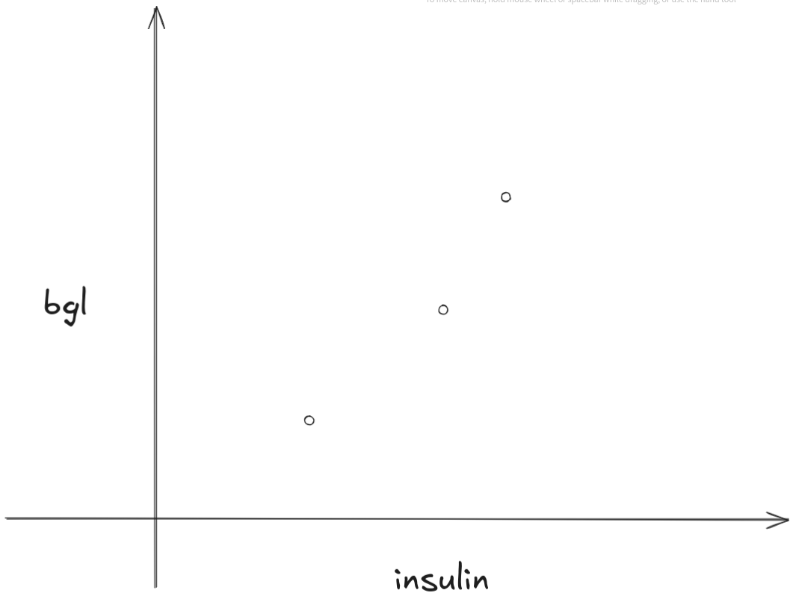

<details>

<summary>What does this tell us about the feature - is it useful to use it when training the model?</summary>

Yep! It is very much positively correlated with the target, thus we could even say, we only need this one feature to create our model!

</details>

<details>

<summary>What would be the geometric equivalent to our model (if we were to draw the model, what would it be)?</summary>

It'd have to be the line of best fit - the one that comes as close as possible to the actual blood glucose levels:

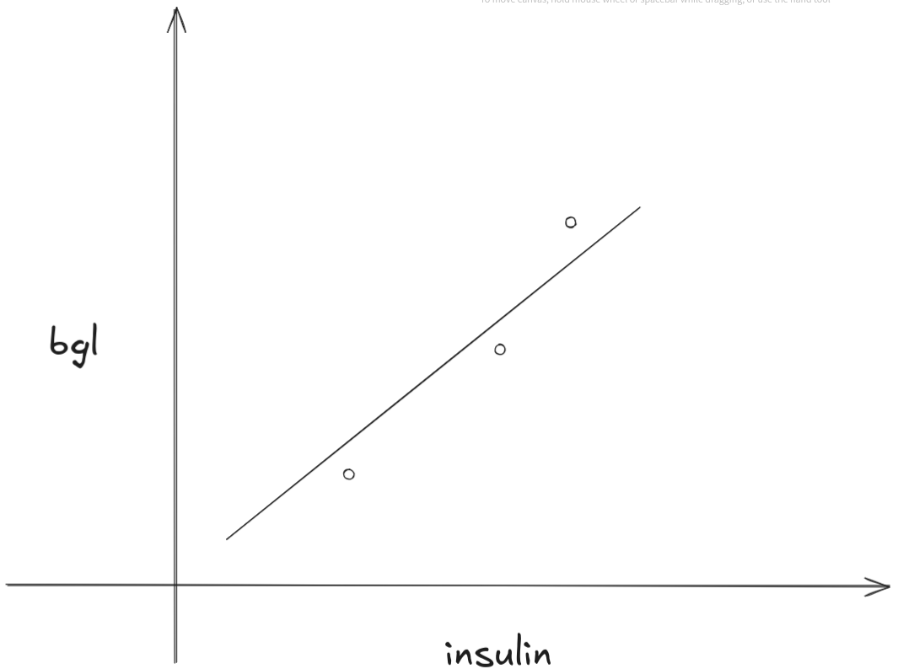

</details>

<details>

<summary>What is linear regression then?</summary>

A **statistical model** that estimates the **relationship** between a scalar response (dependent variable) and one or more explanatory variables (regressor or independent variable).

The method through which that model is created is called **regression analysis**.

> **Note**: At least **some** relationship **must exist** in order for us to conclude that we can use a regression model for this task.

</details>

## Regression mechanics

Let's see how we can obtain this line.

We'll need to small recap of Linear Algebra to see how things are related.

At the heart of Linear Algebra is the **linear transformation**.

<details>

<summary>What are transformations in the context of Linear Algebra?</summary>

Any function that takes a **single vector as input** and **outputs a single vector**.

The word `transformation` suggests that we think in terms of **movement** in $n$-d space.

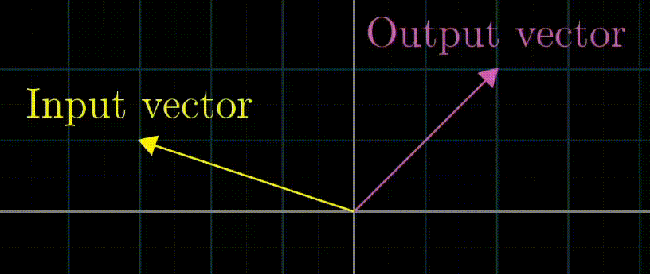

</details>

<details>

<summary>What are linear transformations?</summary>

Transformations that keep grid lines **parallel** and **evenly spaced**.


</details>

<details>

<summary>What is a matrix?</summary>

A numerical description of a linear transformation.


</details>

<details>

<summary>What does it mean visually for a matrix to have linearly dependent columns?</summary>

The vectors on which the basis vectors land on are scaled versions of each other:


</details>

<details>

<summary>What is the visual interpretation of the determinant of a matrix?</summary>


</details>

<details>

<summary>What is the definition of the determinant of a matrix then?</summary>

The factor by which a linear transformation changes areas.

To recap the formulas used to compute the determinants, we can refer to the [Wikipedia page](https://en.wikipedia.org/wiki/Determinant).

</details>

<details>

<summary>When is the determinant zero?</summary>

When the columns of the matrix are linearly dependent.


</details>

<details>

<summary>What is the inverse of a matrix?</summary>

In general, $A^{-1}$ is the unique transformation with the property that if you apply the transformation $A$, and follow it with the transformation $A$ inverse, you end up back where you started.


</details>

<details>

<summary>Why is the inverse helpful?</summary>

It allows us to solve linear systems of equations.

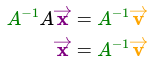

</details>

<details>

<summary>Which matrices are not invertible?</summary>

The ones that have a determinant of $0$.

</details>

Let's say that we have $Ax = b$.

<details>

<summary>If A is not invertible, does that mean there is no solution?</summary>

A solution exists if and only if $b$ lies in the lower dimensional space or is the $0$ vector:

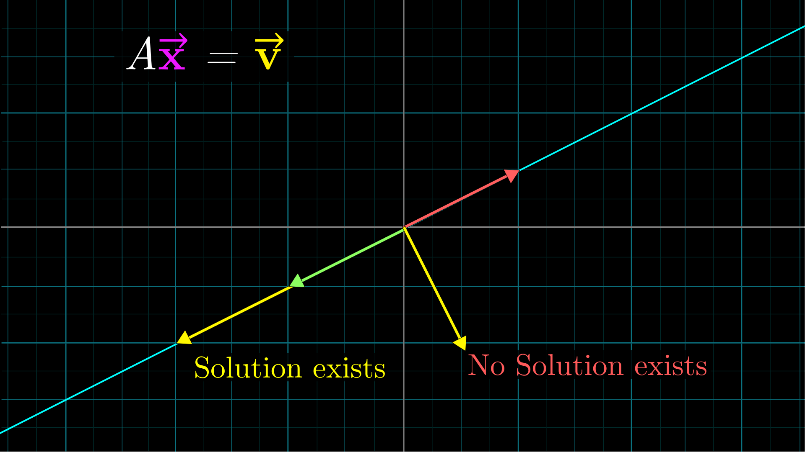

</details>

<details>

<summary>What is the "rank" of a matrix?</summary>

- The number of dimensions in the output of a transformation.
- The number of linearly independent columns.

</details>

What is the rank of this matrix?

$$
\begin{bmatrix}
1 & -2 & 4 \\
-2 & 4 & -8 \\
5 & -10 & 20
\end{bmatrix}
$$

<details>

<summary>Reveal answer</summary>

The columns of this matrix can be expressed as
\[
\begin{bmatrix}
1 \\ -2 \\ 5
\end{bmatrix}
= -\tfrac{1}{2}
\begin{bmatrix}
-2 \\ 4 \\ -10
\end{bmatrix}
= \tfrac{1}{4}
\begin{bmatrix}
4 \\ -8 \\ 20
\end{bmatrix}.
\]
Since they are all linearly dependent and form a line, the rank is $1$.

</details>

What's the dot product of $\left[\begin{smallmatrix}4\\6\end{smallmatrix}\right]$ and $\left[\begin{smallmatrix}-3\\2\end{smallmatrix}\right]$?

<details>

<summary>Reveal answer</summary>

$4(-3) + 6(2) = -12 + 12 = 0$

</details>

<details>

<summary>What does this mean for these vectors?</summary>

They are perpendicular to each other.

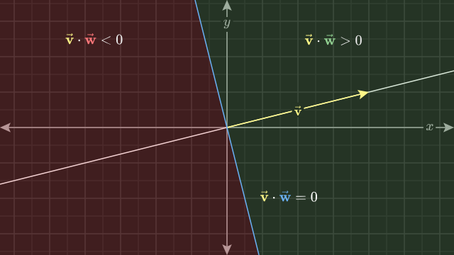

</details>

<details>

<summary>What is the geometric interpretation of the dot product?</summary>

We project one onto the other and take multiply their lengths:


</details>

<details>

<summary>What is relationship between dot products and matrix-vector multiplication?</summary>

The dual of a vector is the linear transformation it encodes, and the dual of a linear transformation from some space to one dimension is a certain vector in that space.

$$a \cdot b = a^Tb$$

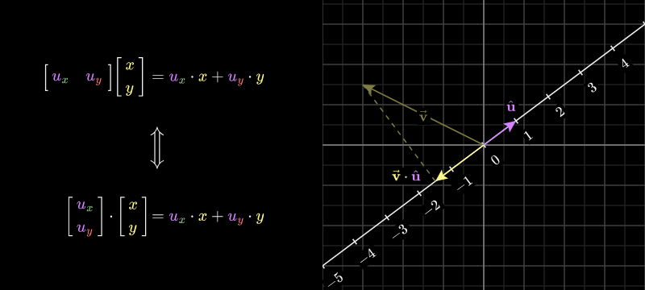

</details>

Ok, awesome, let's now go back to our example:


<details>

<summary>How can we write the above in the context of equations?</summary>

If we label the points as follows:

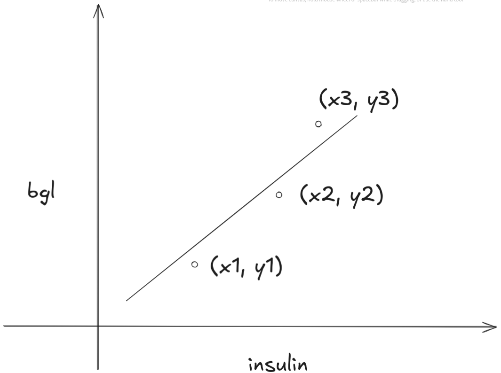

Then we can produce three equations:

$$
\begin{align*}
y_1 &= \beta_0 + \beta_1x_1 \\
y_2 &= \beta_0 + \beta_1x_2 \\
y_3 &= \beta_0 + \beta_1x_3
\end{align*}
$$

</details>

<details>

<summary>What can go wrong in the above equations?</summary>

We have three equations, but only $2$ unknowns. The system might be inconsistent, i.e. there doesn't exist a solution.

There might not be any single line that can pass through our datapoints (which as we can see is indeed the case).

</details>

<details>

<summary>What does this mean geometrically - how can we visualize the problem?</summary>

The columns of this matrix can be expressed as

\[
\begin{bmatrix}
y_1 \\ y_2 \\ y_3
\end{bmatrix}
= \beta_0
\begin{bmatrix}
1 \\ 1 \\ 1
\end{bmatrix} +
\beta_1
\begin{bmatrix}
x_1 \\ x_2 \\ x_3
\end{bmatrix}.
\]

And we'll see that actually **$y$ cannot be reached via a linear combination of the $1$s and the $x$s**:

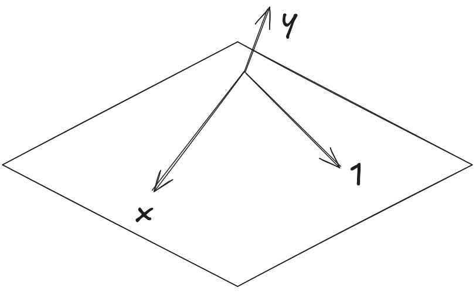

If there was a solution, then $y$ would lie in the plane.

</details>

<details>

<summary>Hmm - ok, this is a bummer - what can we do?</summary>

The strategy of least squares is:

1. Project $y$ onto the plane.
2. Choose $\beta$ values which can get us to that projection.

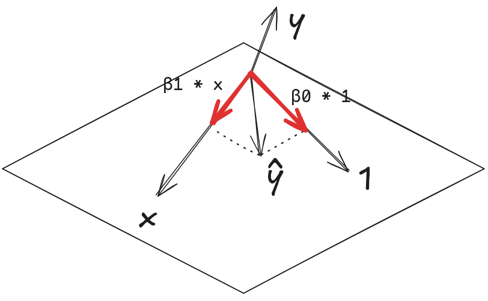

</details>

But, how do we choose this $\hat{y}$?

<details>

<summary>Reveal answer</summary>

Well, we want to get the best model, right?

So the question is "Which choice of $\hat{y}$ comes as close as possible to the actual $y$?".

It must be where the **rejection vector** ($y - \hat{y}$) is perpendicular to the plane. Any other choice would be farther away.

Minimizing this distance is why the method is referred to as *least squares*. The loss function we'll see shortly - sum of squared residuals is the squared length of this rejection vector.

</details>

Ok, so now we have $\hat{y}$ (orthogonal projection of $y$) - how do we compute the values for the $\beta$s?

<details>

<summary>Reveal answer</summary>

Since the projection and rejection are orthogonal to the plane, they are orthogonal to the vectors with $1$ and $x$:

$$(y - \hat{y}) \cdot 1 = 0$$

and

$$(y - \hat{y}) \cdot x = 0$$

Let's rearrange to get positive signs:

$$1 \cdot \hat{y} = 1 \cdot y$$

$$x \cdot \hat{y} = x \cdot y$$

We know what $\hat{y}$ is:

$$1 \cdot (\beta_01 + \beta_1x)= 1 \cdot y$$

$$x \cdot (\beta_01 + \beta_1x)= x \cdot y$$

Removing the parenthesis:

$$\beta_01 \cdot 1 + \beta_11 \cdot x = 1 \cdot y$$

$$\beta_0x \cdot 1 + \beta_1x \cdot x = x \cdot y$$

And we get to a matrix format:

\[
\begin{bmatrix}
1 \cdot 1 & 1 \cdot x \\ x \cdot 1 & x \cdot x
\end{bmatrix}
\begin{bmatrix}
\beta_0 \\ \beta_1
\end{bmatrix}
= \begin{bmatrix}
1 \cdot y \\ x \cdot y
\end{bmatrix}
\]

Let's use the dual property of vectors:

\[
\begin{bmatrix}
1^T 1 & 1^T x \\ x^T 1 & x^T x
\end{bmatrix}
\begin{bmatrix}
\beta_0 \\ \beta_1
\end{bmatrix}
= \begin{bmatrix}
1^T y \\ x^T y
\end{bmatrix}
\]

And we can further decompose the left-most matrix:

\[
\begin{bmatrix}
1^T \\ x^T
\end{bmatrix}
\begin{bmatrix}
1 & x
\end{bmatrix}
\begin{bmatrix}
\beta_0 \\ \beta_1
\end{bmatrix}
= \begin{bmatrix}
1^T y \\ x^T y
\end{bmatrix}
\]

And take out the repeating $y$:

\[
\begin{bmatrix}
1^T \\ x^T
\end{bmatrix}
\begin{bmatrix}
1 & x
\end{bmatrix}
\begin{bmatrix}
\beta_0 \\ \beta_1
\end{bmatrix}
= \begin{bmatrix}
1^T \\ x^T
\end{bmatrix} y
\]

Now, if we put all the features into their own matrix, we'll get the famous **normal equation** associated with $X\beta = y$:

\[
X=
\begin{bmatrix}
1 & x
\end{bmatrix}
\]

\[
X^T X
\begin{bmatrix}
\beta_0 \\ \beta_1
\end{bmatrix}
= X^T y
\]

</details>

<details>

<summary>What would be the formula for our model's coefficients?</summary>

We'd have to invert:

\[
\begin{bmatrix}
\beta_0 \\ \beta_1
\end{bmatrix}
= (X^T X)^{-1} X^T y
\]

</details>

<details>

<summary>What would be the formula for the model's predictions?</summary>

We'll use the original formula we got:

$$\hat{y} = \beta_01 + \beta_1x$$

Convert it to a matrix form via the dual property:

\[
\hat{y}
= \begin{bmatrix}
1 & x
\end{bmatrix}
\begin{bmatrix}
\beta_0 \\ \beta_1
\end{bmatrix}
\]

And then substitute with what we just found, firstly the capital $X$:

\[
\hat{y}
= X
\begin{bmatrix}
\beta_0 \\ \beta_1
\end{bmatrix}
\]

And then the formula for the coefficients:

$$\hat{y} = X(X^T X)^{-1} X^T y$$

In addition, $X(X^T X)^{-1} X^T$ is the projection matrix.

</details>

Ok, great! So, everything is nice and easy, just solve the equation and we're good to go, right?

<details>

<summary>Right?</summary>

We'll, we have a small problem here / corner case. It is due to the assumption we're making about the matrix with the features $X$.

The above formula works only if $X^TX$ is **invertible**, i.e. has full rank / contains only independent columns.

</details>

<details>

<summary>Hmm - ok, but what if it's not?</summary>

We have several options here, the first of which we should apply in every situation:

1. Remove the collinear features. This would allows us to invert $X^TX$.
2. Compute the pseudoinverse of $X$ and use it instead.

I'd recommend to always be wary of the features we put into the model and never put collinear ones - that would mean we have redundant information which is irrelevant.

If you're curious to learn how we can compute and use the pseudoinverse of $X$, check out [this Wikipedia article](https://en.wikipedia.org/wiki/Moore%E2%80%93Penrose_inverse) and [this phenomenal lecture](https://www.youtube.com/watch?v=ZUU57Q3CFOU).

</details>

## Modelling via regression

Here are the actual first five rows:

|  idx | pregnancies | glucose | diastolic | triceps | insulin | bmi  | dpf   | age | diabetes |
| ---: | ----------- | ------- | --------- | ------- | ------- | ---- | ----- | --- | -------- |
|    0 | 6           | 148     | 72        | 35      | 0       | 33.6 | 0.627 | 50  | 1        |
|    1 | 1           | 85      | 66        | 29      | 0       | 26.6 | 0.351 | 31  | 0        |
|    2 | 8           | 183     | 64        | 0       | 0       | 23.3 | 0.672 | 32  | 1        |
|    3 | 1           | 89      | 66        | 23      | 94      | 28.1 | 0.167 | 21  | 0        |
|    4 | 0           | 137     | 40        | 35      | 168     | 43.1 | 2.288 | 33  | 1        |

<details>

<summary>What is simple linear regression?</summary>

Using one feature to predict the target:

$$y = ax + b$$

</details>

<details>

<summary>What would be an example of that type of regression with the given dataset?</summary>

Using (**only** the) `insulin` levels to predict the blood glucose levels.

</details>

<details>

<summary>What is multiple linear regression?</summary>

Using at least two features to predict the target:

$$y = a_1x_1 + a_2x_2 + a_3x_3 + \dots + a_nx_n + b$$

</details>

<details>

<summary>What would be an example of that type of regression with the given dataset?</summary>

Using `insulin` levels and the `diastolic` pressure to predict the blood glucose levels.

</details>

We need to decide which feature(s) to use.

<details>

<summary>How can we do it?</summary>

Two options:

- if we have experience in the field: we create the data audit file and based on it create **multiple hypothesis**. We then try them out and pick the features that lead to the model scoring highest on our metrics.
- if we do not have experience in the field: we create the data audit file and discuss it with domain experts (medical personnel, consultants with medical knowledge, clients). They'd guide us in what features make sense and which would end-up introducing more noise.

</details>

Let's say that we talk with internal consultants and they advise us to check whether there's any relationship between between blood glucose levels and body mass index. We plot them using a scatter plot:


We can see that, generally, as body mass index increases, blood glucose levels also tend to increase. This is great - we can use this feature to create our model.

### Data Preparation

To do simple linear regression we slice out the column `bmi` of `X` and use the `[[]]` syntax so that the result is a dataframe (i.e. two-dimensional array) which `scikit-learn` requires when fitting models.

```python
X_bmi = X[['bmi']]
print(X_bmi.shape, y.shape)
```

```console
(752, 1) (752,)
```

### Modelling

Now we're going to fit a regression model to our data.

We're going to use the model `LinearRegression`. It fits a straight line through our data.

```python
from sklearn.linear_model import LinearRegression

reg = LinearRegression()
reg.fit(X_bmi, y)

predictions = reg.predict(X_bmi)
```

## Model evaluation

### Visually

The most basic form of evaluation is the visual one:

```python
plt.scatter(X_bmi, y) # plot the true target values
plt.plot(X_bmi, predictions) # plot the predicted target values
plt.ylabel('Blood Glucose (mg/dl)')
plt.xlabel('Body Mass Index')
plt.show()
```


The black line represents the linear regression model's fit of blood glucose values against body mass index, which appears to have a weak-to-moderate positive correlation.

<details>

<summary>What is the baseline model in regression tasks?</summary>

The model that always predicts the mean target value in the training data.

</details>

### Using a metric

The default metric for linear regression is $R^2$.

It represents the proportion of variance (of $y$) that has been explained by the independent variables in the model.

If $\hat{y}_i$ is the predicted value of the $i$-th sample and $y_i$ is the corresponding true value for total $n$ samples, the estimated $R^2$ is defined as:

$$R^2(y, \hat{y}) = 1 - \frac{\sum_{i=1}^{n} (y_i - \hat{y}_i)^2}{\sum_{i=1}^{n} (y_i - \bar{y})^2}$$

where $\bar{y} = \frac{1}{n} \sum_{i=1}^{n} y_i$ and $\sum_{i=1}^{n} (y_i - \hat{y}_i)^2 = \sum_{i=1}^{n} \epsilon_i^2$.

Best possible score is $1.0$ and **it can be negative** (because the model can be arbitrarily worse).

Here are two plots visualizing high and low R-squared respectively:


To compute $R^2$ in `scikit-learn`, we can call the `.score` method of a linear regression class passing test features and targets. Let's say that for our task we get this:

```python
reg_all.score(X_test, y_test)
```

```console
0.356302876407827
```

<details>

<summary>Is this a good result?</summary>

No. Here the features only explain about 35% of blood glucose level variance.

</details>

<details>

<summary>What would be the score of the baseline model on the training set?</summary>

$0$, because it'll just predict the mean of the target.

$$R^2(y, \hat{y}) = 1 - \frac{\sum_{i=1}^{n} (y_i - \hat{y}_i)^2}{\sum_{i=1}^{n} (y_i - \bar{y})^2} = 1 - \frac{\sum_{i=1}^{n} (y_i - \bar{y})^2}{\sum_{i=1}^{n} (y_i - \bar{y})^2} = 1 - 1 = 0$$

> **Note**: we would still need to evaluate the baseline model on the test set, as the training and test set needn't have the same value for the mean.

</details>

#### Adjusted $R^2$ ($R_{adj}^2$)

Using $R^2$ could have downsides in some situations. In today's tasks you'll investigate what they are and how the extension $R_{adj}^2$ can help.

### Using a loss function

Another way to assess a regression model's performance is to take the mean of the residual sum of squares. This is known as the **mean squared error**, or (`MSE`).

> **Note**: `error` function = `loss` function = `cost` function.

$$MSE = \frac{1}{n} \sum (y_i - \hat{y_i})^2$$

`MSE` is measured in units of our target variable, squared. For example, if a model is predicting a dollar value, `MSE` will be in **dollars squared**.

This is not very easy to interpret. To convert to dollars, we can take the **square root** of `MSE`, known as the **root mean squared error**, or `RMSE`.

$$RMSE = \sqrt{MSE}$$

`RMSE` has the benefit of being in the same unit as the target variable.

To calculate the `RMSE` in `scikit-learn`, we can use the `root_mean_squared_error` function in the `sklearn.metrics` module.

<details>

<summary>What's the main difference then between metrics and loss functions?</summary>

- Metrics are maximized.
- Loss functions are minimized.

</details>

# Week 04 - Regularized Regression, Logistic Regression, Cross Validation

## Logistic Regression

### Binary classification

Let's say we want to predict whether a patient has diabetes. During our data audit we spot the following relationship:

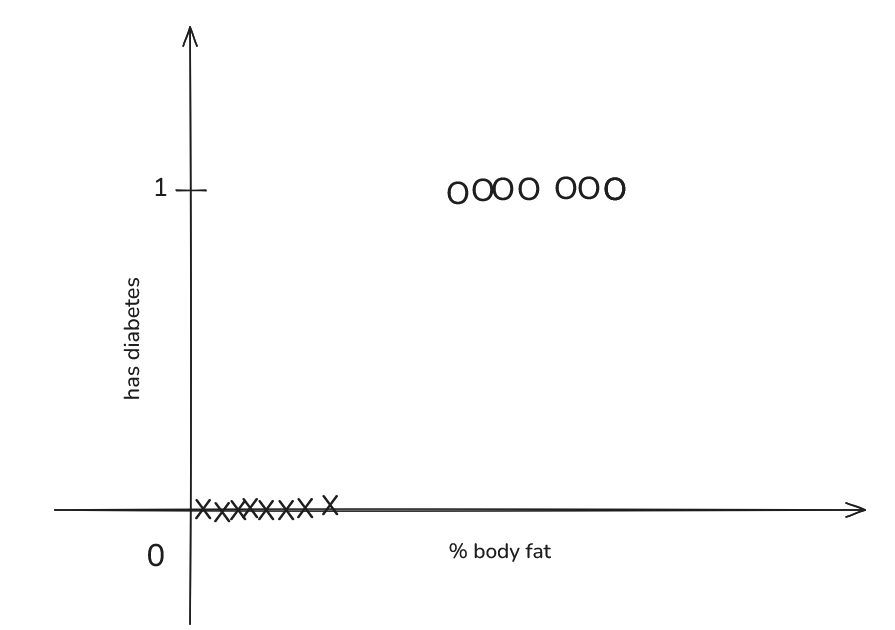

<details>

<summary>What are some examples of a working decision boundary for this task?</summary>

There are many lines that we could use:

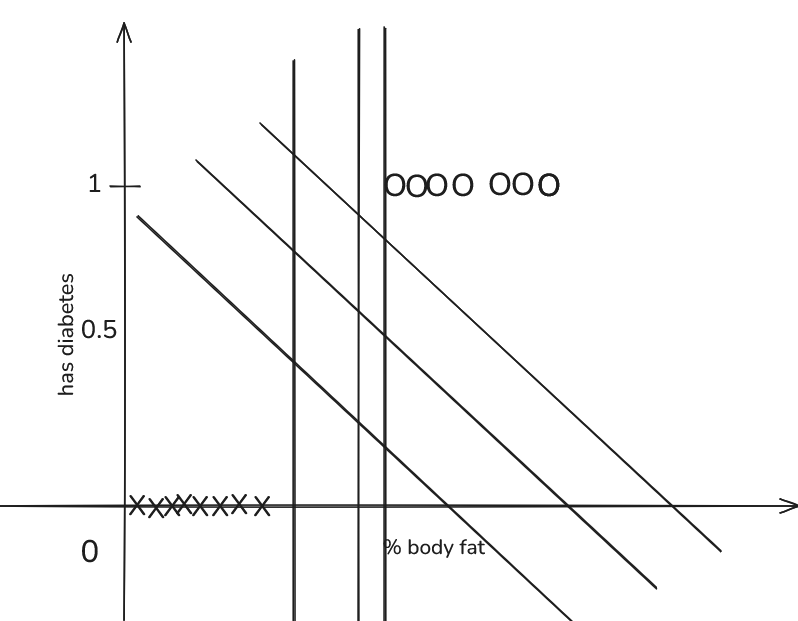

</details>

<details>

<summary>What model can we use from the ones we already know about that can solve this task?</summary>

- We could use KNN, but it is prone to overfitting if there are outliers:

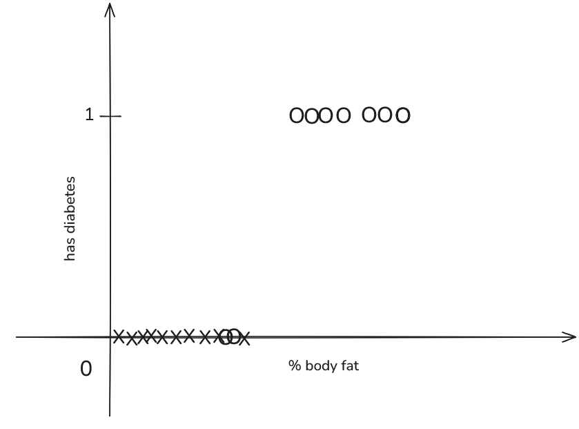

- We could also use linear regression, but if there are outliers it is going to get very skewed as well:

If the dataset is perfectly separable, maybe we could use a threshold:

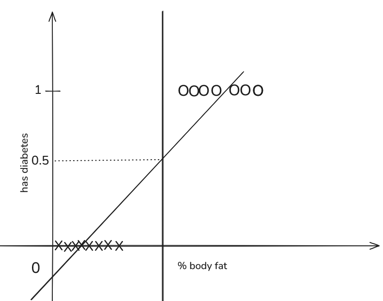

In this case we could say:

If $\beta^{T}x >= 0.5$, predict $y = 1$.
If $\beta^{T}x < 0.5$, predict $y = 0$.

But that solution would break if there's a single outlier:

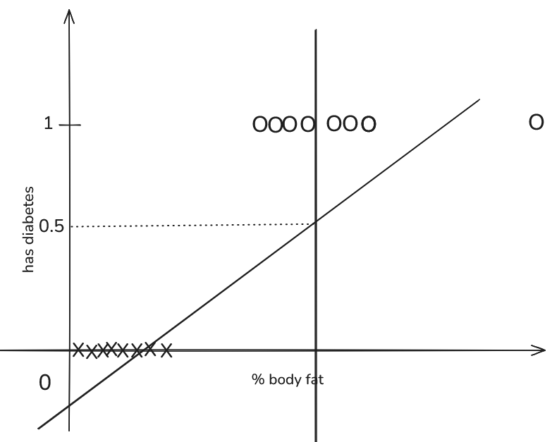

</details>

<details>

<summary>What other problem does linear regression have in relation to the y-axis?</summary>

It can output any value, actually - much greater than 1 and much less than 0.

</details>

<details>

<summary>So what should be output range of our desired model?</summary>

Ideally, we should get a confidence score / a probability. It spans the range $[0, 1]$ and would be very easy for us to threshold at $0.5$.

</details>

Well, this is that Logistic regression does. Note that despite its name, **it is a *classification* algorithm**, not a regression one.

$$0 <= h_{\beta}(x) <= 1$$

Hmm - so then we only have to define what $h_{\beta}(x)$ is.

<details>

<summary>Do you know what "h" is for logistic regression?</summary>

It's actually pretty close to the one for linear regression.

For linear regression we have: $\beta^{T}x$.
For logistic regression we have: $\sigma(\beta^{T}x)$, where $\sigma$ is the [sigmoid function](https://en.wikipedia.org/wiki/Sigmoid_function) also known as the logistic function:

$$\sigma(\beta^{T}x) = \frac{1}{1 + e^{-\beta^{T}x}}$$

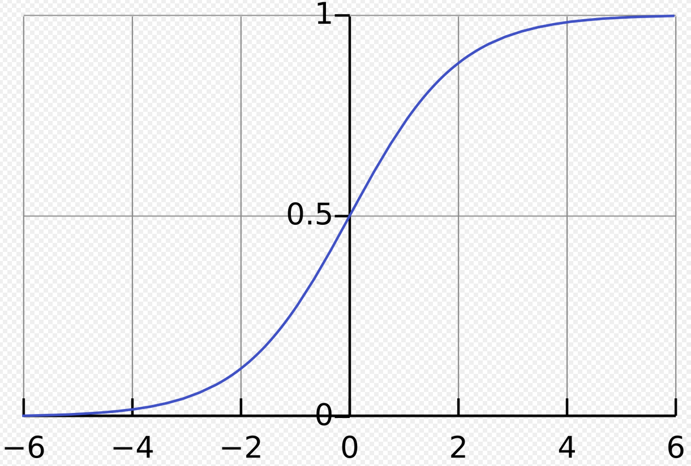

</details>

<details>

<summary>Seeing the graph, can you explain how the output of this model should be interpreted?</summary>

It is the estimated probability that $y = 1$ on input features $x$:

$$h_{\beta}(x) = P(y = 1 | x; \beta)$$

> **Note 1:** In `sklearn` and in our implementation this logic will be defined in a method `predict_proba`.
> **Note 2:** Typically, we have another method `predict` that does the threshold, typically at $0.5$, i.e. predict $y = 1$ if $h_{\beta}(x) >= 0.5$, and $y = 0$ otherwise.

</details>

<details>

<summary>What's your intuition - can logistic regression produce non-linear decision boundary?</summary>

It can! Unlike in linear regression, we can create a decision boundary in any shape that can be described by a polynomial:

Suppose that $h_{\beta}(x) = \sigma(\beta_0 + \beta_1x_1 + \beta_2x_2 + \beta_3x_{1}^{2} + \beta_4x_{2}^{2})$ and we get the following estimated parameters:

$$\beta_0=-1, \beta_1=0, \beta_2=0, \beta_3=1, \beta_4=1$$

> **Note:** We have correlated features here. This will not stop us from getting our parameters $\beta$, but like we said earlier - it is not encouraged, as they do not add predictive value.

Those coefficients actually describe a non-linear boundary ($x_{1}^{2} + x_{2}^{2} = 1$):

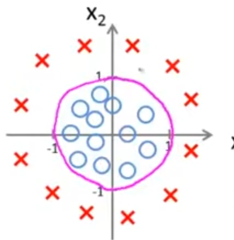

</details>

### Model fitting

Ok, great! We have a powerful model that we can use to create linear and non-linear decision boundaries. The question that remains is: *How do we train it? / How do we obtain the values for the coefficients $\beta$?*. Let's answer it in this section.

<details>

<summary>Last time we showed how we can "train" a linear regression model - what was the goal of this training that allowed us to obtain the best parameters?</summary>

We wanted to reduce the error rate, i.e. minimize the loss of the model which was expressed by the sum of the squared differences between predicted and actual values:

$$J(\beta) = \Sigma(y - \hat{y})^2$$

</details>

The strategy of logistic regression is to **maximize the likelihood of observing our target values**. It postulates that the best model parameters are the ones via which we can do $\beta^{T}x$ and get the target values.

<details>

<summary>Do you know what the formal name of this process that finds such coefficients is?</summary>

[Maximum likelihood estimation](https://en.wikipedia.org/wiki/Maximum_likelihood_estimation)!

From Wikipedia:

"... a method of estimating the parameters of an assumed probability distribution, given some observed data. This is achieved by maximizing a likelihood function so that, under the assumed statistical model, the observed data is most probable."

</details>

Perfect - let's then see whether we have these ingredients.

<details>

<summary>Do we have observed data?</summary>

Yes, this is any dataset for classification purposes.

</details>

<details>

<summary>Do we know what our model is?</summary>

Yes, it is:

$$h_{\beta}(x) = P(y = 1 | x; \beta) = \sigma(\beta^{T}x) = \frac{1}{1 + e^{-\beta^{T}x}}$$

</details>

<details>

<summary>Do we know the probability distribution of our target variable?</summary>

In the context of a single observation, it follows the [Bernoulli distribution](https://en.wikipedia.org/wiki/Bernoulli_distribution) - the distribution for 0s and 1s:

$$y_i \sim Ber(\sigma(\beta^{T}x))$$

</details>

<details>

<summary>Ok, what was P(y = 1)?</summary>

$$P(y = 1) = \sigma(\beta^{T}x) = h_{\beta}(x)$$

</details>

<details>

<summary>What is P(y = 0)?</summary>

$$P(y = 0) = 1 - \sigma(\beta^{T}x) = 1 - h_{\beta}(x)$$

</details>

<details>

<summary>How can we combine the above two equations into one that can show us the probability for either of the two classes for a single observation?</summary>

$$P(y_i) = h_{\beta}(x_i)^{y_i} (1 - h_{\beta}(x_i))^{1 - y_i}$$

</details>

Awesome!

<details>

<summary>What is the general form of the likelihood function?</summary>

$$L(\beta) = P(Y | X; \beta)$$

where $Y$ are our target labels and $X$ are the inputs.

</details>

<details>

<summary>Knowing that Y has a Bernoulli distribution, how can we express the likelihood function?</summary>

Our ($m$) observations are (assumed to be) independent, so this probability is equal to the product of the individual probabilities:

$$L(\beta) = P(Y | X; \beta) = \prod_{i=1}^{m} P(y_i) = \prod_{i=1}^{m} h_{\beta}(x_i)^{y_i} (1 - h_{\beta}(x_i))^{1 - y_i}$$

</details>

<details>

<summary>We're dealing with products of probabilities here - what's a problem that can occur?</summary>

It wouldn't be numerically stable for very small numbers (which we'll get from all those multiplications).

</details>

<details>

<summary>How can we deal with this?</summary>

We can instead maximize the **log likelihood** to get a sum of probabilities:

$$L(\beta) = \sum_{i=1}^{m} \left( \log h_{\beta}(x_i)^{y_i} + \log (1 - h_{\beta}(x_i))^{1 - y_i} \right)$$

After moving the powers to become a multiplier, we get:

$$L(\beta) = \sum_{i=1}^{m} \left( {y_i} \log h_{\beta}(x_i) + (1 - y_i) \log (1 - h_{\beta}(x_i)) \right)$$

</details>

Ok, perfect! So, now we just have to maximize this function and we'll get our parameters $\beta$.

<details>

<summary>But wait a minute - last time we minimized a function (the loss function), why are we maximizing now?</summary>

That's a fair question! We needn't maximize, actually.

</details>

<details>

<summary>How can we still find the best parameters, but without maximizing?</summary>

We can **minimize** the **negative log likelihood** instead!

$$J(\beta) = - \sum_{i=1}^{m} \left( {y_i} \log h_{\beta}(x_i) + (1 - y_i) \log (1 - h_{\beta}(x_i)) \right)$$

Further more we can scale this function, like we did with linear regression and the **mean** squared error to get the average loss per observation:

$$J(\beta) = -\frac{1}{m} \sum_{i=1}^{m} \left( {y_i} \log h_{\beta}(x_i) + (1 - y_i) \log (1 - h_{\beta}(x_i)) \right)$$

</details>

And this right here that we derived is referred to as the **binary cross-entropy** (or **log loss**) is a **loss** function! It is a special case of [the cross-entropy function](https://en.wikipedia.org/wiki/Cross-entropy) ($k = 2$):

$$L_{\log}(Y, \hat{P}) = -\log \operatorname{Pr}(Y|\hat{P}) = - \frac{1}{M} \sum_{i=0}^{M-1} \sum_{k=0}^{K-1} y_{i,k} \log \hat{p}_{i,k}$$

Great! Let's recap:

- Loss function for linear regression: $\frac{1}{m}\sum_{i=1}^{m}(y_i-\hat{y_i})^2$
- Loss function for logistic regression: $-\frac{1}{m} \sum_{i=1}^{m} \left( {y_i} \log h_{\beta}(x_i) + (1 - y_i) \log (1 - h_{\beta}(x_i)) \right)$

<details>

<summary>What would be our next steps?</summary>

1. Compute the first derivative of the loss.
2. Set it to $0$.
3. Solve.

</details>

<details>

<summary>What do we get from step 1?</summary>

The derivative of the log is:

$$\frac{d}{dx} \log(g(x)) = \frac{g'(x)}{g(x)}$$

so we get:

$$
\frac{\partial J(\beta)}{\partial \beta} = \frac{y}{h_{\beta}(x)} \frac{\partial h_{\beta}(x)}{\partial \beta} + \frac{1 - y}{1 - h_{\beta}(x)} (- \frac{\partial h_{\beta}(x)}{\partial \beta})
$$

> **Note:** Let's ignore the leading negative sign for now.

What's left is to calculate $\frac{\partial h_{\beta}(x)}{\partial \beta} = \frac{\partial \sigma(\beta^{T}x)}{\partial \beta}$:

$$\frac{\partial h_{\beta}(x)}{\partial \beta} = \frac{\partial h_{\beta}(x)}{\partial \beta^{T}x} * \frac{\partial \beta^{T}x}{\partial \beta}$$

We can show that:

$$\frac{\partial \beta^{T}x}{\partial \beta} = x$$

and with the derivative of the sigmoid (which is mathematically convenient):

$$\frac{\partial h_{\beta}(x)}{\partial \beta^{T}x} = h_{\beta}(x) (1 - h_{\beta}(x))$$

we get:

$$\frac{\partial h_{\beta}(x)}{\partial \beta} = h_{\beta}(x) (1 - h_{\beta}(x))x$$

Substituting above:

$$
\frac{\partial J(\beta)}{\partial \beta} = \frac{y}{h_{\beta}(x)} h_{\beta}(x) (1 - h_{\beta}(x))x - \frac{1 - y}{1 - h_{\beta}(x)} h_{\beta}(x) (1 - h_{\beta}(x))x
$$

We can cancel some of the elements:

$$
\frac{\partial J(\beta)}{\partial \beta} = y (1 - h_{\beta}(x))x - (1 - y) h_{\beta}(x) x = yx - yx h_{\beta}(x) - h_{\beta}(x)x + h_{\beta}(x) x y = yx - h_{\beta}(x)x
$$

And we get:

$$
\frac{\partial J(\beta)}{\partial \beta} = (y - h_{\beta}(x))x = (y - \hat{y})x
$$

After taking into account the negative sign we ignored in the beginning, we obtain the final result:

$$
\frac{\partial J(\beta)}{\partial \beta} = (\hat{y} - y)x
$$

</details>

And now we have to set to $0$ and solve.

Except ...

We have a little bit of a problem - there's no closed-form solution, i.e. there is no exact formula that we can obtain. So, we kinda get into the situation with the invertible matrices last time.

<details>

<summary>From the approaches we mentioned last time, which one do you think we'll use?</summary>

We have several options now, but all of them are based on **approximation**:

- fancy algorithms: `sklearn` comes with them - `lbfgs`, `liblinear`, `newton-cg`, `newton-cholesky`, `sag`, `saga`, etc.
- gradient descent.

Let's go with gradient descent.

</details>

<details>

<summary>Do you know what its pseudocode looks like?</summary>

betas = ... initialize with small values around 0... <- this is our starting solution

for i in range(max_iter):
  betas = betas - learning_rate * dJ(beta)

</details>

To monitor the algorithm for converging, you could output the (training) loss at every step.

<details>

<summary>Why - what value would it have?</summary>

It should decrease if we're training properly.

</details>

And that's it! We'll probably not be able to obtain zero loss - again, this is ok so long as our approximation is the best we can do.

### Multiclass classification

<details>

<summary>Do you know how we can solve this?</summary>

We have two main strategies to choose from:

- One-vs-rest logistic regression.
- Multinomial logistic regression.

</details>

<details>

<summary>Do you know how the first one works?</summary>

We create $N$ models, each being an expert for its own class. For a new observation we take the prediction of the most confident model.

</details>

<details>

<summary>Do you know how the second one works?</summary>

We create a model that outputs $N$ probability values. This is more akin to neural networks (for which we'll talking about later in the course), so we'll skip it for now.

</details>

In this week's implementation we'll use the one-vs-rest (`ovr`) strategy.

To convert the raw output values, we'll use the softmax function:

$$softmax(z_i) = \frac{e^{z_{i}}}{\sum_{j=1}^K e^{z_{j}}} \ \ \ for\ i=1,2,\dots,K$$

### Logistic regression in `scikit-learn`

<details>

<summary>Have you heard about the iris dataset?</summary>

- The [`iris` dataset](https://scikit-learn.org/stable/auto_examples/datasets/plot_iris_dataset.html) is a collection of measurements of many [iris plants](https://en.wikipedia.org/wiki/Iris_flower_data_set).
- Three species of iris:
  - *setosa*;
  - *versicolor*;
  - *virginica*.
- Features: petal length, petal width, sepal length, sepal width.

Iris setosa:


Iris versicolor:


Iris virginica:


</details>

In scikit-learn logistic regression is implemented in the [`sklearn.linear_model`](https://scikit-learn.org/stable/modules/generated/sklearn.linear_model.LogisticRegression.html#logisticregression) module:

```python
from sklearn.datasets import load_iris
from sklearn.linear_model import LogisticRegression
X, y = load_iris(return_X_y=True)
print(f'Possible classes: {set(y)}')
clf = LogisticRegression(random_state=0).fit(X, y)
clf.predict(X[:2, :])
```

```console
Possible classes: {0, 1, 2}
array([0, 0])
```

> **Note:** The hyperparameter `C` is the inverse of the regularization strength - larger `C` means less regularization and smaller `C` means more regularization.

```python
clf.predict_proba(X[:2]) # probabilities of each instance belonging to each of the three classes
```

```console
array([[9.81780846e-01, 1.82191393e-02, 1.44184120e-08],
       [9.71698953e-01, 2.83010167e-02, 3.01417036e-08]])
```

```python
clf.predict_proba(X[:2])[:, 2] # probabilities of each instance belonging to the third class only
```

```console
array([1.44184120e-08, 3.01417036e-08])
```

```python
clf.score(X, y) # returns the accuracy
```

```console
0.97
```

## Regularized Regression

### Regularization

<details>

<summary>Have you heard of regularization?</summary>

Regularization is a technique used to avoid overfitting. It can be applied in any task - classification or regression.


Its main idea is to reduce the size / values of model parameters / coefficients as large coefficients lead to overfitting.

Linear regression models minimize a loss function to choose a coefficient - $a$, for each feature, and an intercept - $b$. When we apply regularization to them, we "extend" the loss function, adding one more variable to the sum, that grows in value as coefficients grow.

</details>

### Ridge Regression

The first type of regularized regression that we'll look at is called `Ridge`. With `Ridge`, we use the `Ordinary Least Squares` loss function plus the squared value of each coefficient, multiplied by a constant - `alpha`.

$$J = \sum_{i=1}^n(y_i - \hat{y_i})^2 + \alpha \sum_{i=1}^na_i^2$$

> **Note:** We usually do not apply regularization to the bias term.

So, when minimizing the loss function, models are penalized both *for creating a line that's far from the ideal one* **and** *for coefficients with large positive or negative values*.

When using `Ridge`, we need to choose the `alpha` value in order to fit and predict.

- we can select the `alpha` for which our model performs best;
- picking alpha for `Ridge` is similar to picking `k` in `KNN`;
- multiple experiments with different values required - choose local minimum; hope it is the global one.

`Alpha` controls model complexity. When alpha equals `0`, we are performing `OLS`, where large coefficients are not penalized and overfitting *may* occur. A high alpha means that large coefficients are significantly penalized, which *can* lead to underfitting (we're making our model dumber).

`Scikit-learn` comes with a ready-to-use class for Ridge regression - check it out [here](https://scikit-learn.org/stable/modules/generated/sklearn.linear_model.Ridge.html#ridge).

The geometric interpretation is similar to the one we showed last time with the only change being that now the projection is not orthogonal since we're not allowed to use the full scale of the feature vectors:

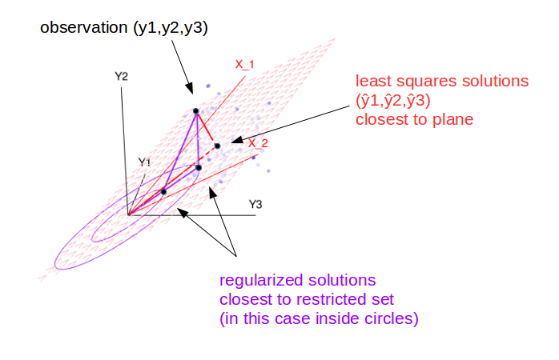

It can be shown that the best parameters for ridge regression can be obtained if we solve the following equation:

$$
\hat{\beta}_{ridge} = (X^{\top} X + \lambda D)^{-1} X^{\top} y, \quad
D = \text{diag}(0, 1, 1, \dots, 1)
$$

> **Note:** Adding $\lambda D$ **ensures the matrix is invertible** (even if $X^{\top} X$ is singular).

### Lasso Regression

There is another type of regularized regression called Lasso, where our loss function is the `OLS` loss function plus the absolute value of each coefficient multiplied by some constant - `alpha`:

$$J = \sum_{i=1}^n(y_i - \hat{y_i})^2 + \alpha \sum_{i=1}^n|a_i|$$

`Scikit-learn` also comes with a ready-to-use class for Lasso regression - check it out [here](https://scikit-learn.org/stable/modules/generated/sklearn.linear_model.Lasso.html#lasso).

### Feature Importance

Feature importance is the amount of added value that a feature provides to a model when that model is trying to predict the target variable. The more important a feature is, the better it is to be part of a model.

Assessing the feature importance of all features can be used to perform **feature selection** - choosing which features will be part of the final model.

### Lasso Regression and Feature Importance

Lasso regression can actually be used to assess feature importance. This is because **it shrinks the coefficients of less important features to `0`**. The features whose coefficients are not shrunk to `0` are, essentially, selected by the lasso algorithm - when summing them up, **the coefficients act as weights**.

Here's how this can be done in practice:

```python
lasso = Lasso(alpha=0.1)
lasso_coef = lasso.fit(X, y).coef_
plt.bar(columns, lasso_coef)
plt.xticks(rotation=45)
plt.show()
```


We can see that the most important predictor for our target variable, `blood glucose levels`, is the binary value for whether an individual has `diabetes` or not! This is not surprising, but is a great sanity check.

Benefits:

- allows us to communicate results to non-technical audiences (stakeholders, clients, management);
- helps us eliminate non-important features when we have too many;
- identifies which factors are important predictors for various physical phenomena.

For Lasso there is no simple matrix inverse like Ridge. We'll have to use gradient descent again.

The function we're minimizing is:

$$
\hat{\beta}_{lasso} = \arg \min_{\beta} \Bigg( \| y - X\beta \|^2 + \lambda \sum_{j=1}^{p} |\beta_j| \Bigg), \quad \text{with } \beta_0 \text{ (bias) not regularized.}
$$

So our update step would be:

$$
\beta_j^{(t+1)} = \beta_j^{(t)} - \alpha \Bigg( \frac{1}{m} \sum_{i=1}^m (h_\beta(x_i) - y_i) x_{ij} + \lambda \cdot \text{sign}(\beta_j^{(t)}) \Bigg)
$$

Since the modulo operator is not differentiable at $0$, we'll have to use the sign of the coefficient:

$$
\text{sign}(\beta) =
\begin{cases}
+1 & \text{if } \beta > 0 \\
-1 & \text{if } \beta < 0 \\
\text{any value in } [-1, 1] & \text{if } \beta = 0 & \text{(we'll choose 0 to create the sparcity)}
\end{cases}
$$

## Classification Metrics

### A problem with using `accuracy` always

**Situation:**

A bank contacts our company and asks for a model that can predict whether a bank transaction is fraudulent or not.

Keep in mind that in practice, 99% of transactions are legitimate and only 1% are fraudulent.

> **Definition:** The situation where classes are not equally represented in the data is called ***class imbalance***.

**Problem:**

<details>

<summary>Do you see any problems with using accuracy as the primary metric here?</summary>

The accuracy of a model that predicts every transaction as legitimate is `99%`.

</details>

**Solution:**

<details>

<summary>How do we solve this?</summary>

We have to use other metrics that put focus on the **per-class** performance.

</details>

<details>

<summary>What can we measure then?</summary>

We have to count how the model treats every observation and define the performance of the model based on the number of times that an observation:

- is positive and the model predicts it to be negative;
- or is negative and the model predicts it to be positive;
- or the model predicts its class correctly.

We can store those counts in a table:


> **Definition:** A **confusion matrix** is a table that is used to define the performance of a classification algorithm.

- Across the top are the predicted labels, and down the side are the actual labels.
- Usually, the class of interest is called the **positive class**. As we aim to detect fraud, **the positive class is an *illegitimate* transaction**.
  - The **true positives** are the number of fraudulent transactions correctly labeled;
  - The **true negatives** are the number of legitimate transactions correctly labeled;
  - The **false negatives** are the number of legitimate transactions incorrectly labeled;
  - And the **false positives** are the number of transactions incorrectly labeled as fraudulent.

</details>

**Benefit:**

<details>

<summary>We can retrieve the accuracy. How?</summary>

It's the sum of true predictions divided by the total sum of the matrix.


</details>

<details>

<summary>Do you know what precision is?</summary>

`precision` is the number of true positives divided by the sum of all positive predictions.

- also called the `positive predictive value`;
- in our case, this is the number of correctly labeled fraudulent transactions divided by the total number of transactions classified as fraudulent:


- **high precision** means having a **lower false positive rate**. For our classifier, it means predicting most fraudulent transactions correctly.

$$FPR = \frac{FP}{FP + TN}$$

</details>

<details>

<summary>Do you know what recall is?</summary>

`recall` is the number of true positives divided by the sum of true positives and false negatives

- also called `sensitivity`;


- **high recall** reflects a **lower false negative rate**. For our classifier, this translates to fewer legitimate transactions being classified as fraudulent.

$$FNR = \frac{FN}{TP + FN}$$

Here is a helpful table that can serve as another example:


</details>

<details>

<summary>Do you know what the f1-score is?</summary>

The `F1-score` is the harmonic mean of precision and recall.

- gives equal weight to precision and recall -> it factors in both the number of errors made by the model and the type of errors;
- favors models with similar precision and recall;
- useful when we are seeking a model which performs reasonably well across both metrics.


Another interpretation of the link between precision and recall:


Why is the harmonic mean used? Since both precision and recall are rates (ratios) between `0` and `1`, the harmonic mean helps balance these two metrics by considering their reciprocals. This ensures that a low value in either one has a significant impact on the overall `F1` score, thus incentivizing a balance between the two.

</details>

### Confusion matrix in scikit-learn

We can use the [`confusion_matrix`](https://scikit-learn.org/stable/modules/generated/sklearn.metrics.confusion_matrix.html#confusion-matrix) function in `sklearn.metrics`:

```python
from sklearn.metrics import confusion_matrix
y_true = [2, 0, 2, 2, 0, 1]
y_pred = [0, 0, 2, 2, 0, 2]
confusion_matrix(y_true, y_pred)
```

```console
array([[2, 0, 0],
       [0, 0, 1],
       [1, 0, 2]])
```

We can also use the `from_predictions` static function of the [`ConfusionMatrixDisplay`](https://scikit-learn.org/stable/modules/generated/sklearn.metrics.ConfusionMatrixDisplay.html#confusionmatrixdisplay) class, also in `sklearn.metrics` to plot the matrix:

```python
import matplotlib.pyplot as plt
from sklearn.metrics import ConfusionMatrixDisplay
y_true = [2, 0, 2, 2, 0, 1]
y_pred = [0, 0, 2, 2, 0, 2]
ConfusionMatrixDisplay.from_predictions(y_true, y_pred)
plt.tight_layout()
plt.show()
```


We can get the discussed metrics from the confusion matrix, by calling the [`classification_report`](https://scikit-learn.org/stable/modules/generated/sklearn.metrics.classification_report.html#classification-report) function in `sklearn.metrics`:

```python
from sklearn.metrics import classification_report
y_true = [0, 1, 2, 2, 2]
y_pred = [0, 0, 2, 2, 1]
target_names = ['class 0', 'class 1', 'class 2']
print(classification_report(y_true, y_pred, target_names=target_names))
```

```console
              precision    recall  f1-score   support

     class 0       0.50      1.00      0.67         1
     class 1       0.00      0.00      0.00         1
     class 2       1.00      0.67      0.80         3

    accuracy                           0.60         5
   macro avg       0.50      0.56      0.49         5
weighted avg       0.70      0.60      0.61         5
```

```python
y_pred = [1, 1, 0]
y_true = [1, 1, 1]
print(classification_report(y_true, y_pred, labels=[1, 2, 3]))
```

```console
              precision    recall  f1-score   support

           1       1.00      0.67      0.80         3
           2       0.00      0.00      0.00         0
           3       0.00      0.00      0.00         0

   micro avg       1.00      0.67      0.80         3
   macro avg       0.33      0.22      0.27         3
weighted avg       1.00      0.67      0.80         3
```

`Support` represents the number of instances for each class within the true labels. If the column with `support` has different numbers, then we have class imbalance.

- `macro average` = $\frac{F1_{class1} + F1_{class2} + F1_{class3}}{3}$
- `weighted average` = $\frac{F1_{class1}*SUPPORT_{class1} + F1_{class2}*SUPPORT_{class2} + F1_{class3}*SUPPORT_{class3}}{3}$
- `micro average` = $\frac{F1_{class1}*SUPPORT_{class1} + F1_{class2}*SUPPORT_{class2} + F1_{class3}*SUPPORT_{class3}}{SUPPORT_{class1} + SUPPORT_{class2} + SUPPORT_{class3}}$

## The receiver operating characteristic curve (`ROC` curve)

<details>

<summary>Do you know what the ROC curve shows?</summary>

> **Note:** Use the `ROC` curve only when doing ***binary* classification**.

The default probability threshold for logistic regression in scikit-learn is `0.5`. What happens as we vary this threshold?

We can use a receiver operating characteristic, or ROC curve, to visualize how different thresholds affect `true positive` and `false positive` rates.


The dotted line represents a random model - one that randomly guesses labels.

When the threshold:

- equals `0` (`p=0`), the model predicts `1` for all observations, meaning it will correctly predict all positive values, and incorrectly predict all negative values;
- equals `1` (`p=1`), the model predicts `0` for all data, which means that both true and false positive rates are `0` (nothing gets predicted as positive).


If we vary the threshold, we get a series of different false positive and true positive rates.


A line plot of the thresholds helps to visualize the trend.


<details>

<summary>What plot would be produced by the perfect model?</summary>

One in which the line goes straight up and then right.


</details>

</details>

### In `scikit-learn`

In scikit-learn the `roc_curve` is implemented in the `sklearn.metrics` module.

```python
import numpy as np
from sklearn import metrics
y = np.array([1, 1, 2, 2])
scores = np.array([0.1, 0.4, 0.35, 0.8])
fpr, tpr, thresholds = metrics.roc_curve(y, scores, pos_label=2)

fpr
```

```console
array([0. , 0. , 0.5, 0.5, 1. ])
```

```python
tpr
```

```console
array([0. , 0.5, 0.5, 1. , 1. ])
```

```python
thresholds
```

```console
array([ inf, 0.8 , 0.4 , 0.35, 0.1 ])
```

To plot the curve can create a `matplotlib` plot or use a built-in function.

Using `matplotlib` would look like this:

```python
plt.plot([0, 1], [0, 1], 'k--') # to draw the dashed line
plt.plot(fpr, tpr)
plt.ylabel('True Positive Rate')
plt.xlabel('False Positive Rate')
plt.title('Logistic Regression ROC Curve')
plt.show()
```


We could also use the `from_predictions` function in the `RocCurveDisplay` class to create plots.

```python
import matplotlib.pyplot as plt
from sklearn.metrics import RocCurveDisplay
RocCurveDisplay.from_predictions(y, scores)
plt.tight_layout()
plt.show()
```


<details>

<summary>The above figures look great, but how do we quantify the model's performance based on them?</summary>

### The Area Under the Curve (`AUC`)

If we have a model with `true_positive_rate=1` and `false_positive_rate=0`, this would be the perfect model.

Therefore, we calculate the area under the ROC curve, a **metric** known as `AUC`. Scores range from `0` to `1`, with `1` being ideal.

In the below figure, the model scores `0.67`, which is `34%` better than a model making random guesses.


### In `scikit-learn`

In scikit-learn the area under the curve can be calculated in two ways.

Either by using the `RocCurveDisplay.from_predictions` function:


or by using the `roc_auc_score` function in the `sklearn.metrics` module:

```python
from sklearn.metrics import roc_auc_score
print(roc_auc_score(y_test, y_pred_probs))
```

```console
0.6700964152663693
```

</details>

## Cross Validation

Currently, we're using train-test split to compute model performance.

<details>

<summary>What are the potential downsides of using train-test split?</summary>

1. Model performance is dependent on the way we split up the data: we may get different results if we do another split.
2. The data points in the test set may have some peculiarities: the R-squared computed on it is not representative of the model's ability to generalize to unseen data.
3. The points in the test set will never be used for training the model: we're missing out on potential benefits.

</details>

<details>

<summary>Have you heard of the technique called cross-validation?</summary>

It is a vital approach to evaluating a model. It maximizes the amount of data that is available to the model, as the model is not only trained but also tested on all of the available data.

Here's a visual example of what cross-validation comprises of:


We begin by splitting the dataset into `k` groups or folds - ex. `5`. Then we set aside the first fold as a test set, fit our model on the remaining four folds, predict on our test set, and compute the metric of interest, such as R-squared.

Next, we set aside the second fold as our test set, fit on the remaining data, predict on the test set, and compute the metric of interest.


Then similarly with the third fold, the fourth fold, and the fifth fold. As a result we get five values of R-squared from which we can compute statistics of interest, such as the mean, median, and 95% confidence intervals.


Usually the value for `k` is either `5` or `10`.

</details>

<details>

<summary>What is the trade-off of using cross-validation compared to train-test split?</summary>

Using more folds is more computationally expensive. This is because we're fitting and predicting multiple times, instead of just `1`.

</details>

To perform k-fold cross-validation in `scikit-learn`, we can use the function [`cross_val_score`](https://scikit-learn.org/stable/modules/generated/sklearn.model_selection.cross_val_score.html#cross-val-score) and the class [`KFold`](https://scikit-learn.org/stable/modules/generated/sklearn.model_selection.KFold.html#kfold) that are part of `sklearn.model_selection`.

- the `KFold` class allows us to set a seed and shuffle our data, making our results repeatable downstream. The `n_splits` argument has a default of `5`, but in this case we assign `2`, allowing us to use `2` folds from our dataset for cross-validation. We also set `shuffle=True`, which shuffles our dataset **before** splitting into folds. We assign a seed to the `random_state` keyword argument, ensuring our data would be split in the same way if we repeat the process making the results repeatable downstream. We save this as the variable `kf`.

```python
X = np.array([[1, 2], [3, 4], [1, 2], [3, 4]])
y = np.array([1, 2, 3, 4])

kf = KFold(n_splits=2, shuffle=True, random_state=42)

print(list(kf.split(X)))
print(list(kf.split(y)))
```

```console
[(array([0, 2]), array([1, 3])), (array([1, 3]), array([0, 2]))]
[(array([0, 2]), array([1, 3])), (array([1, 3]), array([0, 2]))]
```

The result is a list of tuples of arrays with training and testing indices. In this case, we would use elements at indices `0` and `2` to train a model and evaluate it on elements at indices `1` and `3`.

- in practice, you wouldn't call `kf.split` directly. Instead, you would pass the `kf` object to `cross_val_score`. It accepts a model, feature data and target data as the first three positional arguments. We also specify the number of folds by setting the keyword argument `cv` equal to our `kf` variable.

```python
cv_results = cross_val_score(linear_reg, X, y, cv=kf)
print(cv_results)

# we can calculate the 95% confidence interval passing our results followed by a list containing the upper and lower limits of our interval as decimals 
print(np.quantile(cv_results, [0.025, 0.975]))
```

```console
[0.70262578, 0.7659624, 0.75188205, 0.76914482, 0.72551151, 0.736]
array([0.7054865, 0.76874702])
```

This returns an array of cross-validation scores, which we assign to `cv_results`. The length of the array is the number of folds utilized.

> **Note:** the reported score is the result of calling `linear_reg.score`. Thus, when the model is linear regression, the score reported is $R^2$.

## Hyperparameter optimization/tuning

### Hyperparameters

<details>

<summary>What are hyperparameters?</summary>

A hyperparameter is a variable used for selecting a model's parameters.

</details>

<details>

<summary>What are some examples?</summary>

- $a$ in `Ridge`;
- $k$ in `KNN`.

</details>

### Introduction

Recall that we had to choose a value for `alpha` in ridge and lasso regression before fitting it.

Likewise, before fitting and predicting `KNN`, we choose `n_neighbors`.

> **Definition:** Parameters that we specify before fitting a model, like `alpha` and `n_neighbors`, are called **hyperparameters**.

<details>

<summary>So, a fundamental step for building a successful model is choosing the correct hyperparameters. What's the best way to go about achieving this?</summary>

We can try lots of different values, fit all of them separately, see how well they perform, and choose the best values!

> **Definition:** The process of trying out different hyperparameters until a satisfactory performance threshold is reached is called **hyperparameter tuning**.

</details>

When fitting different hyperparameter values, we use cross-validation to avoid overfitting the hyperparameters to the test set:

- we split the data into train and test;
- and perform cross-validation on the training set.

We withhold the test set and use it only for evaluating the final, tuned model.

> **Definition:** The set on which the model is evaluated on during cross-validation is called the **validation set**.

Notice how:

- the training set is used to train the model;
- the validation set is used to tune the model until a satisfactory performance threshold is used;
- the test set is used as the final set on which model performance is reported. It is data that the model hasn't seen, but because it is labeled, we can use to evaluate the performance eliminating bias.

### Grid search cross-validation

<details>

<summary>Do you know what grid search cross-validation comprises of?</summary>

One approach for hyperparameter tuning is called **grid search**, where we choose a grid of possible hyperparameter values to try. In Python this translates to having a dictionary that maps strings to lists/arrays of possible values to choose from.

For example, we can search across two hyperparameters for a `KNN` model - the type of metric and a different number of neighbors. We perform `k`-fold cross-validation for each combination of hyperparameters. The mean scores (in this case, accuracies) for each combination are shown here:


We then choose hyperparameters that performed best:


To get a list of supported values for the model we're building, we can use the scikit-learn documentation. For example, in the documentation for [logistic regression](https://scikit-learn.org/stable/modules/generated/sklearn.linear_model.LogisticRegression.html#logisticregression), the possible values for the `solver` parameter can be seen as one scrolls down the page.

### In `scikit-learn`

`scikit-learn` has an implementation of grid search using cross-validation in the `sklearn.model_selection` module:

```python
from sklearn.model_selection import GridSearchCV

# instantiate a `KFold` object

param_grid = {
    'alpha': np.arange(0.0001, 1, 10),
    'solver': ['sag', 'lsqr']
}

ridge_cv = GridSearchCV(Ridge(), param_grid, cv=kf)
ridge_cv.fit(X_train, y_train)
print(ridge_cv.best_params_, ridge_cv.best_score_)
```

```console
{'alpha': 0.0001, 'solver': 'sag'}
0.7529912278705785
```

</details>

<details>

<summary>What is the main problem of grid search?</summary>

Grid search is great - it allows us to scan a predefined parameter space fully. However, it does not scale well:

<details>

<summary>How many fits will be done while performing 3-fold cross-validation for 1 hyperparameter with 10 values?</summary>

Answer: 30.

</details>

<details>

<summary>How many fits will be done while performing 10-fold cross-validation for 3 hyperparameters with 10 values each?</summary>

Answer: 10,000!

We can verify this:

```python
import numpy as np
from sklearn import svm, datasets
from sklearn.model_selection import GridSearchCV


def main():
    iris = datasets.load_iris()

    parameters = {
        'degree': np.arange(10),
        'C': np.linspace(0, 10, 10),
        'tol': np.linspace(0.0001, 0.01, 10),
    }

    print(len(parameters['degree']))
    print(len(parameters['C']))
    print(len(parameters['tol']))

    svc = svm.SVC() # This is a support vector machine. We'll talk about it soon.
    clf = GridSearchCV(svc, parameters, cv=10, verbose=1)
    clf.fit(iris.data, iris.target)
    print(sorted(clf.cv_results_))


if __name__ == '__main__':
    main()
```

This is because:

1. The total number of parameter combinations is `10^3 = 1000` (we have one for-loop with two nested ones inside).

  ```python
  # pseudocode
  for d in degrees:
    for c in cs:
      for tol in tols:
        # this is one combination
  ```

2. For every single one combination we do a `10`-fold cross-validation to get the mean metric. This means that every single one of the paramter combinations is the same while we shift the training and testing sets `10` times.

</details>

<details>

<summary>What is the formula in general then?</summary>

```text
number of fits = number of folds * number of total hyperparameter values
```

</details>

<details>

<summary>How can we go about solving this?</summary>

### Randomized search cross-validation

We can perform a random search, which picks random hyperparameter values rather than exhaustively searching through all options.

```python
from sklearn.model_selection import RandomizedSearchCV

# instantiate a `KFold` object

param_grid = {
    'alpha': np.arange(0.0001, 1, 10),
    'solver': ['sag', 'lsqr']
}

# optionally set the "n_iter" argument, which determines the number of hyperparameter values tested (default is 10)
# 5-fold cross-validation with "n_iter" set to 2 performs 10 fits
ridge_cv = RandomizedSearchCV(Ridge(), param_grid, cv=kf, n_iter=2)
ridge_cv.fit(X_train, y_train)
print(ridge_cv.best_params_, ridge_cv.best_score_)
```

In this case it is able to find the best hyperparameters from our previous grid search!

```console
{'alpha': 0.0001, 'solver': 'sag'}
0.7529912278705785
```

#### Benefits

This allows us to search from large parameter spaces efficiently.

### Evaluating on the test set

We can evaluate model performance on the test set by passing it to a call of the grid/random search object's `.score` method.

```python
test_score = ridge_cv.score(X_test, y_test)
test_score
```

```console
0.7564731534089224
```

</details>

</details>

# Week 05 - Preprocessing and Pipelines. Support Vector Machines

## Preprocessing and Pipelines

### Dealing with categorical features

`scikit-learn` requires data that:

- is in **numeric** format;
- has **no missing** values.

All the data that we have used so far has been in this format. However, with real-world data:

- this will rarely be the case;
- typically we'll spend around 80% of our time solely focusing on preprocessing it before we can build models (may come as a shoker).

Say we have a dataset containing categorical features, such as `color` and `genre`. Those features are not numeric and `scikit-learn` will not accept them.

<details>

<summary>How can we solve this problem?</summary>

We can substitute the strings with numbers.

<details>

<summary>What approach can we use to do this?</summary>

We need to convert them into numeric features. We can achieve this by **splitting the features into multiple *binary* features**:

- `0`: observation was not that category;
- `1`: observation was that category.


> **Definition:** Such binary features are called **dummy variables**.

We create dummy features for each possible `genre`. As each song has one `genre`, each row will have a `1` in only one of the ten columns and `0` in the rest.

**Benefit:** We can now pass categorical features to models as well.

</details>

</details>

<details>

<summary>What is one problem of this approach?</summary>

#### Dropping one of the categories per feature

If a song is not any of the first `9` genres, then implicitly, it is a `Rock` song. That means we only need nine features, so we can delete the `Rock` column.

If we do not do this, we are duplicating information, which might be an issue for some models (we're essentially introducing linear dependence - if I know the values for the first `9` columns, I for sure know the value of the `10`-th one as well).


Let's see why we have linear dependence:

To check for linear dependece, we can see what happens when we do one-hot encoding:

$$x_2 = 1 - x_0 - x_1 = (1, 1, 1) - (0, 1, 1) = (1, 0, 0)$$

This means that $x_2$ is linearly dependent hence brings no new information.

</details>

#### In `scikit-learn` and `pandas`

To create dummy variables we can use:

- the `OneHotEncoder` class if we're working with `scikit-learn`;
- or `pandas`'s `get_dummies` function.

We will use `get_dummies`, passing the categorical column.

```python
df_music.head()
```

```console
   popularity  acousticness  danceability  duration_ms  energy  instrumentalness  liveness  loudness  speechiness       tempo  valence       genre
0          41        0.6440         0.823       236533   0.814          0.687000    0.1170    -5.611       0.1770  102.619000    0.649        Jazz
1          62        0.0855         0.686       154373   0.670          0.000000    0.1200    -7.626       0.2250  173.915000    0.636         Rap
2          42        0.2390         0.669       217778   0.736          0.000169    0.5980    -3.223       0.0602  145.061000    0.494  Electronic
3          64        0.0125         0.522       245960   0.923          0.017000    0.0854    -4.560       0.0539  120.406497    0.595        Rock
4          60        0.1210         0.780       229400   0.467          0.000134    0.3140    -6.645       0.2530   96.056000    0.312         Rap
```

```python
# As we only need to keep nine out of our ten binary features, we can set the "drop_first" argument to "True".
music_dummies = pd.get_dummies(df_music['genre'], drop_first=True)
music_dummies.head()
```

```console
   Anime  Blues  Classical  Country  Electronic  Hip-Hop   Jazz    Rap   Rock
0  False  False      False    False       False    False   True  False  False
1  False  False      False    False       False    False  False   True  False
2  False  False      False    False        True    False  False  False  False
3  False  False      False    False       False    False  False  False   True
4  False  False      False    False       False    False  False   True  False
```

Printing the first five rows, we see pandas creates `9` new binary features. The first song is `Jazz`, and the second is `Rap`, indicated by a `True`/`1` in the respective columns.

```python
music_dummies = pd.get_dummies(df_music['genre'], drop_first=True, dtype=int)
music_dummies.head()
```

```console
   Anime  Blues  Classical  Country  Electronic  Hip-Hop  Jazz  Rap  Rock
0      0      0          0        0           0        0     1    0     0
1      0      0          0        0           0        0     0    1     0
2      0      0          0        0           1        0     0    0     0
3      0      0          0        0           0        0     0    0     1
4      0      0          0        0           0        0     0    1     0
```

To bring these binary features back into our original DataFrame we can use `pd.concat`, passing a list containing the music DataFrame and our dummies DataFrame, and setting `axis=1`. Lastly, we can remove the original genre column using `df.drop`, passing the `columns=['genre']`.

```python
music_dummies = pd.concat([df_music, music_dummies], axis=1)
music_dummies = music_dummies.drop(columns=['genre'])
```

If the DataFrame only has one categorical feature, we can pass the entire DataFrame, thus skipping the step of combining variables.

If we don't specify a column, the new DataFrame's binary columns will have the original feature name prefixed, so they will start with `genre_`.

```python
music_dummies = pd.get_dummies(df_music, drop_first=True)
music_dummies.columns
```

```console
Index(['popularity', 'acousticness', 'danceability', 'duration_ms', 'energy',
       'instrumentalness', 'liveness', 'loudness', 'speechiness', 'tempo',   
       'valence', 'genre_Anime', 'genre_Blues', 'genre_Classical',
       'genre_Country', 'genre_Electronic', 'genre_Hip-Hop', 'genre_Jazz',   
       'genre_Rap', 'genre_Rock'],
      dtype='object')
```

Notice the original genre column is automatically dropped. Once we have dummy variables, we can fit models as before.

### EDA with categorical feature

We will be working with the above music dataset this week, for both classification and regression problems.

Initially, we will build a regression model using all features in the dataset to predict song `popularity`. There is one categorical feature, `genre`, with ten possible values.

We can use a `boxplot` to visualize the relationship between categorical and numeric features:


### Handling missing data

<details>

<summary>How can we define missing data?</summary>

When there is no value for a feature in a particular row, we call it missing data.

</details>

<details>

<summary>Why might this happen?</summary>

- there was no observation;
- the data might be corrupt;
- the value is invalid;
- etc, etc.

</details>

<details>

<summary>What pandas functions/methods can we use to check how much of our data is missing?</summary>

We can use the `isna()` pandas method:

```python
# get the number of missing values per column
df_music.isna().sum().sort_values(ascending=False)
```

```console
acousticness        200
energy              200
valence             143
danceability        143
instrumentalness     91
duration_ms          91
speechiness          59
tempo                46
liveness             46
loudness             44
popularity           31
genre                 8
dtype: int64
```

We see that each feature is missing between `8` and `200` values!

Sometimes it's more appropriate to see the percentage of missing values:

```python
# get the number of missing values per column
df_music.isna().mean().sort_values(ascending=False)
```

```console
acousticness        0.200
energy              0.200
valence             0.143
danceability        0.143
instrumentalness    0.091
duration_ms         0.091
speechiness         0.059
tempo               0.046
liveness            0.046
loudness            0.044
popularity          0.031
genre               0.008
dtype: float64
```

</details>

<details>

<summary>How could we handle missing data in your opinion?</summary>

1. Remove it.
2. Substitute it with a plausible value.

</details>

<details>

<summary>What similar analysis could we do to find columns that are not useful?</summary>

We can check the number of unique values in categorical columns. If every row has a unique value, then this feature is useless - there is no pattern.

</details>

#### Removing missing values

Two common approaches:

- for the columns with $< 5\%$ missing values, remove the **rows** that contain those missing values.
- for the columns with $> 65\%$ missing values, remove the **columns**.

To remove observations with missing values from a certain columnset, we can use the pandas `dropna` method, passing a list of columns to the `subset` argument. The idea being, that if there are missing values in our subset column, **the entire row** is removed.

```python
df_music = df_music.dropna(subset=['genre', 'popularity', 'loudness', 'liveness', 'tempo'])
df_music.isna().mean().sort_values(ascending=False)
```

```console
acousticness        0.199552
energy              0.199552
valence             0.142377
danceability        0.142377
speechiness         0.059417
duration_ms         0.032511
instrumentalness    0.032511
popularity          0.000000
loudness            0.000000
liveness            0.000000
tempo               0.000000
genre               0.000000
dtype: float64
```

Other rules of thumb include:

- removing every missing value from the target feature;
- removing columns whose missing values are above `65%`;
- etc, etc.

#### Imputing missing values

> **Definition:** Making an educated guess as to what the missing values could be.

Which value to use?

- for numeric features, it's best to use the `median` of the column;
- for categorical values, we typically use the `mode` - the most frequent value.

<details>

<summary>What should we do to our data before imputing missing values?</summary>

We must split our data before imputing to avoid leaking test set information to our model, a concept known as **data leakage**.

</details>

Here is a workflow for imputation:

```python
from sklearn.impute import SimpleImputer
imp_cat = SimpleImputer(strategy='most_frequent')
X_train_cat = imp_cat.fit_transform(X_train_cat)
X_test_cat = imp_cat.transform(X_test_cat)
```

For our numeric data, we instantiate and use another imputer.

```python
imp_num = SimpleImputer(strategy='median') # note that default is 'mean'
X_train_num = imp_num.fit_transform(X_train_num)
X_test_num = imp_num.transform(X_test_num)
X_train = pd.concat([X_train_num, X_train_cat], axis=1)
X_test = pd.concat([X_test_num, X_test_cat], axis=1)
```

> **Definition:** Due to their ability to transform our data, imputers are known as **transformers**.

#### Using pipelines

> **Definition:** A pipeline is an object used to run a series of transformers and build a model in a single workflow.

```python
from sklearn.pipeline import Pipeline

df_music = df_music.dropna(subset=['genre', 'popularity', 'loudness', 'liveness', 'tempo'])
df_music['genre'] = np.where(df_music['genre'] == 'Rock', 1, 0)
X = df_music.drop(columns=['genre'])
y = df_music['genre']
```

To build a pipeline we construct a list of steps containing tuples with the step names specified as strings, and instantiate the transformer or model.

> **Note:** In a pipeline, each step but the last must be a transformer.

```python
steps = [('imputation', SimpleImputer()),
('logistic_regression', LogisticRegression())]

pipeline = Pipeline(steps)

pipeline.fit(X_train, y_train)
pipeline.score(X_test, y_test)
```

### Centering and scaling

Let's use the `.describe().T` function composition to check out the ranges of some of our feature variables in the music dataset.


We see that the ranges vary widely:

- `duration_ms` ranges from `-1` to `1.6` million;
- `speechiness` contains only decimal values;
- `loudness` only has negative values.

<details>

<summary>What is the problem here?</summary>

Some machine learning models use some form of distance to inform them, so if we have features on far larger scales, they can disproportionately influence our model.

For example, `KNN` uses distance explicitly when making predictions.

</details>

<details>

<summary>What are the possible solutions?</summary>

We actually want features to be on a similar scale. To achieve this, we can `normalize` or `standardize` our data, often also referred to as scaling and centering.

As benefits we get:

1. Model agnostic data, meaning that any model would be able to work with it.
2. All features have equal meaning/contribution/weight.

</details>

### Standardization and normalization

Given any column, we can subtract the mean and divide by the variance:


- Result: All features are centered around `0` and have a variance of `1`.
- Terminology: This is called **standardization**.

We can also subtract the minimum and divide by the range of the data:


- Result: The normalized dataset has minimum of `0` and maximum of `1`.
- This is called **normalization**.

Or, we can center our data so that it ranges from `-1` to `1` instead. In general to get a value in a new interval `[a, b]` we can use the formula:

$$x''' = (b-a)\frac{x - \min{x}}{\max{x} - \min{x}} + a$$

### Scaling in `scikit-learn`

To scale our features, we can use the `StandardScaler` class from `sklearn.preprocessing`:

```python
from sklearn.preprocessing import StandardScaler
scaler = StandardScaler()
X_train_scaled = scaler.fit_transform(X_train)
X_test_scaled = scaler.transform(X_test)
print(np.mean(X), np.std(X))
print(np.mean(X_train_scaled), np.std(X_train_scaled))
```

```console
19801.42536120538, 71343.52910125865
2.260817795600319e-17, 1.0
```

Looking at the mean and standard deviation of the columns of both the original and scaled data verifies the change has taken place.

We can also put a scaler in a pipeline!

```python
steps = [('scaler', StandardScaler()),
         ('knn', KNeighborsClassifier(n_neighbors=6))]
pipeline = Pipeline(steps).fit(X_train, y_train)
```

and we can use that pipeline in cross validation. When we specify the hyperparameter space the dictionary has keys that are formed by the pipeline step name followed by a double underscore, followed by the hyperparameter name. The corresponding value is a list or an array of the values to try for that particular hyperparameter.

In this case, we are tuning `n_neighbors` in the `KNN` model:

```python
pipeline = Pipeline(steps)
parameters = {'knn__n_neighbors': np.arange(1, 50)}
```

### How do we decide which model to try out in the first place?

1. The size of our dataset.

   - Fewer features = a simpler model and can reduce training time.
   - Some models, such as Artificial Neural Networks, require a lot of data to perform well.

2. Interpretability.

   - Some models are easier to explain which can be important for stakeholders.
   - Linear regression has high interpretability as we can understand the coefficients.

3. Flexibility.

   - More flexibility = higher accuracy, because fewer assumptions are made about the data.
   - A KNN model does not assume a linear relationship between the features and the target.

4. Train several models and evaluate performance out of the box (i.e. without hyperparameter tuning)

   - Regression model performance
     - RMSE
     - $\text{adjusted} R^2$

   - Classification model performance
     - Confusion matrix
     - Precision, Recall, F1-score
     - ROC AUC

5. Scale the data

    Recall that the performance of some models is affected by scaling our data. Therefore, it is generally best to scale our data before evaluating models out of the box.

    Models affected by scaling:

    - KNN;
    - Linear Regression (+ Ridge, Lasso);
    - Logistic Regression;
    - etc, etc, in general, every model that uses distance when predicting or has internal logic that works with intervals (activation functions in NN)

    Models not affected by scaling:

    - Decision Trees;
    - Random Forest;
    - XGBoost;
    - Catboost;
    - etc, etc, in general, models that are based on trees.

## Support Vector Machines

### The use-case for kernel SVMs

Let's say that during our data audit we find two features that can be used to perfectly separate our training samples:

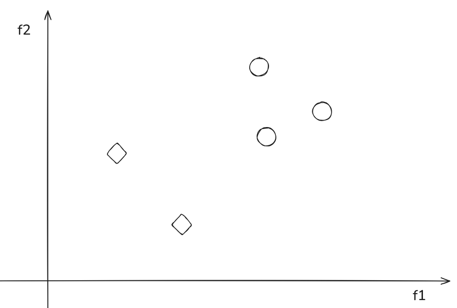

<details>

<summary>If we had the ability to choose between a straight-line model and a curvy-line model, which one would we choose?</summary>

We utilize [Occam's razor](https://en.wikipedia.org/wiki/Occam%27s_razor) and **choose the simpler case**: straight-line model.

</details>

<details>

<summary>What are the possible models, then, that can solve this problem?</summary>

We have many possibilities - here're some:

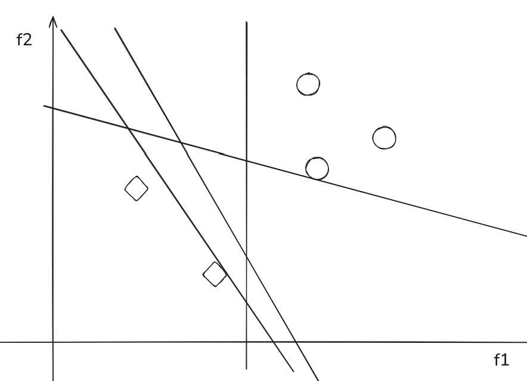

</details>

But, clearly, out of all possible such models, we know that is one and only one that is the best for the given data, right?

<details>

<summary>Which one is it?</summary>

It'd be the one that **maximizes the width** of the "street" between the positive and negative samples:

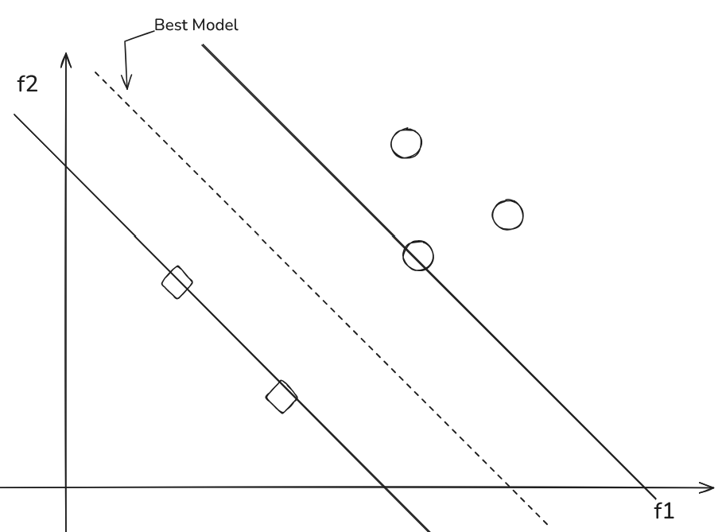

</details>

This is the problem that SVMs solve - they find the model that best separates the training examples!

### Prediction function

Let's say that we do decide to go with an SVM for the above problem. What would be our logic for classifying this new sample:

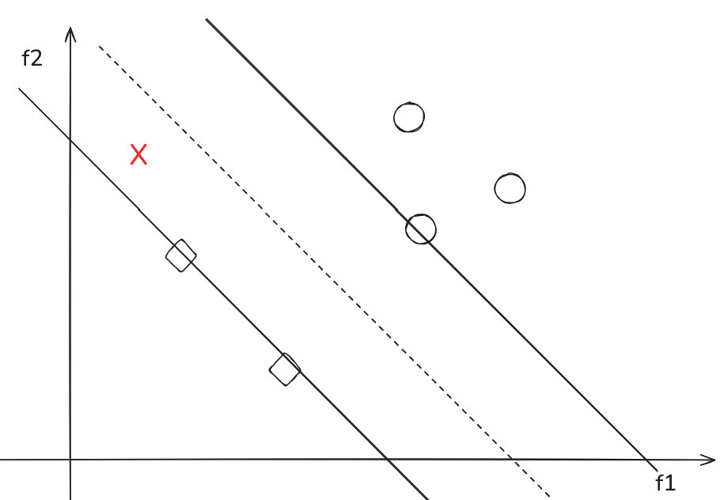

<details>

<summary>Reveal answer</summary>

It'd be really nice if we could base our decision on the median of the street and say that the class would be `circle` if `x` is on the right side of the median / street.

To check that, it'd be easiest to check whether the **dot product** between `x` and an orthogonal vector to the street, ex. `w`, is greater than a constant `c`:

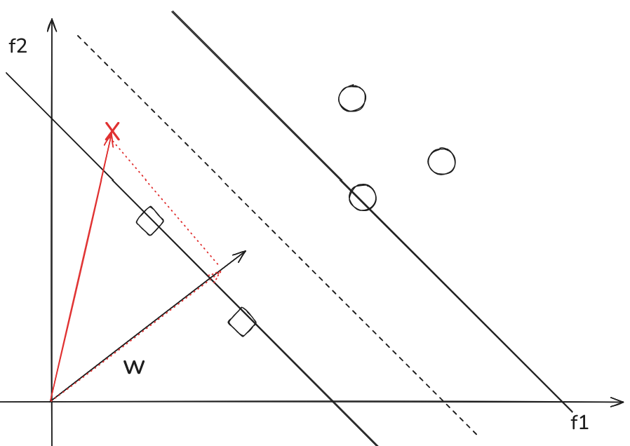

$$w^T x >= b$$

And if we let $c = -b$, then we get our familiar linear combination:

$$w^T x + b >= 0$$

</details>

And this is our model. We can notice that similar to `KNN`, the `SVM` **does *not* output probabilities**. Instead, it outputs either `0` or `1` for the two classes. Unlike `KNN`, but similar to `LogisticRegression`, the `SVM` is typically used for **binary classification**.

Our goal now is to find the parameters of the model - $w$ and $b$:

- we don't know what constant to use, because it depends on $w$;
- but there are many orthogonal vectors $w$ because it can be of any length: how do we choose one?

<details>

<summary>Do you know what strategy support vector machines employ?</summary>

The strategy used by SVMs is that of **enforcing enough *constraints* on the decision function** so that $w$ and $b$ can be uniquely determined. More specifically, two constraints are placed.

</details>

<details>

<summary>What might they be?</summary>

1. For every positive training sample, we want our decision function to output at least $1$:

$$w^T x_+ + b >= 1$$

2. For every negative training sample, we want our decision function to output at most $-1$:

$$w^T x_- + b <= -1$$

</details>

Carrying around two equations like this will be a pain.

<details>

<summary>Can we use the approach we showed last time to combine them into one?</summary>

Yep - we can use the two class labels! If we map them to $-1$ (for all negative samples) and $+1$ (for all positive samples) and multiply the left side of each equation, we'll get that:

Constraint 1 stays the same since $y_i$ is $+1$:

$$y_i (w^T x_i + b) >= 1$$

Constraint 2 becomes:

$$-y_i (w^T x_i + b) <= -1$$

Multiplying by $-1$ on both sides to remove the negative signs:

$$y_i (w^T x_i + b) >= 1$$

Oh - two equations are the same! So, in the end our constraint ends up being:

$$y_i (w^T x_i + b) - 1 >= 0$$

</details>

<details>

<summary>What sign would the value, outputted by the linear combination, need to have in order for the model to satisfy the constraint for negative samples?</summary>

Since $y_i$ is $-1$, it'd need to be negative so that the expression on the left becomes positive.

</details>

<details>

<summary>What sign would the value, outputted by the linear combination, need to have in order for the model to satisfy the constraint for the samples on the edges of street?</summary>

For samples on the edge of the street, we'd have to output $0$.

</details>

<details>

<summary>Do you know how these samples are called?</summary>

Support vectors! Essentially, these are the only samples we need to pay attention to as they define the decision boundary.

</details>

### Fitting the model

Given the constraint $y_i (w^T x_i + b) - 1 >= 0$, we can in fact find the optimal $w$ and $b$. Let's start thinking about $w$.

<details>

<summary>What was its geometrical interpretation?</summary>

It is the vector that allows us to calculate the width of the "street" - the distance between the positive and negative samples.

</details>

Great! So, if we take the following to samples:

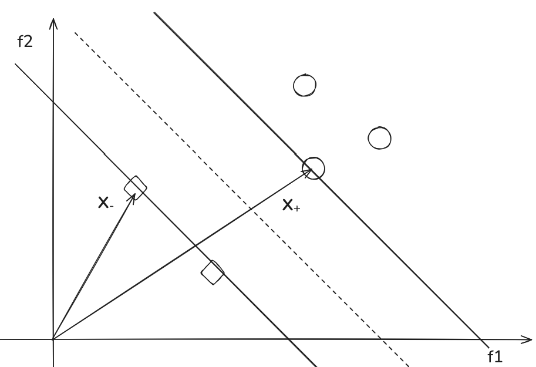

<details>

<summary>What would be the formula for the width of the street?</summary>

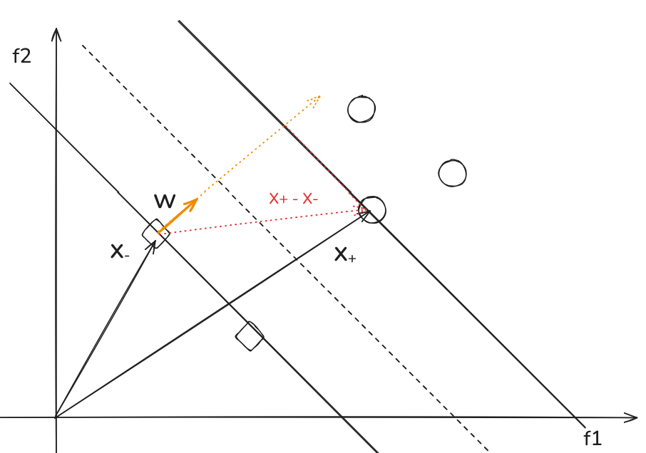

$$\text{width} = (x_+ - x_-) \cdot \frac{w}{\|w\|}$$

</details>

<details>

<summary>We aren't done yet - how can we expand this expression using the meaning of support vectors?</summary>

Firstly, we can expand the parenthesis:

$$\text{width} = (x_+ - x_-) \cdot \frac{w}{\|w\|} = \frac{x_+ w - x_- w}{\|w\|}$$

And then we can use the property that $y_i (w^T x_i + b) - 1 = 0$ for all support vectors:

- For $x_+$:

   $$y_+ (w^T x_+ + b) - 1 = 0$$

   Since $y_+ = +1$:

   $$w^T x_+ + b - 1 = 0$$

   Moving $+ b - 1$ to the other side:

   $$w^T x_+ = 1 - b$$

- For $x_-$:

   $$y_- (w^T x_- + b) - 1 = 0$$

   Since $y_- = -1$:

   $$- w^T x_- - b - 1 = 0$$

   Moving $- b - 1$ to the other side:

   $$- w^T x_- = 1 + b$$

Substituting with these equalities in the above equation, we get that the width is inversely proportional to the magnitude of $w$:

$$\text{width} = \frac{x_+ w - x_- w}{\|w\|} = \frac{1 - b + 1 + b}{\|w\|} = \frac{2}{\|w\|}$$

</details>

<details>

<summary>What is our goal then?</summary>

$$\text{max} \frac{2}{\|w\|}$$

</details>

<details>

<summary>What is that equivalent to?</summary>

$$\text{max} \frac{1}{\|w\|}$$

</details>

<details>

<summary>What is that equivalent to?</summary>

$$\text{min} \|w\|$$

</details>

<details>

<summary>What is that equivalent to?</summary>

$$\text{min} \frac{1}{2} \|w\|^2$$

</details>

And it this point, we have our loss function:

$$\text{min } J(\theta) = \frac{1}{2} \|w\|^2$$

$$\text{s.t. } y_i (w^T x_i + b) - 1 >= 0$$

<details>

<summary>Could we solve this with gradient descent?</summary>

This is a **constrained convex optimization problem**. Gradient descent doesn't naturally handle constraints.

Instead, we use [**Lagrange multipliers**](https://en.wikipedia.org/wiki/Lagrange_multiplier) to incorporate the constraints into the objective function, leading us to **the dual SVM problem**.

</details>

The introduction of Lagrange multipliers is expressed as the introduction of new coefficients $\alpha_i$, $\alpha_i \isin [0, \inf]$ ($i$ = for each of the samples) that will be used to enforce the constraints of the primal problem:

$$\max_{\alpha_i >= 0} L(w, b, \alpha) = \frac{1}{2} \|w\|^2 - \sum_i \alpha_i \left[ y_i (w^T x_i + b) - 1 \right]$$

With this addition, our optimization problem becomes a maximization (adversary) minimization (us) one:

- Suppose the constraint is violated, ex. $y_i (w^T x_i + b) - 1 = -1$ ($-1 < 0$) - what value would the adversary place on $\alpha$?

   <details>

   <summary>Reveal answer</summary>

   A really large positive value, since they'd have $-\alpha (-1)$, so: $\alpha = \inf$.

   </details>

- Suppose the constraint is not violated, ex. $100$ ($100 > 0$) - what value would the adversary place on $\alpha$?

   <details>

   <summary>Reveal answer</summary>

   The lowest they can - $0$.

   </details>

Ok - great - we now have to find the extremum of a function!

<details>

<summary>What was the process for that?</summary>

We take the derivatives and set them to $0$!

- The derivative of $L$ with respect to $w$ is:

   $$\frac{\partial L}{\partial w} = w - \sum_i \alpha_i y_i x_i$$

   We set it to $0$:

   $$w - \sum_i \alpha_i y_i x_i = 0$$

   And get that $w$ is just a linear sum of the samples:

   $$w = \sum_i \alpha_i y_i x_i$$

- The derivative of $L$ with respect to $b$ is:

   $$\frac{\partial L}{\partial b} = - \sum_i \alpha_i y_i$$

   We set it to $0$ and get that the dot product between the $\alpha$ vector and the $b$ vector is $0$:

   $$\sum_i \alpha_i y_i = 0$$

> **Note:** This $\sum_i \alpha_i y_i = 0$ is actually a constraint on the possible values for $\alpha$. It is referred to as the "linear equality constraint". We'll have to enforce this to our optimization problem.

</details>

<details>

<summary>What would our next step be?</summary>

Let's substitute $w$ with what we've found.

We can rewrite the norm of $w$ as a matrix operation:

$$\max_{\alpha_i >= 0} L = \frac{1}{2} w^T w - \sum_i \alpha_i \left[ y_i (w^T x_i + b) - 1 \right]$$

Let's now distribute the $y$s in the parenthesis:

$$\max_{\alpha_i >= 0} L = \frac{1}{2} w^T w - \sum_i \alpha_i \left( y_i w^T x_i + y_i b - 1 \right)$$

Let's now distribute the $\alpha$s in the parenthesis:

$$\max_{\alpha_i >= 0} L = \frac{1}{2} w^T w - \sum_i \left( \alpha_i y_i w^T x_i + \alpha_i y_i b - \alpha_i \right)$$

Distributing the sum:

$$\max_{\alpha_i >= 0} L = \frac{1}{2} w^T w - \sum_i \alpha_i y_i w^T x_i - \sum_i \alpha_i y_i b + \sum_i \alpha_i$$

Moving constants outside of the sum:

$$\max_{\alpha_i >= 0} L = \frac{1}{2} w^T w - w^T \sum_i \alpha_i y_i x_i - b \sum_i \alpha_i y_i + \sum_i \alpha_i$$

We can remove one element since $\sum_i \alpha_i y_i = 0$ and start substituting $w$:

$$\max_{\alpha_i >= 0} L = \frac{1}{2} w^T \sum_i \alpha_i y_i x_i - w^T \sum_i \alpha_i y_i x_i + \sum_i \alpha_i$$

We have the same multipliers for $w^T$, so we're left with $-\frac{1}{2}$:

$$\max_{\alpha_i >= 0} L = - \frac{1}{2} w^T \sum_i \alpha_i y_i x_i + \sum_i \alpha_i$$

</details>

Let's substitute the second $w$ and change the indices of the sums so as to make it clear that they are separate:

$$\max_{\alpha_i >= 0} L = - \frac{1}{2} (\sum_i \alpha_i y_i x_i^T) (\sum_j \alpha_j y_j x_j) + \sum_i \alpha_i$$

Combining the sums yields:

$$\max_{\alpha_i >= 0} L(\alpha) = - \frac{1}{2} \sum_i \sum_j \alpha_i \alpha_j y_i y_j x_i^T x_j + \sum_i \alpha_i$$

Which we can make into a minimization problem:

$$\min_{\alpha_i >= 0} L(\alpha) = \frac{1}{2} \sum_i \sum_j \alpha_i \alpha_j y_i y_j x_i^T x_j - \sum_i \alpha_i$$

<details>

<summary>Are we done?</summary>

Not yet - we need to enforce the constraints.

</details>

<details>

<summary>What variables would the constraints be related to?</summary>

Since this is a function the $\alpha$s, they are the only variable that can vary, so it'd be the $\alpha$s.

</details>

<details>

<summary>Which is the first constraint?</summary>

The linear equality constraint that we got from differentiation: $\sum_i \alpha_i y_i = 0$.

</details>

The second one is related to the possible values values that the $\alpha$s can take.

<details>

<summary>What values did we say that they can take initially?</summary>

$$[0, \inf]$$

</details>

<details>

<summary>What do very high values mean?</summary>

The loss will be higher as $\alpha$ grows. This would mean that we'll have to classify every point perfectly to get $\alpha = 0$.

But ...

We know what this means right? **Overfitting**.

</details>

<details>

<summary>How can we handle this problem?</summary>

We can introduce a hyperparameter of the SVM that would control how much **regularization** we impose - this parameter is typically called **C**:

$$\alpha_i \in [0, C]$$

</details>

Interestingly enough this parameter **C** did already show up.

<details>

<summary>Which algorithm also had the parameter "C"?</summary>

`LogisticRegression`

</details>

So, `C` is the regularization parameter we'll employ in SVMs as well.

<details>

<summary>What was its meaning - as "C" increases what happens to the regularization strength?</summary>

It **decreases**! Notice, as we make the interval bigger, our model would start overfitting, since the adversary wants to maximize the values of the $\alpha$s.


</details>

<details>

<summary>Hmm, that is interesting - can we then use the values of the alphas to distinguish whether a sample is a support vector or not?</summary>

We can! The support vectors are the samples $i$ for which $\alpha_i$ is strictly positive!

> **Note:** In practice, the resulting alphas are very tiny, so we usually pick the support vectors based on a small positive values $\epsilon$, i.e. `support_ = np.where(alphas > 1e-5)[0]`.

</details>

Ok, great! So, how are we going to solve this? We already know that Gradient descent won't work as we have constraints?

We'll use a quadratic solver for this, more specifically [the package quadprog](https://github.com/quadprog/quadprog). We'll go back to how we're going to use it, but first let's talk about something of equal importance.

### The Kernel Trick

<details>

<summary>Why did we went though all of this trouble if we're going to, in the end, use a third-party package to solve it for us?</summary>

Because it shows us an interesting dependence between the loss function and the training samples.

</details>

<details>

<summary>What is the only information the loss function needs from our samples?</summary>

It **does *not*** depend on the individual samples, but ***only* on the *dot-product*** between every pair of them!

</details>

But the story does not end here - let's substitute $w$ in the prediction function and see what we get for an unknown sample $u$:

We take the initial form for predicting the positive class:

$$w^T u + b >= 0$$

And place $w$:

$$\sum_i \alpha_i y_i x_i^T u + b >= 0$$

<details>

<summary>What do we see?</summary>

**The decision rule also depends only on dot-products!** In this case, between the unknown vector and our support vectors.

</details>

This is a big deal because it let's us switch perspectives when we have linearly inseparable data:

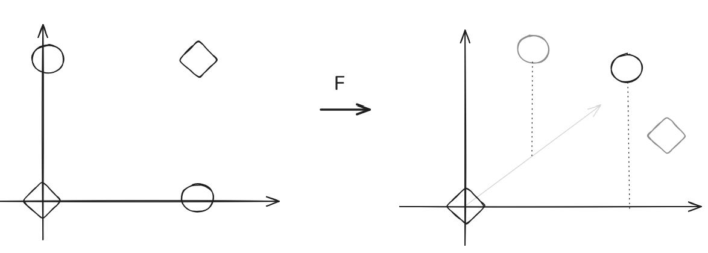

So, if the transformation is $F$, what do we need in order to classify a new point?

<details>

<summary>Reveal answer</summary>

We need $F(x_i) \cdot F(u)$.

</details>

<details>

<summary>And what do we need in order to minimize our loss function?</summary>

We need $F(x_i) \cdot F(x_j)$.

</details>

<details>

<summary>Hmm - ok ... but what does that mean then?</summary>

If we define a function $K(m, n) = F(m) \cdot F(n)$, then $K$ is all we need!

</details>

We don't actually need to compute $F$ directly anywhere! We can use the kernel to get what we require! <- **This is referred to as the *kernel trick*!**

The function $K$ is called the *kernel* - it outputs an approximation of the dot-product in another space, **without knowing the transformation $F$**.

So, we don't need to know $F$, we only need to know $K$! This is the power of SVMs.

Great! What are some popular kernels? We can check them out [in sklearn's documentation](https://scikit-learn.org/stable/auto_examples/svm/plot_svm_kernels.html#sphx-glr-auto-examples-svm-plot-svm-kernels-py):

- Linear: $K(\mathbf{x}_1, \mathbf{x}_2) = \mathbf{x}_1^\top \mathbf{x}_2$.
- Polynomial: $K(\mathbf{x}_1, \mathbf{x}_2) = (\gamma \cdot \ \mathbf{x}_1^\top\mathbf{x}_2 + r)^d$.
- RBF: $K(\mathbf{x}_1, \mathbf{x}_2) = \exp\left(-\gamma \cdot {\|\mathbf{x}_1 - \mathbf{x}_2\|^2}\right)$:
  - The default kernel for Support Vector Machines in `scikit-learn`!
  - Prone to overfitting - watch out and use regularization!
    - When the parameter $\gamma$ is small, the Gaussians get shurk around the sample points and we get overfitting.
  - Measures similarity between two data points in ***infinite* dimensions**!
- Sigmoid: $K(\mathbf{x}_1, \mathbf{x}_2) = \tanh(\gamma \cdot \mathbf{x}_1^\top\mathbf{x}_2 + r)$

### Minimizing the objective

Let's go back now to the way we're optimizing this objective:

$$\min_{\alpha_i >= 0} L(\alpha) = \frac{1}{2} \sum_i \sum_j \alpha_i \alpha_j y_i y_j x_i^T x_j - \sum_i \alpha_i$$

Note, that now we can rewrite this as:

$$\min_{\alpha_i >= 0} L(\alpha) = \frac{1}{2} \sum_i \sum_j \alpha_i \alpha_j y_i y_j K(x_i, x_j) - \sum_i \alpha_i$$

We'll use the function `quadprog.solve_qp`. Here's its docstring:

```python
def solve_qp(double[:, :] G, double[:] a, double[:, :] C=None, double[:] b=None, int meq=0, factorized=False):
    """Solve a strictly convex quadratic program

    Minimize     1/2 x^T G x - a^T x
    Subject to   C.T x >= b

    This routine uses the the Goldfarb/Idnani dual algorithm [1].

    References
    ---------
    ... [1] D. Goldfarb and A. Idnani (1983). A numerically stable dual
        method for solving strictly convex quadratic programs.
        Mathematical Programming, 27, 1-33.

    Parameters
    ----------
    G : array, shape=(n, n)
        matrix appearing in the quadratic function to be minimized
    a : array, shape=(n,)
        vector appearing in the quadratic function to be minimized
    C : array, shape=(n, m)
        matrix defining the constraints under which we want to minimize the
        quadratic function
    b : array, shape=(m), default=None
        vector defining the constraints
    meq : int, default=0
        the first meq constraints are treated as equality constraints,
        all further as inequality constraints (defaults to 0).
    factorized : bool, default=False
        If True, then we are passing `R^{−1}` instead of the matrix G
        in the argument G, where `G = R^T R` and R is upper triangular.

    Returns
    -------
    x : array, shape=(n,)
        vector containing the solution of the quadratic programming problem.
    f : float
        the value of the quadratic function at the solution.
    xu : array, shape=(n,)
        vector containing the unconstrained minimizer of the quadratic function
    iterations : tuple
        2-tuple. the first component contains the number of iterations the
        algorithm needed, the second indicates how often constraints became
        inactive after becoming active first.
    lagrangian : array, shape=(m,)
        vector with the Lagragian at the solution.
    iact : array
        vector with the indices of the active constraints at the solution.
    """
```

We can see that it'll try to `Minimize     1/2 x^T G x - a^T x`.

> **Note:** Here the vector $x$ is not to our training samples. It represent the $\alpha$s that we're trying to find (see `Returns`, first entry in the tuple)!

We see that we have to set values to the following hyperparameters: `G`, `a`, `C`, `b`, `meq`, and `factorized`.

- What value would we give to $G$?
  - $G$ is known as the **Gram matrix** of the kernel: the matrix of pairwise kernel evaluations between all training samples.
  - It represent this part of the loss function: $\frac{1}{2} \sum_i \sum_j \alpha_i \alpha_j y_i y_j K(x_i, x_j)$ ($\frac{1}{2}$ is just a constant, so we can ignore it).
  - Each entry tells us **how similar two samples are** according to the chosen kernel.
  - If we denote the kernel function as $K(x_i, x_j)$, then $G_{ij} = y_i y_j K(x_i, x_j)$.
- What value would we give to $a$?
  - This is the linear term in the loss function: $- \sum_i \alpha_i$.
  - Since the $x$s are the $\alpha_i$s, that means that $a$ is a vector with ones (`num_ones = num_samples`).
- What values would we give to $C$ and $b$?
  - $C$ represents the left side of the equations, while $b$ - the right side.
  - Our goal is to represent out two constraints $\sum_i \alpha_i y_i = 0$, $\alpha_i \in [0, C]$, so $C$ and $b$ will have three (vertical) parts:
    - constraining $\sum_i \alpha_i y_i = 0$:
      - the first in $C$ will be just the vector of mapped classes (to $-1$ and $1$);
      - the first in $b$ will be $0$, since the alphas should combine them in such a way that the sum is equal to $0$.
    - constraining $\alpha_i >= 0$:
      - the second in $C$ is an identity matrix with the size of the samples;
      - the second in $b$ is a vector of $0$s (`num_zeros = num_samples`) to represent the lower bound.
    - constraining $\alpha_i <= C$ via $-\alpha_i >= -C$:
      - the third in $C$ is the negated identity matrix with the size of the samples;
      - the third in $b$ is a vector of $-C$ (`num_neg_cs = num_samples`) to represent the upper bound.

<details>

<summary>What values would we give to "meq"?</summary>

- This tells `quadprog` how many of the constraints are equality constraints.
- We have $1$ such in the matrix $C$ and it is its first row with the mapped classes for each sample.

</details>

<details>

<summary>What value would we give to "factorized"?</summary>

We'll keep it at `False`, since we'll be passing the raw matrix `G`.

</details>

Once we solve the above optimization problem, we'll get the $\alpha$s (the first argument that `solve_qp` returns) and we can compute $b$:

$$b = \text{mean} \left[ y_i - \sum_j \alpha_j y_j K(x_j, x_i) \right]$$

only for samples $i$ where $0 < \alpha_i < C$

And our prediction function for the positive class becomes:

$$\sum_i \alpha_i y_i K(x_i, u) + b >= 0$$

### `SVC` in `scikit-learn`

This is the implementation of the `Kernel SVM` in `sklearn`.

```python
from sklearn import datasets, svm

wine = datasets.load_wine()

svm = svm.SVC()
svm.fit(wine.data, wine.target)
svm.score(wine.data, wine.target)
```

```console
0.7078651685393258
```

With default hyperparameters the accuracy is not particularly high, but it's possible to tune them to achieve `100%` training accuracy (by adjusting `gamma` and `C`). Such a classifier would be overfitting the training set, which is a risk we take when using more complex models.

### `LinearSVC` in `scikit-learn`

Apart from the `Kernel SVM` it is possible to train a **linear** classifier that maximizes the width of the street. It can be trained using stochastic gradient descent and thus is:

- creating the same boundary that we'd get by using a `Kernel SVM` with `kernel=linear`, but the optimization procedure is different.
- much faster than `Kernel SVM` to `fit` and `predict`;
- unable to work with the kernel trick since the decision boundary is linear.

In `scikit-learn` this flavor of SVM is implemented as the class `LinearSVC` (**linear** support vector classifier):

```python
from sklearn import datasets, svm

wine = datasets.load_wine()
print(type(wine))
print(dir(wine))
print(set(wine.target))

svm = svm.LinearSVC()
svm.fit(wine.data, wine.target)
svm.score(wine.data, wine.target)
```

```console
<class 'sklearn.utils._bunch.Bunch'>
['DESCR', 'data', 'feature_names', 'frame', 'target', 'target_names']
{np.int64(0), np.int64(1), np.int64(2)}
0.9887640449438202
```

We see that the `wine` dataset has more than `2` classes and the classifier handles them automatically using the one-vs-rest strategy (like `LogisticRegression`).

### Loss function diagrams

The linear SVM uses a different / new loss function - [the Hinge loss](https://en.wikipedia.org/wiki/Hinge_loss). In the soft margin SVM (a margin that allows for some misclassifications), the total loss combines the hinge loss with the regularization term:

$$
\min_{\mathbf{w}, b} \quad \frac{1}{2} \|\mathbf{w}\|^2 + C \sum_{i=1}^n \max(0, 1 - y_i (\mathbf{w} \cdot \mathbf{x}_i + b))
$$

We want to draw loss functions, so let's set up a plot with `loss` on the vertical axis. On the horizontal axis we'll plot the `raw model output`.

Let's say that the training example is from class `+1`.Then, the right half represents correct predictions and the left half represents incorrect predictions.


Here's how the loss used by logistic regression looks like:


<details>

<summary>What was the loss function for logistic regression?</summary>

Binary cross entropy / Log loss:

$\text{Log Loss} = \sum_{(x,y)\in D} -y\log(y') - (1 - y)\log(1 - y')$

</details>

And here is the [`hinge loss`](https://en.wikipedia.org/wiki/Hinge_loss) used by support vector machines in comparison:


For an intended output $t = ±1$ and a classifier score $y$, the hinge loss of the prediction $y$ is defined as:

$${hidge(y)=\max(0,1-t\cdot y)} \text{,   where   } y = \mathbf{w}^\intercal \cdot \mathbf{x} - b$$

Note that as we move to the right, towards the zone of correct predictions, the loss goes down.

Which of the four loss functions makes sense for classification?
    

```text
A. (1)
B. (2)
C. (3)
D. (4)
```

<details>

<summary>Reveal answer:</summary>

B.

</details>

### Comparing logistic regression and SVM

Let's compare as a final step the two linear classifiers, logistic regression and linear SVMs.

| Logistic Regression                     | Linear Support Vector Machine                  |
| --------------------------------------- | ---------------------------------------------- |
| a linear classifier                     | a linear classifier                            |
| can utilize kernels, but is very slow   | can utilize kernels and fast                   |
| outputs easy-to-interpret probabilities | does not naturally output probabilities        |
| can be extended to multiclass           | can be extended to multiclass                  |
| all data points affect fit              | only "support vectors" affect fit              |
| has L1 and L2 regularization            | without extending, uses only L2 regularization |

Comparing the use in scikit-learn, we have:

| Logistic Regression                   | Linear Support Vector Machine                  |
| ------------------------------------- | ---------------------------------------------- |
| `linear_model.LogisticRegression`     | `svm.LinearSVC` and `svm.SVC(kernel='linear')` |
| `C` (inverse regularization strength) | `C` (inverse regularization strength)          |
| `penalty` (type of regularization)    | `kernel` (type of transformation)              |
| `multi_class` (type of multiclass)    | `gamma` (inverse RBF smoothness)               |

### [`SGDClassifier`](https://scikit-learn.org/stable/modules/generated/sklearn.linear_model.SGDClassifier.html)

This is a classifier that is a wrapper around logistic regression and linear SVMs. One "gotcha" is that the regularization hyperparameter is called `alpha`, instead of `C`, and bigger `alpha` means more regularization. Basically, `alpha = 1/C`.

```python
from sklearn.linear_model import SGDClassifier

# to switch between logistic regression and a linear SVM, one only has to set the "loss" hyperparameter

logreg = SGDClassifier(loss='log_loss')
logsvm = SGDClassifier(loss='hidge')
```

Which of the following is an advantage of SVMs over logistic regression?

```text
A. They naturally output meaningful probabilities.
B. They can be used with kernels.
C. They are computationally efficient with kernels.
D. They learn sigmoidal decision boundaries.
```

<details>

<summary>Reveal answer:</summary>

C. Having a limited number of support vectors makes kernel SVMs computationally efficient.

</details>

Which of the following is an advantage of logistic regression over SVMs?

```text
A. It naturally outputs meaningful probabilities.
B. It can be used with kernels.
C. It is computationally efficient with kernels.
D. It learns sigmoidal decision boundaries.
```

<details>

<summary>Reveal answer:</summary>

A.

</details>

# Week 06 - The Bias-Variance Tradeoff. Decision Trees

## Decision Trees

### Classification-And-Regression-Tree (`CART`)

#### Classification tree

##### What is a classification tree?

Given a labeled dataset, a classification tree learns a **sequence** of **if-else** questions about **individual features** in order to infer the labels.

In contrast to linear models, trees:

- capture ***naturally* non-linear relationships** between features and labels;
- don't require the features to be on the same scale through standardization/normalization.

Let's try to predict whether a tumor is malignant or benign in the [Wisconsin Breast Cancer dataset](https://scikit-learn.org/stable/modules/generated/sklearn.datasets.load_breast_cancer.html) using only `2` features.


When a classification tree is trained on this dataset, the tree learns a sequence of if-else questions.

Each question involves `1` feature and `1` **split-point**.


1. At the top, the tree asks whether the mean of the concave-points is <= `0.051`. If it is, the instance traverses the `True` branch; otherwise, it traverses the `False` branch.
2. The instance keeps traversing the internal branches until it reaches an end (a leaf node).
3. The label of the instance is then predicted to be that of the **prevailing class at that end**.

In scikit-learn the class for creating decision trees is called `DecisionTreeClassifier` and can be found in `sklearn.tree`. Here's how we could implement the above solution

```python
from sklearn.model_selection import train_test_split
from sklearn.tree import DecisionTreeClassifier
from sklearn.metrics import accuracy_score

X_train, X_test, y_train, y_test = train_test_split(X, y, test_size=0.2, stratify=y, random_state=1)

dt = DecisionTreeClassifier(max_depth=2, random_state=1)
dt.fit(X_train, y_train)
y_pred = dt.predict(X_test)
accuracy_score(y_test, y_pred)
```

```console
0.90350877192982459
```

To understand the tree's predictions more concretely, let's see how it classifies instances in the feature-space.


- the left figure shows the decision regions of a logistic regression:
  - note how the boundary is a straight-line.
- the right figure shows the decision regions of a classification tree:
  - see how it produces rectangular decision regions in the feature space:
    - this happens because at each split made by the tree, only `1` feature is involved.

##### How does a classification tree learn?

Until now we know that:

- **Decision Tree:** a binary data structure consisting of a hierarchy of nodes;
- **Non-leaf Node:** question;
- **Leaf Node:** prediction.


The nodes of a classification tree are grown recursively. At each node, a tree asks a question involving one feature `f` and a split-point `sp`.


But how does it know which feature and which split-point to pick?

- It considers that every node contains an amount of uncertainty and aims to minimize that amount in the children nodes (make them more **pure**) with each split.

- The above is equivalent to saying that the tree maximizes the **information gain** it makes with every split.

Consider the case where a node with `N` samples is split into a left-node with `Nleft` samples and a right-node with `Nright` samples. The information gain (or the amount of uncertainty removed) for such split is given by this formula:


Here `I` is the amount of uncertainty and `IG` is information gain.[^1]

##### What criterion is used to measure the impurity of a node?

There are different criteria you can use among which are the **gini-index** and **entropy**.

**Gini Index Formula and Example[^2]:**


**Entropy Formula and Example[^3]:**


Note that here when we're considering multiple splits, we take the weighted averages between the entropies for each split:


The default criteria in scikit-learn is `gini`, though we could also specify `entropy`. Often we would compare both in a grid search.

```python
dt_with_gini = DecisionTreeClassifier(criterion='gini') # default
dt_with_entropy = DecisionTreeClassifier(criterion='entropy')
```

<details>

<summary>
Which of the following is not true?

1. The existence of a node depends on the state of its predecessors.
2. The impurity of a node can be determined using different criteria such as entropy and the gini-index.
3. When the information gain resulting from splitting a node is null, the node is declared as a leaf.
4. When an internal node is split, the split is performed in such a way so that information gain is minimized.

Click to reveal answer.
</summary>

Answer: 4. It's quite the contrary - splitting an internal node always involves maximizing the information gain.

</details>

#### Regression tree

Below the [`automobile miles-per-gallon`](https://archive.ics.uci.edu/dataset/9/auto+mpg) dataset is shown (it's also present in our `DATA` folder as `auto.csv`).


It consists of `6` features corresponding to the characteristics of a car and a continuous target variable labeled `mpg` (miles-per-gallon). Our task is to predict the mpg consumption of a car given these features.

Let's try to do this by only using the displacement of a car - `displ`.

A 2D scatter plot shows that the mpg-consumption decreases **nonlinearly** with displacement.


When a regression tree is trained on a dataset, the **impurity** of a node is measured using the **mean-squared error** of the targets in that node.


This means that the regression tree tries to find the splits that produce leafs where in each leaf the target values are on average, the closest possible to the mean-value of the labels in that particular leaf.

As a new instance traverses the tree and reaches a certain leaf, its target-variable `y` is computed as the average of the target-variables contained in that leaf.


To highlight the importance of the flexibility of regression trees, take a look at this figure. The regression tree shows a greater flexibility and is able to capture the non-linearity, though not fully.


### The Bias-Variance Tradeoff

In supervised learning, you make the assumption: $y = f(x), f$ is unknown.

$f$ shown in red is an unknown function that you want to determine. Real data, however, is always accompanied with randomness or noise like the blue points.


#### The goals of Supervised Learning

- find a model $\hat{f}$ that best approximates $f$: $\hat{f} \approx f$:
  - $\hat{f}$ can be any machine learning model: logistic regression, decision tree, neural network, etc.
- discard noise as much as possible;
- $\hat{f}$ should achieve a low predictive error on unseen data.

#### Difficulties in Approximating $f$

- **Overfitting:** $\hat{f}(x)$ fits the training set noise.


- **Underfitting:** $\hat{f}$ is not flexible enough / complex enough to approximate $f$.


#### Generalization Error

- **Generalization Error of $\hat{f}$**: Quantifies how well $\hat{f}$ generalizes on unseen data.
- It can be decomposed to:

$$\hat{f} = bias^2 + variance + irreducible\ error$$

- **Bias:** error term that quantifies how much on average the model fails to predict the true outcome ($\hat{f} \neq f$). Here is a model with high bias:


- **Variance:** error term that quantifies how much $\hat{f}$ is inconsistent over different training sets (how overfit the model is). Here is a model with high variance:


- **Irreducible error:** The error contribution of noise. There can never be a perfect model, so we regard this term as a small constant that is always present.

#### Model Complexity

- The easiest way in which we can control how well $\hat{f}$ approximates $f$ is by varying its (the model's) complexity.
- Examples: Maximum tree depth, Minimum samples per leaf, Number of features used, Number of neurons, etc.
- This diagram is known as the **Bias-Variance Tradeoff**: it shows how the best model complexity corresponds to the lowest generalization error.


#### Bias-Variance Tradeoff: A Visual Explanation

Let's say that we want to create a model that predicts `2D` points.

The inner-most blue circle of the below diagrams represents perfect predictions with `0` error (in a certain threshold (the value of which does not matter)). The squares represent individual predictions.

The `x` and `y` axes represent the errors made for each coordinate - the center represents perfect predictions, so the errors are near `0`.

Then, we can visualize the bias-variance tradeoff with the following `4` diagrams:


#### Checkpoint

- Which of the following correctly describes the relationship between $\hat{f}$'s complexity and $\hat{f}$'s bias and variance terms?

```text
A. As the complexity of decreases, the bias term increases while the variance term decreases.
B. As the complexity of decreases, both the bias and the variance terms increase.
C. As the complexity of increases, the bias term increases while the variance term decreases.
D. As the complexity of increases, the bias term decreases while the variance term increases.
```

<details>

<summary>Click to reveal answer</summary>

Answer: D

</details>

- Visually diagnose whether a model is overfitting or underfitting the training set. Let's say you've trained two different models $A$ and $B$ on the `auto` dataset to predict the `mpg` consumption of a car using only the car's displacement (`displ`) as a feature. The following figure shows you scatterplots of `mpg` versus `displ` along with lines corresponding to the training set predictions of models $A$ and $B$ in red. Which of the following statements is true?

    

```text
A. (A) suffers from high bias and overfits the training set.
B. (A) suffers from high variance and underfits the training set.
C. (B) suffers from high bias and underfits the training set.
D. (B) suffers from high variance and underfits the training set.
```

<details>

<summary>Click to reveal answer</summary>

Answer: C. Model B is not able to capture the nonlinear dependence of `mpg` on `displ`.

</details>

### Train-test split revisited

#### Estimating the Generalization Error

- How do we estimate the generalization error of a model?
- Cannot be done directly because:
  - $f$ is unknown (if it was known, we would've just coded the formula);
  - usually there's only one dataset;
  - noise is unpredictable.
- Solution: split the data into training and testing sets:
  - fit $\hat{f}$ to the training set and evaluate the its error on the **unseen** test set;
  - the generalization error of $\hat{f}$ $\approx$ test set error of $\hat{f}$.
  - there's a problem with this approach, though: the test set should not be used until we're confident about $\hat{f}$'s performance.
    - also, we can't evaluate $\hat{f}$ on the training set as that would give a biased estimate ($\hat{f}$ has already seen all training points).

<details>

<summary>What is the solution?</summary>

K-Fold cross validation!


The error is then calculated as the mean of the cross-validation results:


</details>

#### Diagnose Variance Problems

- If CV error of $\hat{f}$ > training set error of $\hat{f}$: $\hat{f}$ suffers from **high variance**;
- $\hat{f}$ is said to have **overfit** the training set. To remedy overfitting:
  - decrease model complexity;
    - decrease max tree depth, increase min samples per leaf, decrease number of neurons.
  - gather more data.

#### Diagnose Bias Problems

- If CV error of $\hat{f} \approx$ training set error of $\hat{f}$ and this error is much greater than the disired error: $\hat{f}$ suffers from **high bias**;
- $\hat{f}$ is said to have **underfit** the training set. To remedy underfitting:
  - increase model complexity;
    - increase max tree depth, decrease min samples per leaf, increase number of neurons, increase number of layers.
  - gather more relevant features;
  - feature engineering.

- What do we deduct from the below outputs - overfitting or underfitting?

    

<details>

<summary>Click to reveal answer</summary>

Answer: overfitting. The cross-validation error is higher than the training error.

</details>

### Ensemble Learning

#### Advantages of CARTs

- Simple to understand;
- Simple to interpret;
- Easy to use;
- Flexibility: ability to describe non-linear dependecies;
- Preprocessing: no need to standardize or normalize features.

#### Limitations of CARTs

- Classification: can only produce orthogonal decision boundaries;
- Sensitive to small variations in the training set;
- High variance: unconstrained CARTs easily overfit the training set;
- We can address these limitations by utilizing the **Ensemble Learning** technique.

#### What is Ensemble Learning?

- Train different models on the same dataset;
- Let each model make its predictions;
- Create a meta-model that aggregates the predictions of individual models;
- Output the final prediction. Using this technique, we get more robust results that are less prone to errors;
- Usually the best results are obtained when the used models are skillful in different ways:
  - this can be achieved easily if different types of models are used (rather than a variation of the same model).


#### The [`Voting Classifier`](https://scikit-learn.org/stable/modules/generated/sklearn.ensemble.VotingClassifier.html#sklearn.ensemble.VotingClassifier)

Let's say we have a binary classification task.

- We create $N$ classifiers and get their predictions for a single observation: $P_0, P_1, \dots, P_{n-1}$ with $P_i = 0$ or $1$.
- Those predictions get passed to a meta-model. In the case of the `Voting Classifier`, this model is simply a majority vote on the predictions.
  - If $N$ is even and the predictions get event, a class is chosen at random.
  - Therefore, aviod setting $N$ to an even number.


